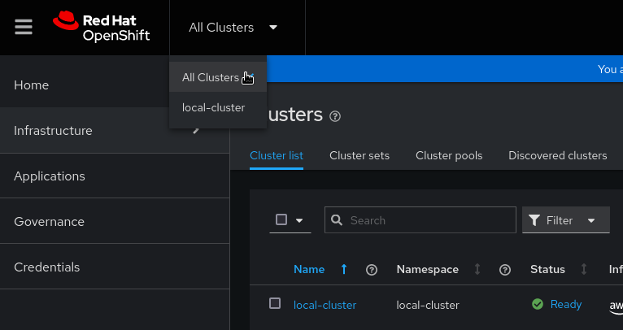
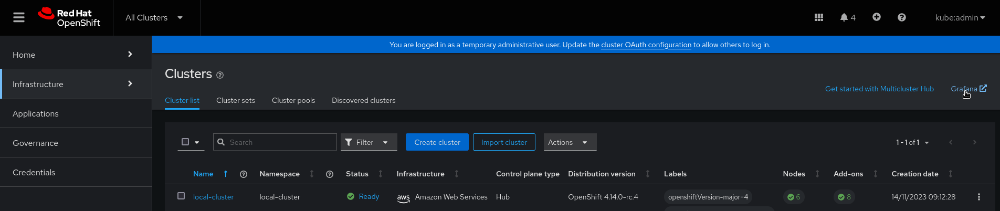
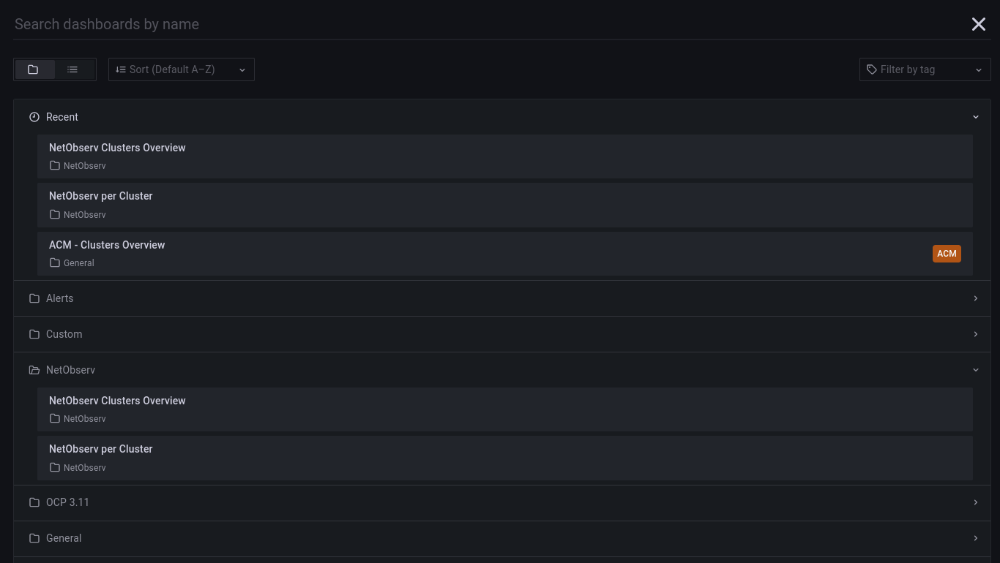
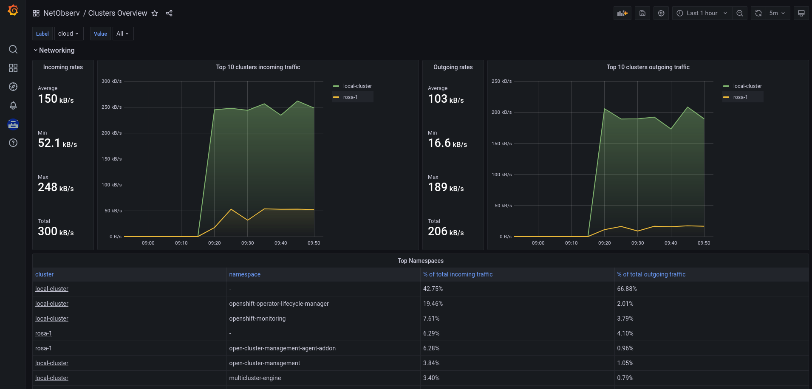
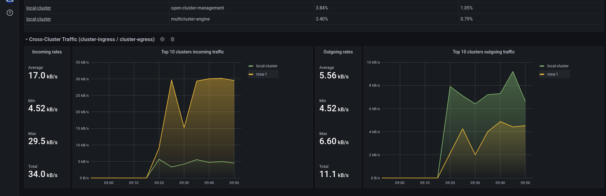
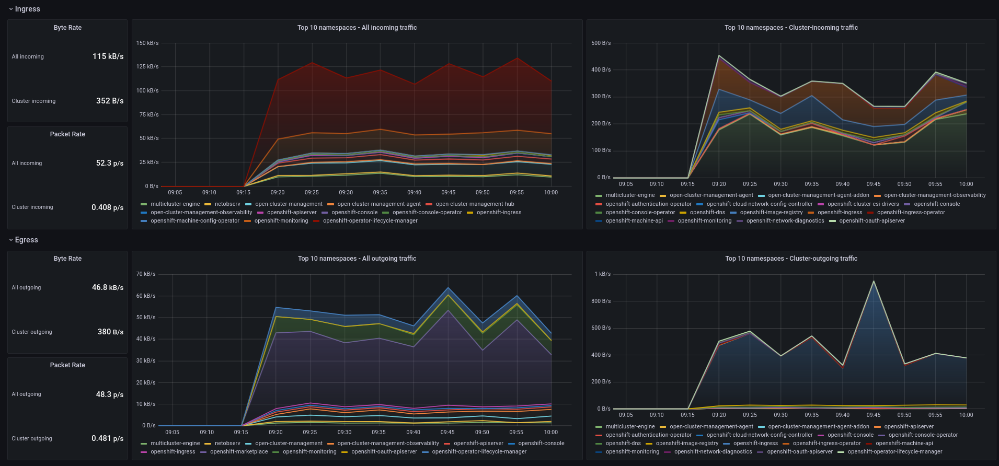
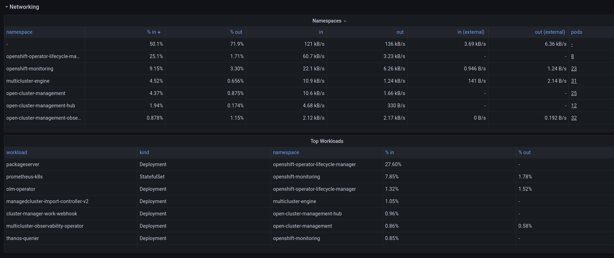

## Leveraging NetObserv metrics in RHACM

_By: Joël Takvorian_

_Credits: Scott Berens, Sara Thomas, Julien Pinsonneau, Steven Lee, Olivier Cazade: thank you for kindly reviewing_


### What is RHACM?

Red Hat Advanced Cluster Management for Kubernetes (RHACM) provides end-to-end management visibility and control to manage a multi-cluster Kubernetes / OpenShift environment. It can be deployed with an OLM operator and is integrated with the OpenShift Console, with all managed clusters being supervised from a hub cluster console. For more information, see [blog posts](https://cloud.redhat.com/blog/tag/red-hat-advanced-cluster-management) on RHACM , and [documentation](https://access.redhat.com/documentation/en-us/red_hat_advanced_cluster_management_for_kubernetes/2.9/html/about/welcome-to-red-hat-advanced-cluster-management-for-kubernetes).

### What is NetObserv?

Network Observability (NetObserv) is a Red Hat operator providing observability over all the network traffic on a cluster by installing eBPF agents per-node which generate flow logs. These flows are collected, stored, converted into metrics, queried from dashboards and so on. More observability blog posts [here](https://cloud.redhat.com/blog/tag/observability), and NetObserv documentation [there](https://docs.openshift.com/container-platform/4.14/network_observability/network-observability-overview.html).

### How to combine them?

RHACM has an Observability add-on that uses Thanos and Prometheus federation to pull some of the metrics from the monitored clusters, automatically injecting cluster name and ID as metric labels. It provides [an API](https://access.redhat.com/documentation/en-us/red_hat_advanced_cluster_management_for_kubernetes/2.9/html/observability/customizing-observability#adding-custom-metrics) to configure which additional metrics to pull.

On the other hand, NetObserv generates metrics out of the processed flow logs. They are pulled and stored by Prometheus, in each cluster where NetObserv is installed.

So it seems there could be a match between RHACM and NetObserv?

(Spoiler: yes!) Let's dive into the details and set it up.

#### Pre-requisites

- A running OpenShift[*] cluster, configured as a hub with RHACM. In this blog, I am simply installing the Advanced Cluster Management for Kubernetes operator from console Operator Hub, with the default `MultiClusterHub` resource. For full installation guidance, see the [documentation](https://access.redhat.com/documentation/en-us/red_hat_advanced_cluster_management_for_kubernetes/2.9/html/install/installing).
- Other clusters imported in RHACM. To do this, you are well guided when using the OpenShift Console, after selecting "All Clusters" in the top-left dropdown list.
- NetObserv operator installed and configured on each cluster to monitor. This can also be done entirely from the OpenShift Console, via OperatorHub, or even better, directly piloted via RHACM policies. We [provide some templates](https://github.com/netobserv/documents/tree/main/examples/ACM/policies) that you can install on the hub cluster. If you choose to use them, NetObserv install is triggered by adding a label `netobserv=true` on clusters; but be aware that at the time of writing, it does not cover installing Loki, which means you don't get full-featured NetObserv.

_*: nothing should stop you from doing the same with other Kubernetes flavors, but this blog will focus on OpenShift as it contains a few references to the OpenShift Console, and assumes Prometheus-based monitoring is set up on each cluster like is provided out of the box with OpenShift._

The following instructions have been tested with RHACM 2.8 and 2.9, and NetObserv 1.4.2 and pre-release 1.5.

#### Configure NetObserv metrics

By default, NetObserv configures a small set of metrics, namely:
- `namespace_flows_total`
- `node_ingress_bytes_total`
- `workload_ingress_bytes_total`

For the purpose of this blog, we enable more metrics. Note that enabling more metrics may have a noticeable impact on Prometheus. You should monitor Prometheus resource usage when doing so.

If you're running NetObserv 1.4.x or older, edit the `FlowCollector` resource, find property `spec.processor.metrics.ignoreTags` and remove `egress` and `packets`.

If you're running NetObserv 1.5 or above, edit the `FlowCollector` resource, find property `spec.processor.metrics.includeList` and set it up with:
- `namespace_flows_total`
- `node_ingress_bytes_total`
- `workload_ingress_bytes_total`
- `workload_egress_bytes_total`
- `workload_egress_packets_total`
- `workload_ingress_packets_total`

This adds metrics used in later steps. [Take a look](https://github.com/netobserv/network-observability-operator/blob/main/docs/Metrics.md) at the available metrics if you want to customize this setup further.

If you are only interested in metrics, you don't need to install and enable Loki. Read more about that [here](https://cloud.redhat.com/blog/deploying-network-observability-without-loki-an-example-with-clickhouse). But while NetObserv doesn't currently provide an out-of-the-box experience for viewing multi-cluster logs from Loki, these flow logs are still the most detailed and accurate data available when it comes to troubleshooting the network per cluster, providing a finer insight than metrics.

Said differently:

- Metrics are the best for wide angle, aggregated view: ideal for a multi-cluster single pane of glass.
- Flow logs are the best for zoomed-in, detailed views: ideal for an in-cluster deep dive.

#### Start the observability add-on

If you already have observability configured in RHACM, you can skip this section.

Else, follow the instructions [documented here](https://access.redhat.com/documentation/en-us/red_hat_advanced_cluster_management_for_kubernetes/2.9/html/observability/enabling-observability-service). This involves configuring access for metrics storage, such as using AWS S3, Google Cloud Storage, ODF or a few others as you can see in the documentation.

Proceed until you have created a `MultiClusterObservability` resource.

Before going further, make sure the observability stack is up and running:

```bash
kubectl get pods -n open-cluster-management-observability -w
```

Example output:
```
NAME                                                       READY   STATUS    RESTARTS      AGE
observability-alertmanager-0                               3/3     Running   0             91s
observability-alertmanager-1                               3/3     Running   0             52s
observability-alertmanager-2                               3/3     Running   0             30s
observability-grafana-6c9984bd7b-6556s                     3/3     Running   0             92s
observability-grafana-6c9984bd7b-hd8v6                     3/3     Running   0             92s
observability-observatorium-api-8598c7f6d-l7psc            1/1     Running   0             75s
observability-observatorium-api-8598c7f6d-nq888            1/1     Running   0             75s
observability-observatorium-operator-55674f7fc8-szh7k      1/1     Running   0             92s
observability-rbac-query-proxy-7b7dd7cb96-mgpwt            2/2     Running   0             91s
observability-rbac-query-proxy-7b7dd7cb96-w99xg            2/2     Running   0             90s
observability-thanos-compact-0                             1/1     Running   0             75s
observability-thanos-query-748f4bb977-7scd6                1/1     Running   0             76s
observability-thanos-query-748f4bb977-jbwqx                1/1     Running   0             76s
observability-thanos-query-frontend-5d8b9c878d-btbgm       1/1     Running   0             76s
observability-thanos-query-frontend-5d8b9c878d-h48mt       1/1     Running   0             75s
observability-thanos-query-frontend-memcached-0            2/2     Running   0             76s
observability-thanos-query-frontend-memcached-1            2/2     Running   0             55s
observability-thanos-query-frontend-memcached-2            2/2     Running   0             54s
observability-thanos-receive-controller-85bf46b584-l22wp   1/1     Running   0             75s
observability-thanos-receive-default-0                     1/1     Running   0             75s
observability-thanos-receive-default-1                     1/1     Running   0             54s
observability-thanos-receive-default-2                     1/1     Running   0             41s
observability-thanos-rule-0                                2/2     Running   0             76s
observability-thanos-rule-1                                2/2     Running   0             46s
observability-thanos-rule-2                                2/2     Running   0             24s
observability-thanos-store-memcached-0                     2/2     Running   0             75s
observability-thanos-store-memcached-1                     2/2     Running   0             58s
observability-thanos-store-memcached-2                     2/2     Running   0             49s
observability-thanos-store-shard-0-0                       1/1     Running   2 (64s ago)   76s
observability-thanos-store-shard-1-0                       1/1     Running   2 (63s ago)   76s
observability-thanos-store-shard-2-0                       1/1     Running   2 (57s ago)   76s
```

#### Configure pulling NetObserv metrics

This is done with a new ConfigMap that declares all metrics to be pulled from the federated Prometheus, along with recording rules:

```yaml
kind: ConfigMap
apiVersion: v1
metadata:
  name: observability-metrics-custom-allowlist
  namespace: open-cluster-management-observability
data:
  metrics_list.yaml: |
    rules:
    # Namespaces
    - record: namespace:netobserv_workload_egress_bytes_total:src:rate5m
      expr: sum(label_replace(rate(netobserv_workload_egress_bytes_total[5m]),\"namespace\",\"$1\",\"SrcK8S_Namespace\",\"(.*)\")) by (namespace)
    - record: namespace:netobserv_workload_ingress_bytes_total:dst:rate5m
      expr: sum(label_replace(rate(netobserv_workload_ingress_bytes_total[5m]),\"namespace\",\"$1\",\"DstK8S_Namespace\",\"(.*)\")) by (namespace)
    - record: namespace:netobserv_workload_egress_packets_total:src:rate5m
      expr: sum(label_replace(rate(netobserv_workload_egress_packets_total[5m]),\"namespace\",\"$1\",\"SrcK8S_Namespace\",\"(.*)\")) by (namespace)
    - record: namespace:netobserv_workload_ingress_packets_total:dst:rate5m
      expr: sum(label_replace(rate(netobserv_workload_ingress_packets_total[5m]),\"namespace\",\"$1\",\"DstK8S_Namespace\",\"(.*)\")) by (namespace)

    # Namespaces / cluster ingress|egress
    - record: namespace:netobserv_workload_egress_bytes_total:src:unknown_dst:rate5m
      expr: sum(label_replace(rate(netobserv_workload_egress_bytes_total{DstK8S_OwnerType=\"\"}[5m]),\"namespace\",\"$1\",\"SrcK8S_Namespace\",\"(.*)\")) by (namespace)
    - record: namespace:netobserv_workload_ingress_bytes_total:dst:unknown_src:rate5m
      expr: sum(label_replace(rate(netobserv_workload_ingress_bytes_total{SrcK8S_OwnerType=\"\"}[5m]),\"namespace\",\"$1\",\"DstK8S_Namespace\",\"(.*)\")) by (namespace)
    - record: namespace:netobserv_workload_egress_packets_total:src:unknown_dst:rate5m
      expr: sum(label_replace(rate(netobserv_workload_egress_packets_total{DstK8S_OwnerType=\"\"}[5m]),\"namespace\",\"$1\",\"SrcK8S_Namespace\",\"(.*)\")) by (namespace)
    - record: namespace:netobserv_workload_ingress_packets_total:dst:unknown_src:rate5m
      expr: sum(label_replace(rate(netobserv_workload_ingress_packets_total{SrcK8S_OwnerType=\"\"}[5m]),\"namespace\",\"$1\",\"DstK8S_Namespace\",\"(.*)\")) by (namespace)

    # Workloads
    - record: workload:netobserv_workload_egress_bytes_total:src:rate5m
      expr: sum(label_replace(label_replace(label_replace(rate(netobserv_workload_egress_bytes_total[5m]),\"namespace\",\"$1\",\"SrcK8S_Namespace\",\"(.*)\"),\"workload\",\"$1\",\"SrcK8S_OwnerName\",\"(.*)\"),\"kind\",\"$1\",\"SrcK8S_OwnerType\",\"(.*)\")) by (namespace,workload,kind)
    - record: workload:netobserv_workload_ingress_bytes_total:dst:rate5m
      expr: sum(label_replace(label_replace(label_replace(rate(netobserv_workload_ingress_bytes_total[5m]),\"namespace\",\"$1\",\"DstK8S_Namespace\",\"(.*)\"),\"workload\",\"$1\",\"DstK8S_OwnerName\",\"(.*)\"),\"kind\",\"$1\",\"DstK8S_OwnerType\",\"(.*)\")) by (namespace,workload,kind)
```

Let's take a break here: what are we doing?

This is defining a bunch of [Prometheus recording rules](https://prometheus.io/docs/prometheus/latest/configuration/recording_rules/#rule).

RHACM offers two options for pulling custom metrics from the managed clusters:

- By declaring metric names to pull
- Or by declaring such recording rules

The former is easier to configure but in many cases, this is probably not what you want. When pulling metrics from many sources, the key concept to have in mind is [metrics cardinality](https://www.robustperception.io/cardinality-is-key/). The more metrics you configure, the bigger the impact on Prometheus and Thanos resource usage and performance. "Cardinality" here does not refer to the number of record rules or names that we declare in this configuration - these are called _metric families_ - after all, if you look closely, we only mention four distinct metric families in this config, which isn't a lot. No, what really matters with cardinality is the distinct count of all metric families _and all their combinations of label keys and values_.

Imagine a metric that provides per-pod information: this is a high cardinality. Imagine a metric that provides per-source pod and per-destination pod information: cardinality explodes. Imagine all of that, pulled from hundreds, thousands of clusters: I prefer not to.

Thankfully, in each cluster, NetObserv's metrics aren't per-pod, but per-workload. This is a first degree of aggregation to tackle cardinality. So the cardinality of such metrics grows capped as `N²`, where `N` is the number of workloads in the cluster. For multi-cluster metrics, this is probably still too much, so we filter or aggregate further using recording rules. Also, multi-cluster dashboards don't have to go ultra deep in the level of details, they need to provide overviews, so we can keep the more detailed metrics just per-cluster, possibly with a smaller retention.

In the config shown above, we are reducing the workload metrics cardinality to `2N` by storing independently `ingress` metrics (per destination, without the source) and `egress` metrics (per source, without the destination). We are also creating other metrics more aggregated, per namespace. And finally, there is a set of metrics with special filters dedicated to watching traffic in/out of the cluster.

End of the break, let's continue with our setup.

Create this `ConfigMap` in your hub cluster - the one where the RHACM operator is installed:

```bash
kubectl apply -f https://raw.githubusercontent.com/netobserv/documents/main/examples/ACM/netobserv-metrics.yaml
```

Note that, if you are using the NetObserv upstream (community) operator, metrics are only available as "user workload metrics", and the procedure to configure RHACM observability then differs a little bit: the `ConfigMap` must be deployed in a different namespace, and the file key must be `uwl_metrics_list.yaml`. More information [here](https://access.redhat.com/documentation/en-us/red_hat_advanced_cluster_management_for_kubernetes/2.9/html/observability/customizing-observability#adding-user-workload-metrics).

This config is immediately picked up by the metrics collector. To make sure everything worked correctly, you can take a look at these logs:

```bash
kubectl logs -n open-cluster-management-addon-observability -l component=metrics-collector -f
```

Hopefully you should see an info log such as: `Metrics pushed successfully`. If there are some typos or mistakes in the ConfigMap, you would see an error in these logs.

#### Installing the dashboards

We've built two dashboards for the set of metrics configured:

- One showing Clusters Overview
- Another showing more details per cluster

To install them:

```bash
kubectl apply -f https://raw.githubusercontent.com/netobserv/documents/main/examples/ACM/dashboards/clusters-overview.yaml
kubectl apply -f https://raw.githubusercontent.com/netobserv/documents/main/examples/ACM/dashboards/per-cluster.yaml
```

#### Viewing the dashboards

From the hub cluster console, select the "All Clusters" view:



Click the Grafana link:



The new dashboards are in the "NetObserv" directory:



1. NetObserv / Clusters Overview


_Clusters overall in/out stats and top namespaces_


_Clusters in/out external traffic_

2. NetObserv / Per Cluster


_Top namespaces charts_


_Namespaces and Workloads tables_

These dashboards provide high level views on cluster metrics. To dive more in the details, such as for troubleshooting or performance analysis, it is still preferable to use the NetObserv plugin or metrics on a given cluster, via the OpenShift Console: not only the metrics are more accurate there, with less aggregation and a better resolution, but there are also more details available in the raw flow logs that aren't visible in metrics, such as pod/port/IP/interface information per flow and accurate timestamps.

#### It's on you

You can customize these dashboards or create new ones. [This documentation](https://access.redhat.com/documentation/en-us/red_hat_advanced_cluster_management_for_kubernetes/2.9/html/observability/using-observability#setting-up-the-grafana-developer-instance) will guide you through the steps of creating your own dashboards.

For instance, do you want to track workloads having external traffic, which we haven't done in this blog (we did only for namespaces)? You can just adapt the rules defined above. If you look at them closely, you'll notice they're all really using the same four metrics under the cover: `netobserv_workload_egress_bytes_total`, `netobserv_workload_ingress_bytes_total` and their equivalent for packets. To track per-workload external traffic, we can use them again, and as for namespaces, filter on empty `SrcK8S_OwnerType` or `DstK8S_OwnerType`. This trick stands for: NetObserv hasn't been able to identify any in-cluster resource corresponding to this source or destination, so this is likely a cluster-external caller or service.

We would end up with these two new rules:

```yaml
    - record: workload:netobserv_workload_egress_bytes_total:src:unknown_dst:rate5m
      expr: sum(label_replace(label_replace(label_replace(rate(netobserv_workload_egress_bytes_total{DstK8S_OwnerType=\"\"}[5m]),\"namespace\",\"$1\",\"SrcK8S_Namespace\",\"(.*)\"),\"workload\",\"$1\",\"SrcK8S_OwnerName\",\"(.*)\"),\"kind\",\"$1\",\"SrcK8S_OwnerType\",\"(.*)\")) by (namespace,workload,kind)
    - record: workload:netobserv_workload_ingress_bytes_total:dst:unknown_src:rate5m
      expr: sum(label_replace(label_replace(label_replace(rate(netobserv_workload_ingress_bytes_total{SrcK8S_OwnerType=\"\"}[5m]),\"namespace\",\"$1\",\"DstK8S_Namespace\",\"(.*)\"),\"workload\",\"$1\",\"DstK8S_OwnerName\",\"(.*)\"),\"kind\",\"$1\",\"DstK8S_OwnerType\",\"(.*)\")) by (namespace,workload,kind)
```

Be careful about escaping double-quotes, though it's not very pretty, it is necessary: else you would end up with a parsing error. Also, the `label_replace` chained calls here could be avoided as they look messy, but they make it actually easier to manipulate those metrics later on, in Grafana.

Also, don't forget that NetObserv has [more metrics to show](https://github.com/netobserv/network-observability-operator/blob/main/docs/Metrics.md), especially starting from the coming-soon release 1.5, such as TCP latencies, [packet drop](https://cloud.redhat.com/blog/network-observability-real-time-per-flow-packets-drop) counters and so on. And just for teasing, we are working on a fresh new API in NetObserv that will soon let you build pretty much any metric you want out of flow logs, for even more dashboarding possibilities.

If you want to get in touch with the NetObserv team, you can use our [discussion board](https://github.com/netobserv/network-observability-operator/discussions).