# Performance fine-tuning - a deep dive in eBPF Agent metrics

We have recently introduced new metrics to instrument the eBPF Agent, which are incredibly useful for performance fine-tuning.
This blog focuses on some of the agent internal mechanisms of flows eviction, and more specifically how tuning the `cacheMaxFlows` parameter can help you improve the memory consumption while keeping the best possible performances.

## Testbed

We will be running a test scenario consisting in:

- An OpenShift 4.15 cluster deployed on AWS, with 3 worker nodes and 3 control-plane nodes, all amd64, `m6i.xlarge`.
- Stable traffic generated by [hey-ho](https://github.com/jotak/hey-ho): `./hey-ho.sh -r 3 -d 3 -z 60m -n 2 -q 2 -p -b`. This creates 900 small load generators distributed in 2 namespaces, 6 deployments and 18 pods. Here I am more interested in the number of distinct 5-tuples that it generates (source/destination IP and ports, protocol) than in the bytes throughput itself, as this is what primarily impacts the number of created flows. Higher throughput does not necessarily mean more flows, as flows are an aggregation of packets meta-data per 5-tuple.
- A build of NetObserv not yet available at the time of writing, based on the current development build plus some pending changes, including performance improvements. They should soon find their way to the main development branch.
- An almost-default `FlowCollector` resource installed, with just:
  - `spec.agent.ebpf.sampling` set to `1`, meaning: collect everything
  - `spec.agent.ebpf.metrics.enable` set to `true` to get the metrics that we'll talk about
  - `spec.loki.enable` set to `false` as we don't need it here

## A revisited Health dashboard

The dashboard called "NetObserv / Health" is created when you install a `FlowCollector` resource. You can find it in the OpenShift Console under the "Observe" > "Dashboards" menu. It has got a fresh restyling while we added there the new agent metrics.

It shows a bunch of statistics such as the flows per second that NetObserv captures, the configured sampling ratio (0 or 1 mean sample everything), the errors reported by managed components and the number of flows dropped, either upstream from the eBPF Agent, or downstream not stored in Loki. Below, the dashboard is broken down into a different section per component, and lastly the resource usage.

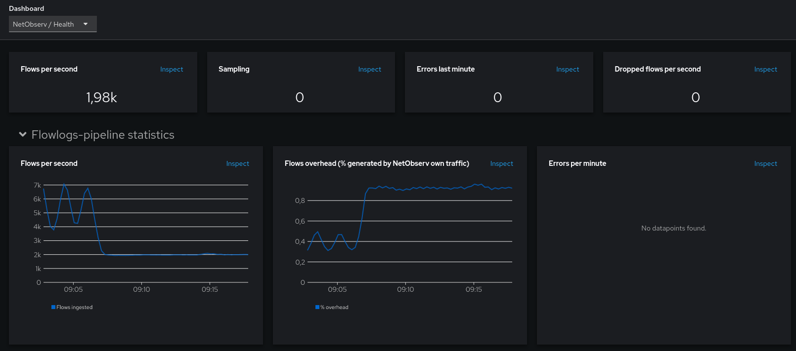

For this blog we are more interested in the eBPF Agent statistics and the resource usage.

## Generating traffic

Like mentioned above, let's generate some traffic with `hey-ho`:

```bash
./hey-ho.sh -r 3 -d 3 -z 60m -n 2 -q 2 -p -b
```

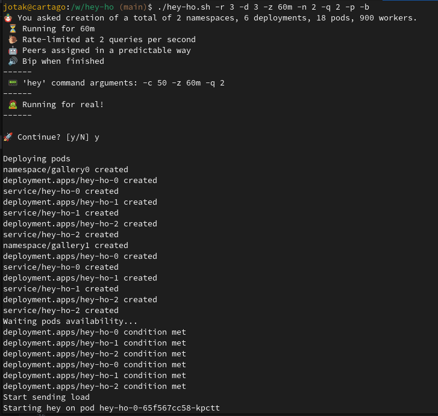

This is spawning 18 pods in 2 namespaces, talking to each other. Let's have a look at the metrics then.

The dashboard shows a stable number of flows captured per second, most of the time between 3K and 3.5K. No drops, no errors:

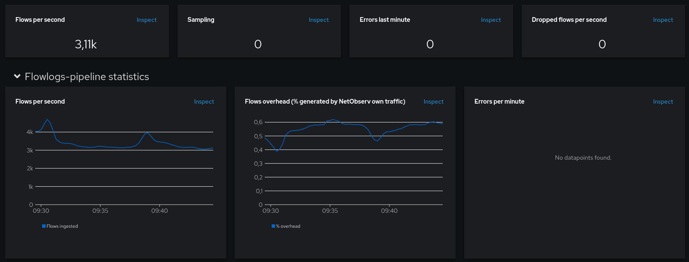

We may also check the `hey-ho` traffic captured by NetObserv, in bytes per second, with this `promql` query: `sum(rate(netobserv_workload_ingress_bytes_total{DstK8S_Namespace=~"gallery.*",DstK8S_OwnerType="Deployment"}[2m]))`. It is very stable at 4MBps:

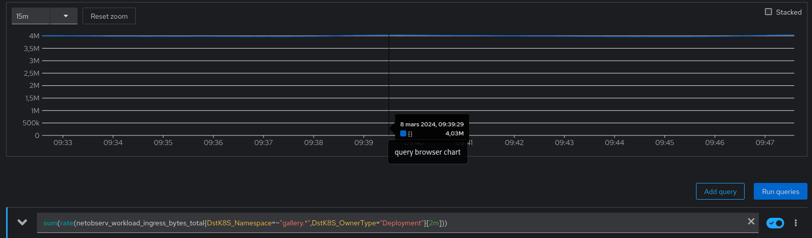

Now looking at the resource usage:

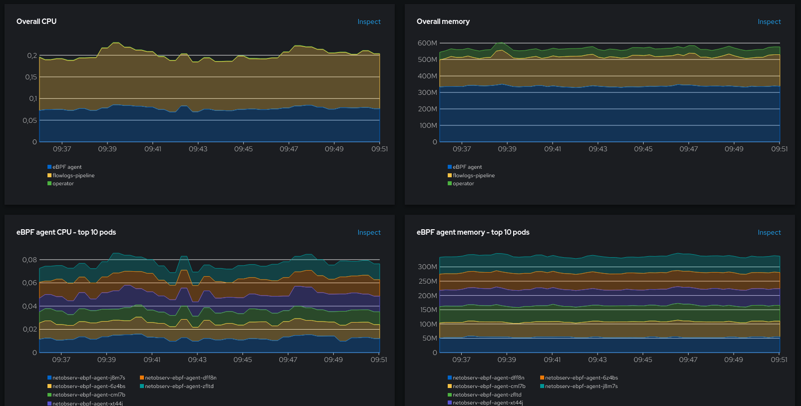

That's also relatively stable, with the eBPF pods using in total around 0.08 CPU and around 340 MB.

## Agent stats

Now let's look at the agent stats:

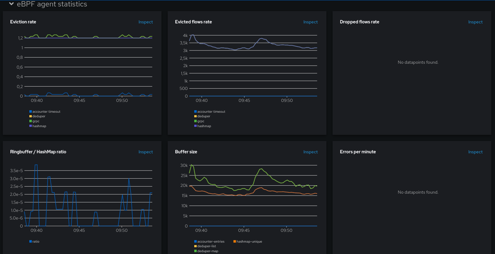

What does all this mean? OK, take a breath. We need to talk about the [agent architecture](https://github.com/netobserv/netobserv-ebpf-agent/blob/main/docs/architecture.md) first.

### Agent architecture

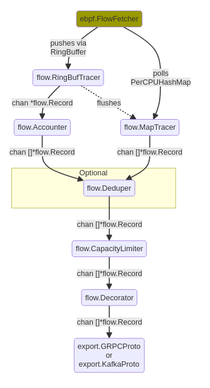

The Agent runs on every node and injects an [eBPF](https://ebpf.io/) program in the Linux kernel in order to listen received and sent packets on network interfaces. The Linux architecture segregates the kernel space and the user space, restricting how data can flow between them. Some specific data structures are available to eBPF programs in order to transfer data between those spaces. By default, our Agent uses two of these structures: a ring buffer, and per-CPU hashmaps (other structures can be used depending on the enabled features of the agent).

The diagram above shows the data path coming from the kernel space (the `FlowFetcher` box at the top), and being either retrieved from the ring buffer or from the maps, before being eventually merged into a single stream that goes down to the exporters.

Why two structures? When does a flow come from ring buffer, and when does it come from maps?
Well, maps are the "normal" way to go. [We've found that they perform better than the ring buffer](https://opensource.com/article/22/8/ebpf-network-observability-cloud) for this use case. So normally, all flows should go through the maps.

But because the maps are polled from the user space, it might happen sometimes, when a new flow comes up, it cannot be added to the map, generally because it is busy or full. Those flows would be dropped unless we find another way to send them to the user space; and here comes the ring buffer. This is it: just a fallback mechanism to avoid loosing flows.

The fundamental difference for us, between maps and the ring buffer, is that maps allow to cache data in kernel and perform aggregations of the packets meta-data into the cached flows, whereas the ring buffer transfers data to the user space every time a new flow packet is received. Thus, it involves many more exchanges between kernel and user spaces, which comes with a computational cost. When the ring buffer is involved, this is like a degraded situation; but with the intent that it's just temporary and exceptional. When a packet is received in user space from the ring buffer, if the reason was that the map was full, it triggers a map flush event to get things back to normal as soon as possible.

Previously, it was difficult to track what's going on under the cover, especially about the agent data path. We mostly had to turn on profiling and deep dive using `pprof`. Now metrics give both developers and users a better insight that allows taking more informed decisions about fine-tuning. So let's go back to the metrics.

### Back to the dashboard

Parenthesis closed, we were looking at the different charts under the eBPF agent stats section:

- **Eviction rate**: this is the rate of eviction events, broken down per internal component

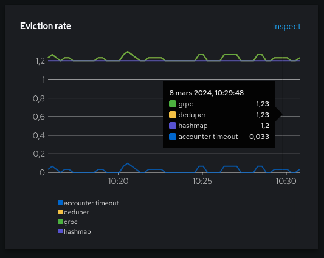

In theory, you should see the same rate between the exporter (`grpc` here) and the `deduper`, and it should also equal the sum of `hashmap` and `accounter` (which is in the ring buffer data path).

We seen on this picture that the hashmap is much more used than the ring buffer (accounter), which is expected when everything works well.

You may also notice that the hashmap eviction rate is a flat constant 1.2. That's because the `cacheTimeout` setting used is the default `5s`, and I have 6 pods. (1 / 5s) x 6 = 1.2. In other words, all the evictions from the hashmap currently obey to the timeout rule.

- **Ringbuffer / HashMap ratio**: ratio between ring-buffer evictions and hashmap evictions.

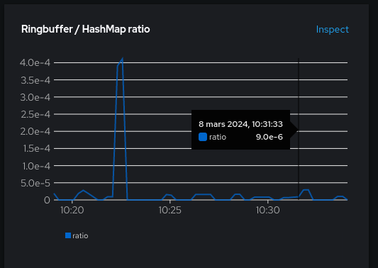

Keep it as low as possible. The picture here is fine: even the spike is actually a low one, at 4e-4.

- **Evicted flows rate**: similar to the rate of evictions except it counts the number of flows rather than the individual eviction events. Also broken down per internal component.

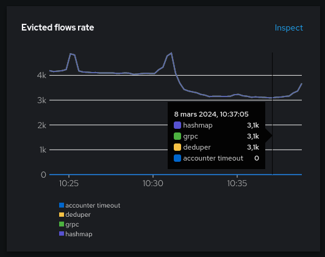

- **Buffer sizes**: some internal buffer sizes. This will be our starting point for fine-tuning.

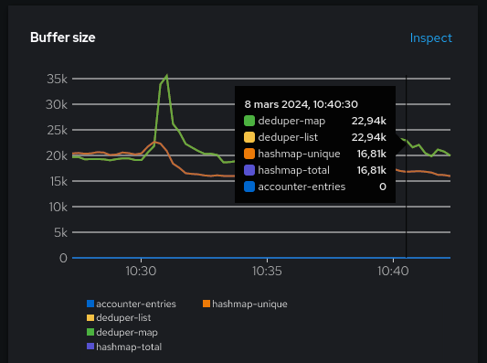

Even if there are five metrics, it shows mostly three things: the deduper cache size, the hashmap size and the accounter cache size. `deduper-map` and `deduper-list` should normally be identical, as well as `hashmap-total` and `hashmap-unique`. They were mostly duplicated for debugging. If you find that they aren't identical, that might be an indication that something isn't going as expected. In that case, feel free to [open a github issue](https://github.com/netobserv/netobserv-ebpf-agent/issues) to discuss.

## What can we learn already?

The buffer size metrics tell us that the hashmaps are containing between 15K and 25K elements, which is a sum for every eBPF Agent pods. We are interested to know if the hashmap configuration isn't over-sized. We can click the Inspect link and edit a little bit the promQL to see per-pod utilization:

`netobserv_agent_buffer_size{name="hashmap-unique"}` shows per-pod maps size, or `max(netobserv_agent_buffer_size{name="hashmap-unique"})` shows the maximum map utilization across pods.

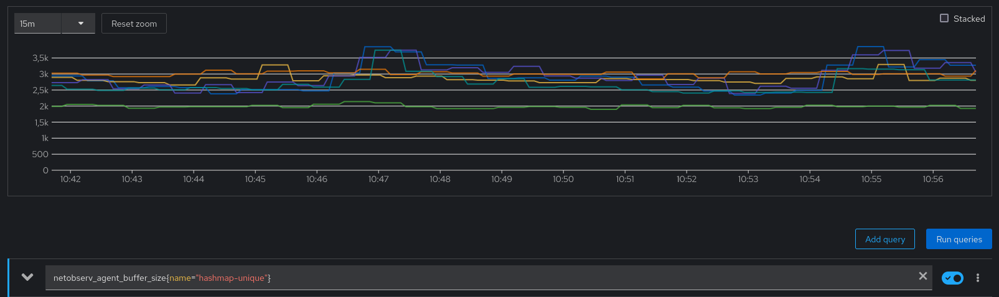

Sounds like it never goes above 4K.

## Fine-tuning

Remember the `FlowCollector` settings? We didn't change the `spec.agent.ebpf.cacheMaxFlows` value. This is the setting used to set the map sizes, and it defaults to 100K. So yes, for this usage, perhaps it is over-sized as the maps are generally under 4K.

Let's halve it and see what happens.

### cacheMaxFlows=50000

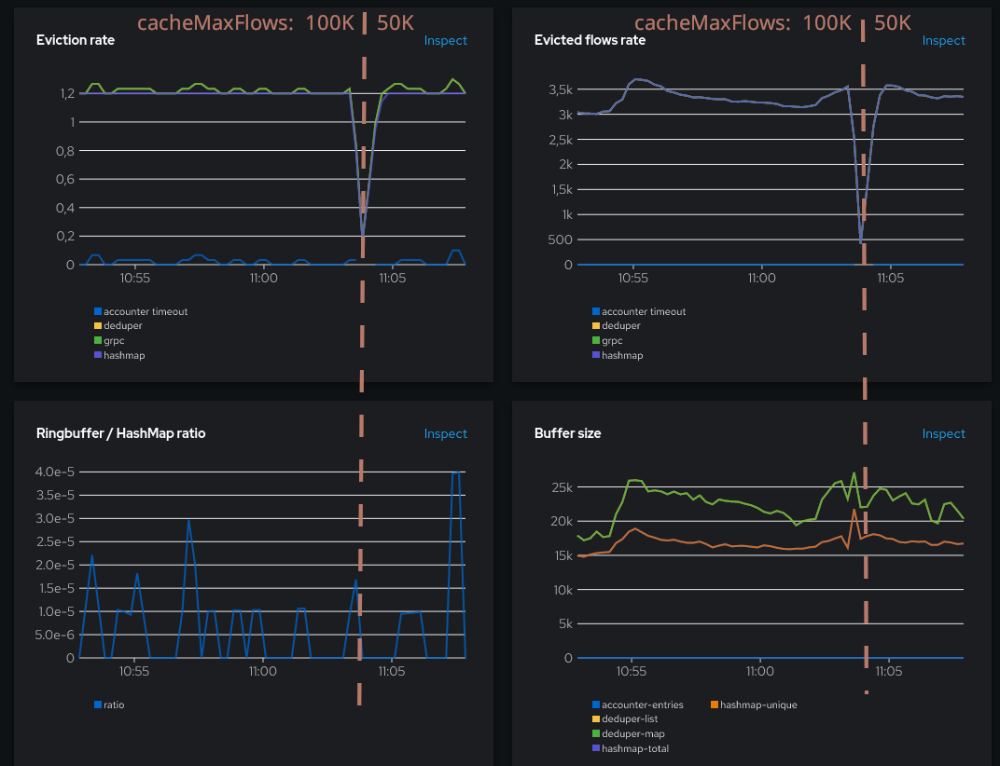

The eviction rate, and the flows per second haven't changed a lot, this is reassuring. The ring buffer ratio is still low. We can also take a look at the captured traffic, to double-check we're not missing anything:

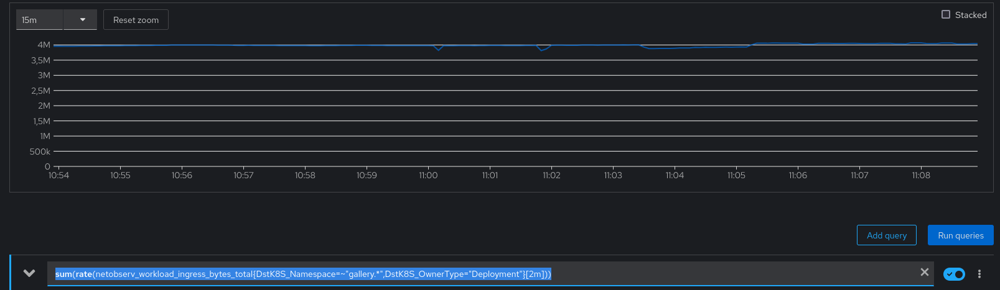

Still a pretty flat 4 MBps. So far so good. So what, does it have any impact at all? What about the resource usage?

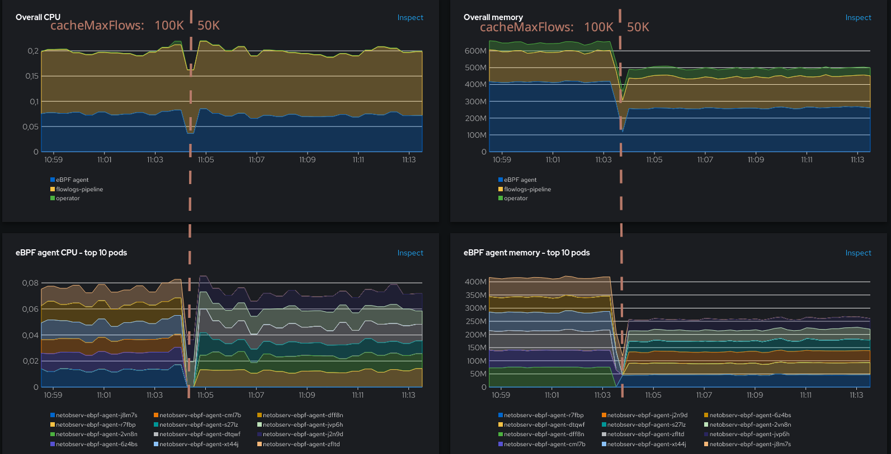

Oh, waw! Although no much impact on CPU, the memory has been greatly reduced! From more than 400 MB to 250 MB. That was a good move.

Let's go further and set `cacheMaxFlows` to 10K.

### cacheMaxFlows=10000

We're getting closer to the 4K utilization that we were seeing before. If this threshold is reached, we can expect more use of the ring buffer. Let's see if that happens.

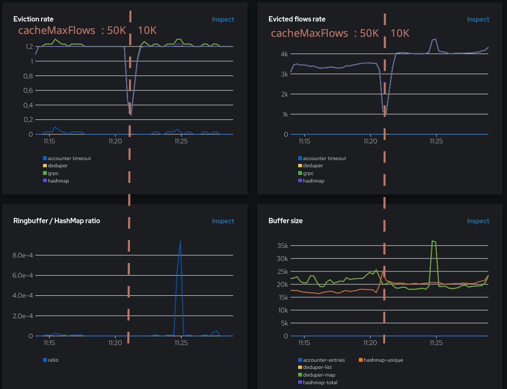

While the ring buffer doesn't seem to be more used most of the time, there is a spike at 11:25. Maps are still well used but it had an impact on the deduper buffer size and the flows evicted.

Taking a close look at the eviction rate graph, there's a small increase of the hashmap line (purple) at the same time, whereas it used to be a flat 1.2 otherwise. What does it say? It says that for the first time here, the map eviction was not due to the `cacheTimeout` setting (evicting every 5s), but it was due to the map being full.

Note that there is an artifact visible here, a global increase of the flows being generated (~3.5K to ~4K), which could be related to a test workloads restart. 10 minutes later it retrieved its previous level, closer to 3K:


What about the resource usage?

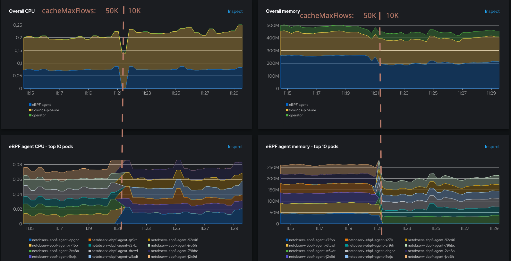

Memory decreased again, though not as much as before. There is a slight CPU increase which can be attributed to the increased number of flows (which decreases as well after 10 minutes). So it sounds like despite approaching the utilization threshold, we're still on a positive trend, but it weakens.

Next step: dare the devil below the utilization threshold, with 2K.

### cacheMaxFlows=2000

We shouldn't expect anything good here, but let's see.

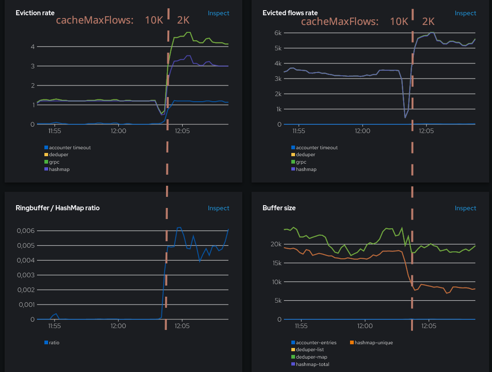

Resource usage:

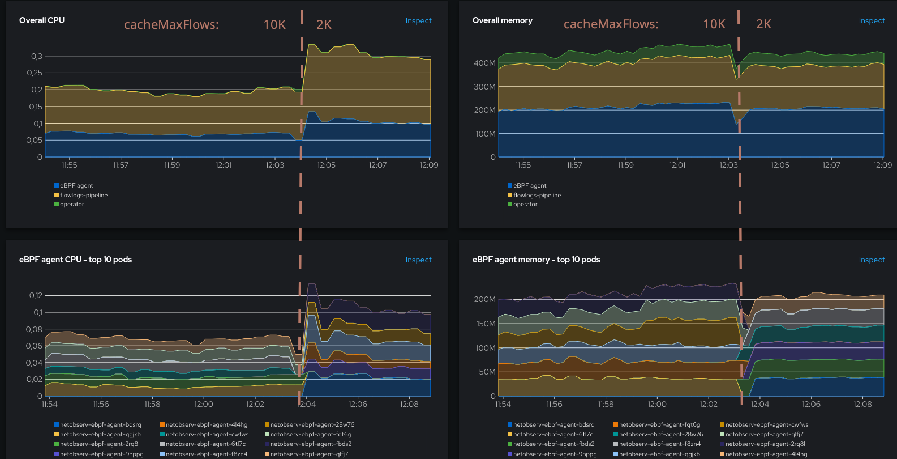

Well, the situation has worsened, but not as much as we could fear. The CPU has increased by +40% but the number of flows, while also growing, is not exploding. Memory consumption looks unchanged, although it has probably been re-balanced internally between the hashmap and other parts. The ring buffer is now consistently used, indicating a somewhat degraded situation, but usage is still in a decent proportion. Things can really get out of hand when the ratio exceeds ~0.05, and here it is still an order of magnitude below.

Also, something interesting to note is that the hashmap evictions (purple line in Evictions rate graph) are now consistently above 1.2, meaning that they are not due to the timeout, but to the maps being full. Let's see what happens if we set a more aggressive timeout.

### cacheTimeout=1s

The goal for setting a more aggressive timeout is to flush the hashmaps more often, hence removing as much as possible the need of the ring buffer as a fallback due to having full maps. But flushing maps more often comes at the cost of generating more flows.

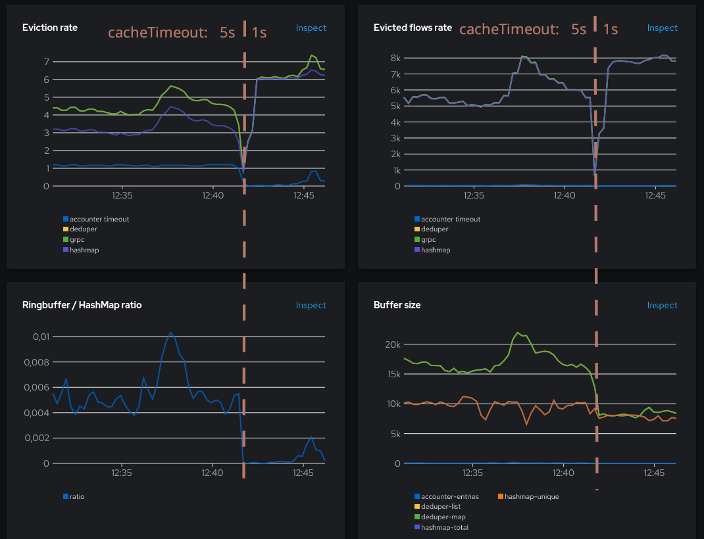

We reached our goal: the ring buffer ratio has dropped. But we see more flows are generated, around 8K instead of 5-6K previously. Also, buffers are smaller since we flush them more often.

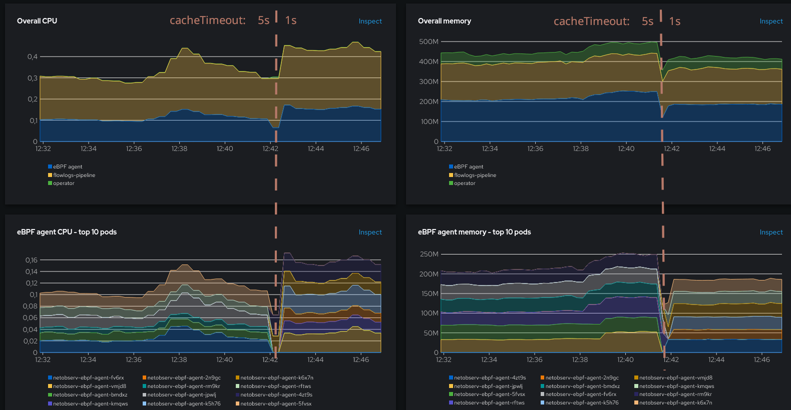

More flows mean more CPU. The impact goes beyond the agent alone, as the components that are downstream the pipeline (flowlogs-pipeline and, if you use them, Kafka and Loki), will also need to process more flows. But while the situation seems less glorious here, this is on purpose: to keep us out of a flows runaway due to over-use of the ring buffer, which we will see next.

### When it all goes wrong

Just for the sake of the demonstration, here's how it looks like with an undersized hashmap leading to over-use of the ring buffer. This is between 12:20 and 12:30 in the charts:

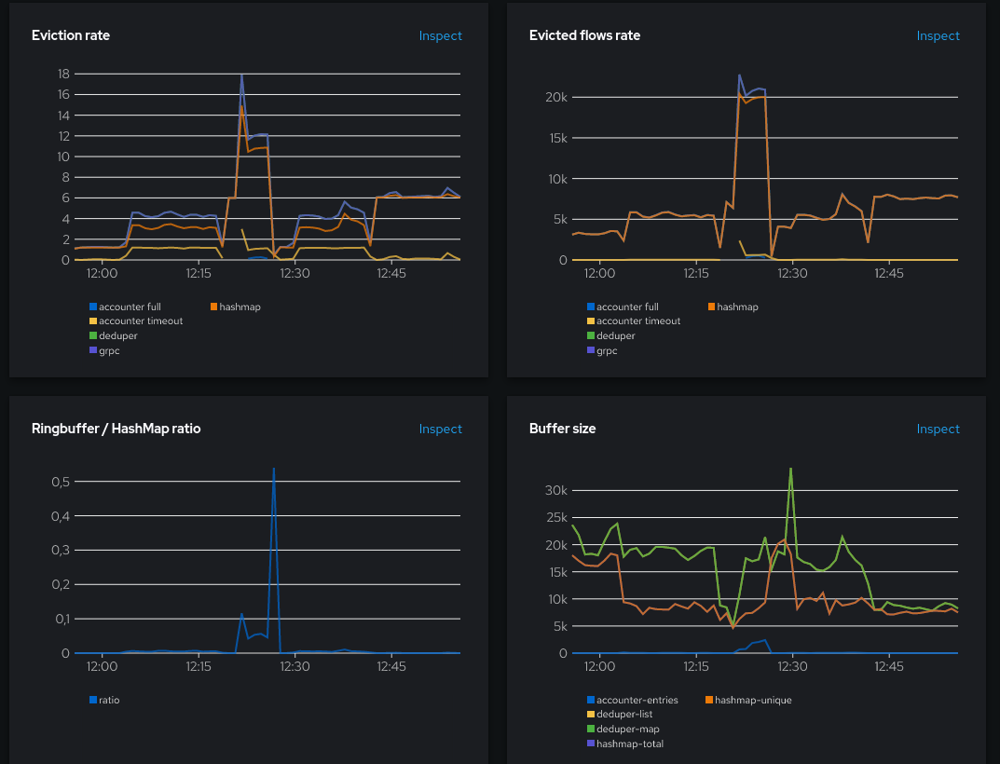

The ring buffer ratio went above 0.05 with even a huge spike to 0.5. This resulted in a burst of evicted flows from ~5K to ~20K.

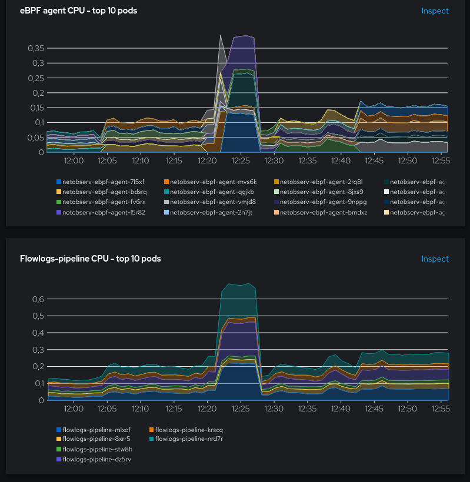

This had a big impact on CPU usage:
- +457% CPU when compared to `cacheMaxFlows=10000`
- +143% CPU when compared to `cacheMaxFlows=2000, cacheTimeout=1s`

To avoid this, it's best to keep `cacheMaxFlows` big enough to minimize the ring buffer ratio usage, in spite of the increased memory usage. Other mitigation options could be limiting the number of generated flows by other means, such as [configuring the agent](https://github.com/netobserv/network-observability-operator/blob/19bcb45d6899f12feb13f94a925a10a4f4c92106/docs/FlowCollector.md#flowcollectorspecagentebpf-1) to add filters on monitored interfaces or to increase the sampling value, if the resulting loss in observability is an acceptable trade-off for you.

## Conclusion

The key takeaways are:

1. Ensure to not use under-sized eBPF hashmaps, which is controlled in `FlowCollector` with `spec.agent.ebpf.cacheMaxFlows`. The suggested way to do this is by monitoring the Ringbuffer / HashMap ratio. It might be a good idea to create a Prometheus alert when the ratio reaches some threshold such as 0.05.

2. While keeping point 1 in mind, there are potentially nice improvements to be made on the memory footprint, by downsizing the hashmaps where possible. It is however highly recommended to keep a safety margin, because of course, real world traffic isn't flat and the maps must be able to absorb traffic increases.

To conclude with a last picture, this is how the captured traffic looked during all these tests (in orange) versus the same from cAdvisor metrics taken as a reference (in blue):


You can see that they almost perfectly match. It means that all the tweaks we did haven't affected the correctness of the data, even during the "flows runaway" at 12:25 where we could have feared some drops.
