# Network Observability On Demand

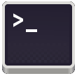

By: Julien Pinsonneau

Installing an entire observability stack may be hard to handle and not worth the effort in some cases. That's why we are introducing Network Observability CLI as a technical preview ! 
This first version of the tool allows users to capture `flows` or `packets` running a simple command. It reuses the netobserv components without the need to install and configure operator(s).

## Architecture

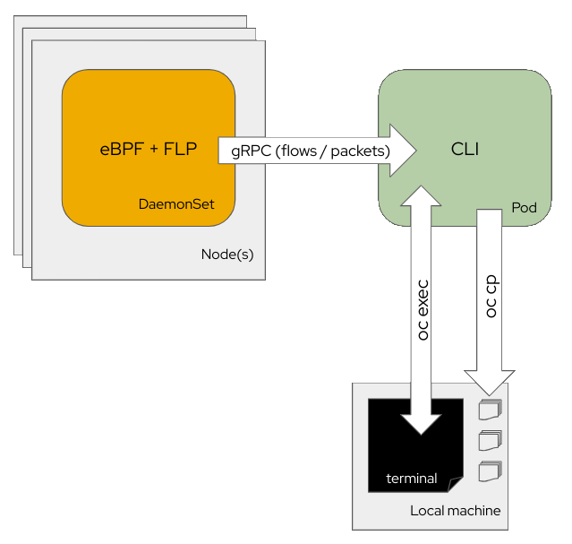

The CLI deploys eBPF agents as a DaemonSet embedding flowlogs pipeline in the same pods. These collect either flows or packets and send these data to a collector pod. The collector pod displays the collected content during the capture. Flows are stored as JSON  and SQLite database files and packets are stored as pcap file(s).

Behind the scene, your local terminal is calling `oc run` to deploy the collector and then `oc exec` for a distant terminal access. Finally, when you exit a capture using `CTRL + C`, the CLI runs `oc cp` command to copy the output files to your local machine.


## A different approach for each scenario

Let's first compare which deployment methods of the Network Observability stack best fit with these example scenarios:

| Deployment method  	  | Configuration     | Short debug session         | Overall observability on short period of time | Long term observability                   | Per flows details   | Packet capture (pcap)
|---	                  |---                |---	                        |---                                            |---	                                      | ---                 |---
| CLI  	                | Flows             | 🗸 best for enriched content | ✗                                             | ✗                                         | 🗸                  | ✗
|     	                | Packets           | 🗸 best for data analysis	   | ✗                                             | ✗                                         | ✗ no enrichment    | 🗸
| Operator              | Loki              | ✗  	                        | 🗸                                             | ✗ unsatisfactory metrics performances 	  | 🗸                  | ✗
|                       | Prometheus        | ✗  	                        | 🗸                                             | 🗸  	                                     | ✗                  | ✗
|                       | Using both        | ✗  	                        | 🗸                                             | 🗸  	                                     | 🗸                  | ✗

It's not worth installing the operator and dependent storage(s) for a short debug session or to get a preview of what eBPF agents can capture whereas it makes sense for a long run scenario where you aim to keep history of logs or metrics for several days.

To see flows in details, both CLI and Operators allows you to deep dive into the K8S enriched fields (Node / Owner / Pod / Service names + Zones) and featured fields such as Bytes / Packets drops, DNS Ids and Latencies and Round Trip Time.

## How to install ?

`kubectl` and `oc` CLIs allows installation of plugins that extends their capabilities with additionnal commands.
A plugin is mainly a script placed in your `PATH` and prefixed with the corresponding <cli+command> name such as `oc-netobserv`.
Read more about [kubectl-plugins](https://kubernetes.io/docs/tasks/extend-kubectl/kubectl-plugins/) and [oc-plugins](https://docs.openshift.com/container-platform/4.15/cli_reference/openshift_cli/extending-cli-plugins.html#cli-installing-plugins_cli-extend-plugins).

For the purpose of this article, the following commands assume you are using `oc`.

### The krew way

> Krew itself is a kubectl plugin that is installed and updated via Krew (yes, Krew self-hosts).

Follow the instructions on [krew.sigs.k8s.io](https://krew.sigs.k8s.io/docs/user-guide/setup/install/) official website.
Once installed, run the following command to install netobserv:
```
oc krew install netobserv
```

### From tar archive

Download the latest version either from [github releases]((https://github.com/netobserv/network-observability-cli/releases)) or [mirror.openshift.com](https://mirror.openshift.com/pub/openshift-v4/amd64/clients/).

Then follow the instructions on [Installing and using CLI plugins](https://docs.openshift.com/container-platform/4.15/cli_reference/openshift_cli/extending-cli-plugins.html#cli-installing-plugins_cli-extend-plugins) from Openshift documentation.

These should resume as following commands using `/usr/local/bin` as PATH folder:
```
tar -xvzf ./netobserv-linux-amd64.tar.gz
chmod +x ./netobserv-linux-amd64/build/oc-netobserv
sudo mv  ./netobserv-linux-amd64/build/oc-netobserv /usr/local/bin/.
```

## Verify the installation

To ensure the installation completed correctly, simply run the following command:
```
oc netobserv version
```

It should print `Netobserv CLI version XXX` with the version you picked earlier.

## Usage

Use the following command to display the help:
```
oc netobserv help
```

```
Netobserv allows you to capture flow and packets from your cluster.
Find more information at: https://github.com/netobserv/network-observability-cli/

Syntax: netobserv [flows|packets|cleanup] [filters]

options:
  flows      Capture flows information. Use options below for features / filtering.
        Options:
          --interfaces: interfaces to monitor
          --enable_pktdrop: enable packet drop (default: false)
          --enable_dns: enable DNS tracking (default: false)
          --enable_rtt: enable RTT tracking (default: false)
          --enable_filter: enable flow filter (default: false)
          --direction: flow filter direction
          --cidr: flow filter CIDR (default: 0.0.0.0/0)
          --protocol: flow filter protocol
          --sport: flow filter source port
          --dport: flow filter destination port
          --port: flow filter port
          --sport_range: flow filter source port range
          --dport_range: flow filter destination port range
          --port_range: flow filter port range
          --icmp_type: ICMP type
          --icmp_code: ICMP code
          --peer_ip: peer IP
          --action: flow filter action (default: Accept)
  packets    Capture packets from a specific protocol/port pair such as 'netobserv packets tcp,80'.
  cleanup    Remove netobserv components.
  version    Print software version.
  ```

As you can see, the CLI offers two captures options for now:
- `flows` to get network flows containing [enriched informations](https://github.com/netobserv/network-observability-operator/blob/main/docs/flows-format.adoc#network-flows-format-reference)

On top of this command, you can add extra features and filters. Example to capture `Round Trip Time` of `TCP` flows using port `80`:
```
oc netobserv flows --enable_filter=true --protocol=tcp --port=80 --enable_rtt=true
```


It will display a table view with latest flows collected and write data under output/flow directory.
To stop capturing press `CTRL + C`.

This will write data into two separate files:
- `./output/flow/<CAPTURE_DATE_TIME>.json` containing json array of received data such as:
```json
{
  "AgentIP": "10.0.1.76",
  "Bytes": 561,
  "DnsErrno": 0,
  "Dscp": 20,
  "DstAddr": "f904:ece9:ba63:6ac7:8018:1e5:7130:0",
  "DstMac": "0A:58:0A:80:00:37",
  "DstPort": 9999,
  "Duplicate": false,
  "Etype": 2048,
  "Flags": 16,
  "FlowDirection": 0,
  "IfDirection": 0,
  "Interface": "ens5",
  "K8S_FlowLayer": "infra",
  "Packets": 1,
  "Proto": 6,
  "SrcAddr": "3e06:6c10:6440:2:a80:37:b756:270f",
  "SrcMac": "0A:58:0A:80:00:01",
  "SrcPort": 46934,
  "TimeFlowEndMs": 1709741962111,
  "TimeFlowRttNs": 121000,
  "TimeFlowStartMs": 1709741962111,
  "TimeReceived": 1709741964
}
```
- `./output/flow/<CAPTURE_DATE_TIME>.db` database that can be inspected using `sqlite3` for example: 
```bash
bash-5.1$ sqlite3 ./output/flow/<CAPTURE_DATE_TIME>.db 
SQLite version 3.34.1 2021-01-20 14:10:07
Enter ".help" for usage hints.
sqlite> SELECT DnsLatencyMs, DnsFlagsResponseCode, DnsId, DstAddr, DstPort, Interface, Proto, SrcAddr, SrcPort, Bytes, Packets FROM flow WHERE DnsLatencyMs >10 LIMIT 10;
12|NoError|58747|10.128.0.63|57856||17|172.30.0.10|53|284|1
11|NoError|20486|10.128.0.52|56575||17|169.254.169.254|53|225|1
11|NoError|59544|10.128.0.103|51089||17|172.30.0.10|53|307|1
13|NoError|32519|10.128.0.52|55241||17|169.254.169.254|53|254|1
12|NoError|32519|10.0.0.3|55241||17|169.254.169.254|53|254|1
15|NoError|57673|10.128.0.19|59051||17|172.30.0.10|53|313|1
13|NoError|35652|10.0.0.3|46532||17|169.254.169.254|53|183|1
32|NoError|37326|10.0.0.3|52718||17|169.254.169.254|53|169|1
14|NoError|14530|10.0.0.3|58203||17|169.254.169.254|53|246|1
15|NoError|40548|10.0.0.3|45933||17|169.254.169.254|53|174|1
```
or `dbeaver`:


- `packets` to get pcap file containing [full packet data](https://github.com/netobserv/netobserv-ebpf-agent/blob/main/examples/packetcapture-dump/README.md). 


It will display a table view with latest packets collected and write data under output/pcap directory.
To stop capturing press `CTRL + C`.

This will write pcap into a single file located in `./output/pcap/<CAPTURE_DATE_TIME>.pcap` that can be opened with Wireshark for example:


This command must have both protocol and port specified to work. We will improve the packet capture filtering options in the future.
Packet drop, DNS latencies and RTT features are not available in this command.

A third option called `cleanup` allows you to remove any remaining netobserv component. That should not happen since this command is automatically run when exiting the capture but it may be necessary to manually execute it in case of connectivity issue or crash.

### Use cases

Let's move on some concrete scenarios. For each of the following use cases, you must have `netobserv CLI` installed and you need to be connected to your cluster using:
```
oc login <CLUSTER_API_URL> --username <CLUSTER_ADMIN> --password <PASSWORD>
```

To observ what's our CLI deploys on your cluster, you can run `oc events -n netobserv-cli -w` command to watch all the events happening in the `netobserv-cli` namespace.

The result will look like:
```
LAST SEEN   TYPE     REASON             OBJECT                    MESSAGE
0s          Normal   SuccessfulCreate   DaemonSet/netobserv-cli   Created pod: netobserv-cli-t2vlr
0s          Normal   Scheduled          Pod/netobserv-cli-t2vlr   Successfully assigned netobserv-cli/netobserv-cli-t2vlr to ip-10-0-1-202.ec2.internal
0s          Normal   SuccessfulCreate   DaemonSet/netobserv-cli   Created pod: netobserv-cli-hlmxx
0s          Normal   Scheduled          Pod/netobserv-cli-hlmxx   Successfully assigned netobserv-cli/netobserv-cli-hlmxx to ip-10-0-1-220.ec2.internal
0s          Normal   Pulling            Pod/netobserv-cli-t2vlr   Pulling image "quay.io/netobserv/netobserv-ebpf-agent:main"
0s          Normal   Pulling            Pod/netobserv-cli-hlmxx   Pulling image "quay.io/netobserv/netobserv-ebpf-agent:main"
0s          Normal   Pulled             Pod/netobserv-cli-hlmxx   Successfully pulled image "quay.io/netobserv/netobserv-ebpf-agent:main" in 2.049s (2.049s including waiting)
0s          Normal   Created            Pod/netobserv-cli-hlmxx   Created container netobserv-cli
0s          Normal   Started            Pod/netobserv-cli-hlmxx   Started container netobserv-cli
0s          Normal   Pulled             Pod/netobserv-cli-t2vlr   Successfully pulled image "quay.io/netobserv/netobserv-ebpf-agent:main" in 5.376s (5.376s including waiting)
0s          Normal   Created            Pod/netobserv-cli-t2vlr   Created container netobserv-cli
0s          Normal   Started            Pod/netobserv-cli-t2vlr   Started container netobserv-cli
0s          Normal   Scheduled          Pod/collector             Successfully assigned netobserv-cli/collector to ip-10-0-1-220.ec2.internal
0s          Normal   AddedInterface     Pod/collector             Add eth0 [10.129.0.35/23] from ovn-kubernetes
0s          Normal   Pulling            Pod/collector             Pulling image "quay.io/netobserv/network-observability-cli:main"
0s          Normal   Pulled             Pod/collector             Successfully pulled image "quay.io/netobserv/network-observability-cli:main" in 1.724s (1.724s including waiting)
0s          Normal   Created            Pod/collector             Created container collector
0s          Normal   Started            Pod/collector             Started container collector
```

#### Connectivity check(s) between two endpoints

Let's start with a simple case where you have a pod not able to reach an endpoint. We are using a simple nodejs sample app deployed in `connectivity-scenario` namespace for the demo.

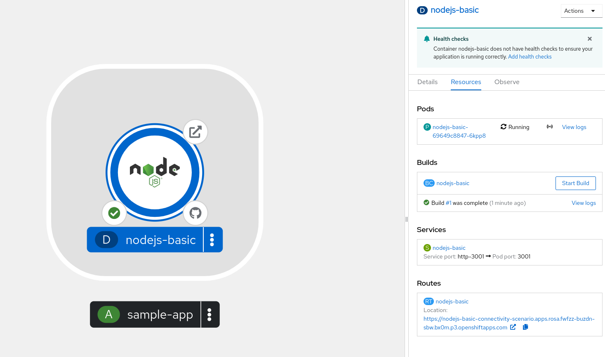

This could be related to many issues such as:
- DNS issue
- Policy or kernel drops 
- Timeouts

Since we don't know what we are looking for yet, we should enable all the features using the options:
```
--enable_pktdrop=true --enable_dns=true --enable_rtt=true
```

By clicking on the pod name, we can see that our current pod IP is `10.129.0.48`. To capture all the traffic going in and out of this pod, we will use the filter:
```
--enable_filter=true --peer_ip=10.129.0.48
```

Alternatively, you could also use the service port
```
--enable_filter=true --port=3001
```

WARNING: Running the capture without filtering is also an option but not recommended as we are going to collect all the flows of the cluster. Depending of the size of your cluster, this could be a lot and make the collector pod crash.

All together, the command to run flow capture with all the features on our pod IP will be:
```
oc netobserv flows --enable_pktdrop=true --enable_dns=true --enable_rtt=true --enable_filter=true --peer_ip=10.129.0.48
```

The script will connect to your cluster and start deploying eBPF agents and collector pod:
```
Setting up... 
cluster-admin
creating netobserv-cli namespace
namespace/netobserv-cli created
creating service account
serviceaccount/netobserv-cli created
clusterrole.rbac.authorization.k8s.io/netobserv-cli configured
clusterrolebinding.rbac.authorization.k8s.io/netobserv-cli unchanged
creating collector service
service/collector created
creating flow-capture agents:
env: pktdrop_enable, env_value: true
env: dns_enable, env_value: true
env: rtt_enable, env_value: true
env: filter_enable, env_value: true
env: filter_peer_ip, env_value: 10.129.0.48
daemonset.apps/netobserv-cli created
Waiting for daemon set "netobserv-cli" rollout to finish: 0 of 2 updated pods are available...
Waiting for daemon set "netobserv-cli" rollout to finish: 1 of 2 updated pods are available...
daemon set "netobserv-cli" successfully rolled out
Running network-observability-cli get-flows... 
pod/collector created
pod/collector condition met
```

Once that done, it will connect to the collector and display its output:
```
Starting network-observability-cli:
=====
Build Version: 
Build Date: 

INFO[0000] Running network-observability-cli
Log level: info
Filter(s): --enable_pktdrop=true --enable_dns=true --enable_rtt=true --enable_filter=true --peer_ip=10.129.0.48 
INFO[0000] Starting Flow Capture...                     
INFO[0000] Creating database...                         
INFO[0000] flows.db created                             
INFO[0000] Create flows table...                        
INFO[0000] flows table created
```

At this stage, the collector wait for incoming data. If nothing shows yet, it means that no traffic is captured. Try to open the route of your application or update the filters of the capture.

Once some traffic is captured, the output will look like:
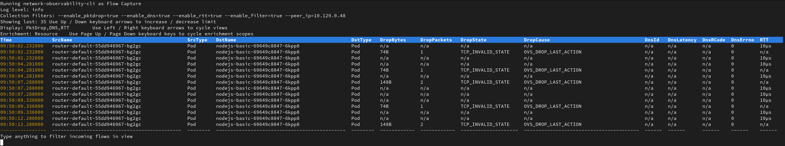

You can cycle to different views using left / right arrow keys and change the displayed enrichment colomns using page up / down ones.
Also, to adapt to your screen height, you can increase / decrease the number of displayed flows using up / down arrow keys.

In this capture, we see that the traffic is blocked by OVS since it reports the `OVS_DROP_LAST_ACTION` drop cause. This probably means that a Network Policy is involved.
Edit your network policies and give another try.

Behind the scenes in our scenario, we used to have a deny all on the pod label:
```
kind: NetworkPolicy
apiVersion: networking.k8s.io/v1
metadata:
  name: deny-nodejs
  namespace: connectivity-scenario
spec:
  podSelector:
    matchLabels:
      app: nodejs-basic
  policyTypes:
    - Ingress
    - Egress
```

Once you updated your policies, you can give another try to your route until you fix the issue:
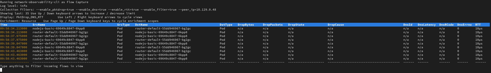

The drop cause will dissapear and your route should open correctly now. On top of that, you can ensure that the Round Trip Time is correct. 
If you are still experienting issues with the route, you may update / get rid of the filter(s) and play with live filtering.

- While running a capture, you can place additionnal live filters to the view by simply typing keywords on your keyboard such as `nodejs`:
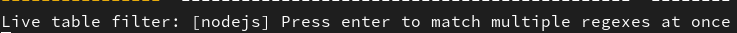

- And add as many keywords as you want by pressing enter:
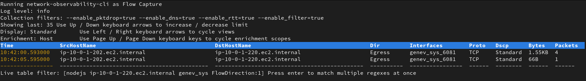

- If your deployment involve some DNS resolution, you can switch to the DNS display and show latencies and errors:
Once you updated your policies, you can give another try to your route until you fix the issue:
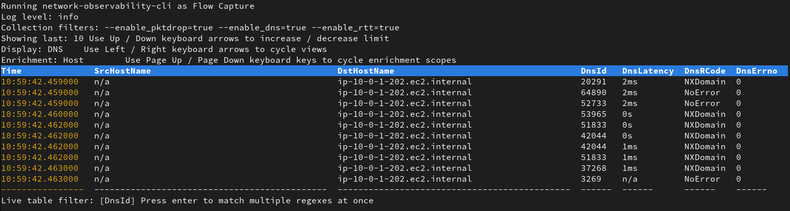

  Those `NxDomain` errors could be from a misconfiguration in your app deployment trying to reach the wrong domain.

Once you are done, simply press `CTRL + C` to exit. Your capture will be copied to your local machine for post mortem analysis.

That's the end of the first scenario about connectivity checks !

#### Identify unknown traffic content

In this next scenario, we are going to dig into unknown packets using unencrypted traffic on `TCP` protocol on port `80`. We usually avoid such usage on production cluster and would like to understand who's involved in these.

For the demo purepose, we are using again a nodejs basic deployment, exposing unencrypted traffic on port 80 in `packet-capture-scenario` namespace.

Let's start a packet capture using the following command:
```
oc netobserv packets tcp,80
```

Similarly to the previous scenario, the script will connect to your cluster and start deploying eBPF agents and collector pod but capturing full packet content this time.

Once first packet is captured, you will see a table with the amount of packets and bytes:

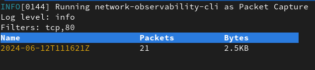

Let the capture run enough time to get some packets and press `CTRL + C` to exit.
Open the generated pcap file using Wireshark and look for your IP as source for example:

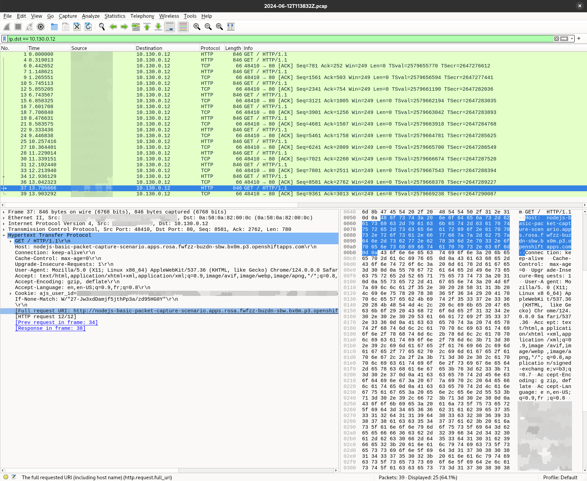

This time, we can see the HTTP content and see the request URL and response. Since we have the entire payload, we cand check for any authentification header, cookie, encoding and so on that may be wrong. 
This is useful to identify traffic content but also to debug a deployment that may be misconfigured or requesting unexpected content on unencrypted connections.

#### Encrypted traffic

What about encrypted traffic ? 

Most of the time, your traffic will be secured and you will not have access to the data it holds. However, Wireshark has the ability to decrypt the content if you [provide the proper secrets](https://wiki.wireshark.org/TLS#tls-decryption). However, getting these secrets may be tricky depending on where the encryption happens and needs some juggling. 
If you are looking for the traffic between your browser and the cluster, you can simply run the following command to capture [pre-master-secret keylog file](https://wiki.wireshark.org/TLS#using-the-pre-master-secret):
```
SSLKEYLOGFILE="keylog.txt" chromium-browser &
```

This generated file contains each client and server traffic secrets to decode your packets.

Then in Wireshark, specify the file path in `Edit→Preferences→Protocols→TLS→(Pre)-Master-Secret log filename`. A single file can hold keys for multiple TLS connections.

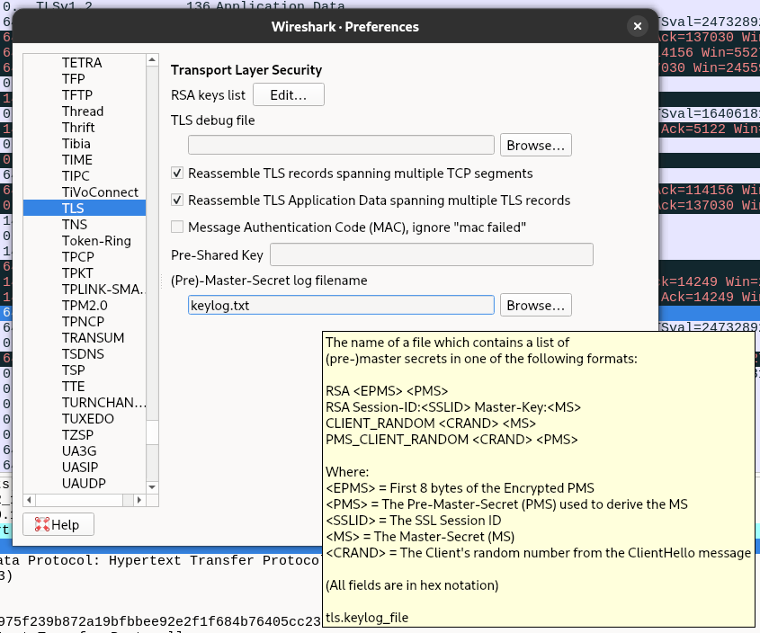

You should now have access to decrypted packets !

What about a secure connection between two pods ? 
For these cases, you need to have a good understanding of what's involved behind the scene. If your application rely on OpenSSL, GnuTLS or NSS TLS library, you should be able to set the `SSLKEYLOGFILE` enviroment variable and extract the result.

For our nodejs example, you need to either use the cli option [--tls-keylog](https://nodejs.org/api/cli.html#cli_tls_keylog_file) or modify the code and subscribe on [keylog event](https://nodejs.org/api/tls.html#event-keylog). When multiple teams are involved, that may take a while !

Another alternative is to get a man in the middle approach using a proxy. This can be done using [kubetap](https://soluble-ai.github.io/kubetap/).

You can install it using krew by running:
```
oc krew install tap
```

Then you can run the following command to port forward the traffic of your service to the proxy:
```
oc tap on -n packet-capture-scenario -p 3001 --https nodejs-basic --port-forward
```

The output should look like this:
```
Establishing port-forward tunnels to Service...
                                                                                     

Port-Forwards:

  mitmproxy - http://127.0.0.1:2244
  nodejs-basic - http://127.0.0.1:4000
```

Open the mitm proxy url and generate a query to your route. You will see queries listed in the proxy web UI with the content displayed:

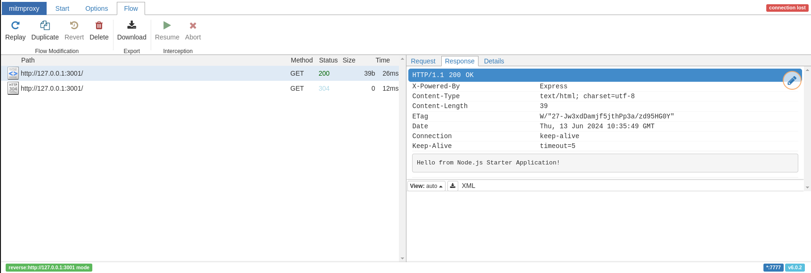

## Future improvements

For now, the Network Observability CLI is only providing `capture commands` such as [many other observability projects](https://github.com/collabnix/kubetools?tab=readme-ov-file#observability) but it will improve to embed tools to facilitate your life as much as possible.

We have in mind to improve the capture process by automatically finding ips and ports matching to the pods you are looking for and automatically filter on these.

The packet capture needs to be improved to align with flows filter capabilities and facilitate decryption of traffic. We are also investigating on ways to embed enriched information inside the pcap file format.

Also, the CLI could hold additionnal functionnalities such as, installing and configuring the Network Observability Operator, in a step by step setup way, including Loki and Prometheus configurations.

It could become 'yet another' toolset of observing and debugging tools such as [inspektor-gadget](https://github.com/inspektor-gadget/inspektor-gadget).

## Feedback

We hope you liked this article !

Netobserv is an OpenSource project [available on github](https://github.com/netobserv).
Feel free to share your [ideas](https://github.com/netobserv/network-observability-operator/discussions/categories/ideas), [use cases](https://github.com/netobserv/network-observability-operator/discussions/categories/show-and-tell) or [ask the community for help](https://github.com/netobserv/network-observability-operator/discussions/categories/q-a).
