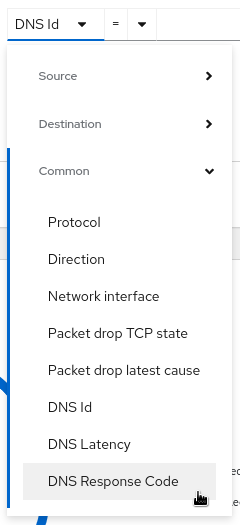
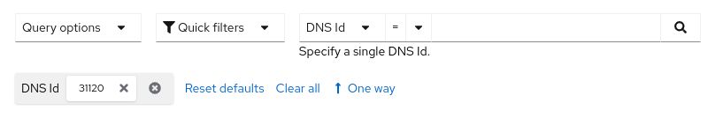
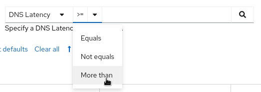
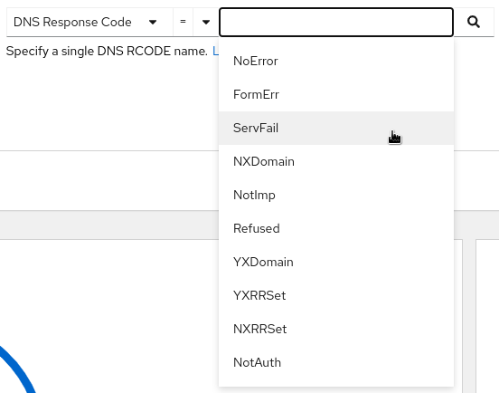
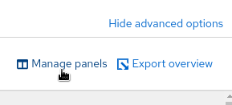
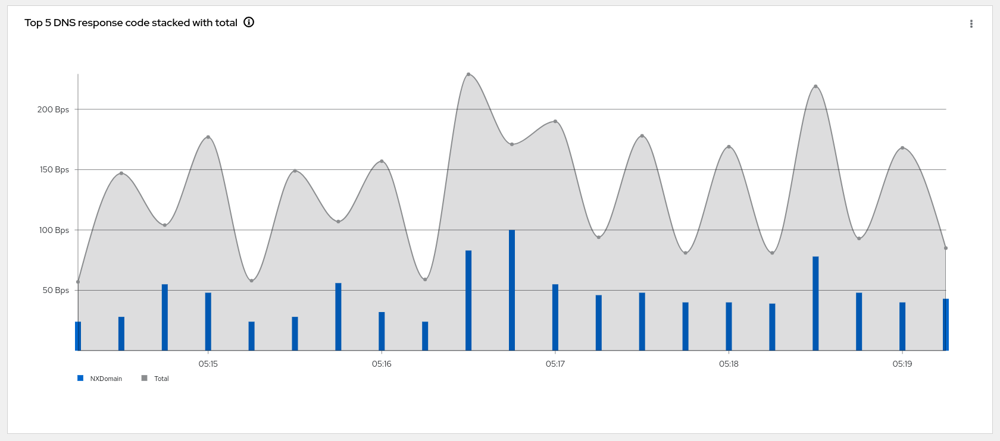
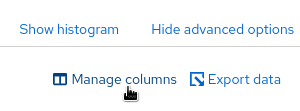
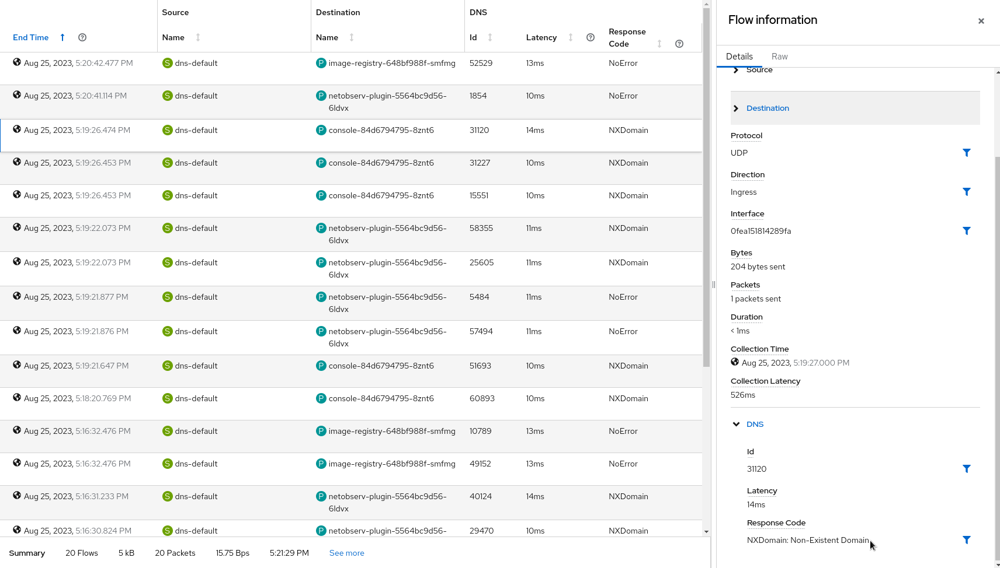

# Network Observability Per Flow DNS tracking


By: Julien Pinsonneau, Mehul Modi and Mohamed S. Mahmoud
<style>body {text-align: justify}</style>

In today's interconnected digital landscape, Domain Name System (DNS) tracking
plays a crucial role in networking and security.
DNS resolution is a fundamental process that translates human-readable domain
names into IP addresses, enabling communication between devices and servers.
However, this process also presents opportunities for monitoring and analysis,
which can be achieved through innovative technologies like
eBPF (extended Berkeley Packet Filter).
In this blog post, we'll delve into the world of DNS tracking using eBPF
tracepoint hooks, exploring how this powerful combination can be used for
various purposes, including network monitoring and security enhancement.

## Understanding DNS Resolution

Before diving into the specifics of eBPF tracepoint hooks, let's briefly
recap how DNS resolution works.
When you enter a website's domain name (e.g., www.example.com) in your
browser, your computer needs to find the corresponding IP address.
This process involves multiple steps, including querying DNS servers,
caching responses, obtaining the IP address to establish a connection
and caching response for future re-occurrence of the same DNS query.

## Utilizing Tracepoint Hooks for DNS Tracking

Tracepoint hooks are predefined points in the Linux kernel where eBPF
programs can be attached to capture and analyze specific events.
For DNS tracking, we leveraged tracepoint hooks associated with DNS
resolution processes, specifically the `tracepoint/net/net_dev_queue` tracepoint.
Then we parse the DNS header to determine if it is a query or a response, attempt
to correlate the query or response for specific DNS transaction, and then record the
elapsed time to compute DNS latency. Further, DNS network flows are enriched
to include fields, viz. DNS Id, DNS latency and DNS response codes to help
build graphs with aggregated DNS statistics and to help filtering on specific
fields in the Network Observability console.

## Potential Use Cases

DNS tracking with eBPF tracepoint hooks can serve various purposes:

- Network Monitoring: Gain insights into DNS queries and responses,
helping network administrators identify unusual patterns,
potential bottlenecks, or performance issues.

- Security Analysis: Detect suspicious DNS activities, such as domain
name generation algorithms (DGA) used by malware,
or identify unauthorized DNS resolutions that might indicate a security breach.

- Troubleshooting: Debug DNS-related issues by tracing DNS resolution steps,
tracking latency, and identifying misconfigurations.

## How to enable DNS tracking

By default DNS tracking is disabled because it requires
`privileged` access, to enable this feature we need to create a flow
collector object with the following fields enabled in eBPF config
section

```yaml
apiVersion: flows.netobserv.io/v1beta1
kind: FlowCollector
metadata:
  name: cluster
spec:
  agent:
    type: EBPF
    ebpf:
      privileged: true
      features:
        - DnsTacking
```

## A quick tour in the UI

Once `DnsTacking` feature enabled, the Console plugin will automatically
adapt to provide additional filters and show informations across views.

Open your OCP Console and move to
`Administrator view` -> `Observe` -> `Network Traffic` page as usual.

Three new filters, `DNS Id`, `DNS Latency` and `DNS Response Code` will be available
in the common section:



The first one will allow you to filter on a specific DNS Id to correlate
with your query.



The second one helps to identify potential performance issues by looking at DNS
resolution latency.



The third filter surfaces DNS response codes, which can help detect errors or
unauthorized resolutions.



### Overview

New graphs are introduced in the `advanced options` -> `manage panels` popup:



- Top 5 average DNS latencies
- Top 5 DNS response code
- Top 5 DNS response code stacked with total




### Traffic flows

The table view adds the new DNS columns `Id`, `Latency` and
`Response code`, which are available from the `advanced options` -> `manage columns` popup.



The DNS flows display this information in both the table and the side panel:



## Future support

- Adding tracking capability for mDNS

- Adding support for DNS over TCP

- Investigating options to handle DNS over TLS where the DNS header is fully encrypted.
