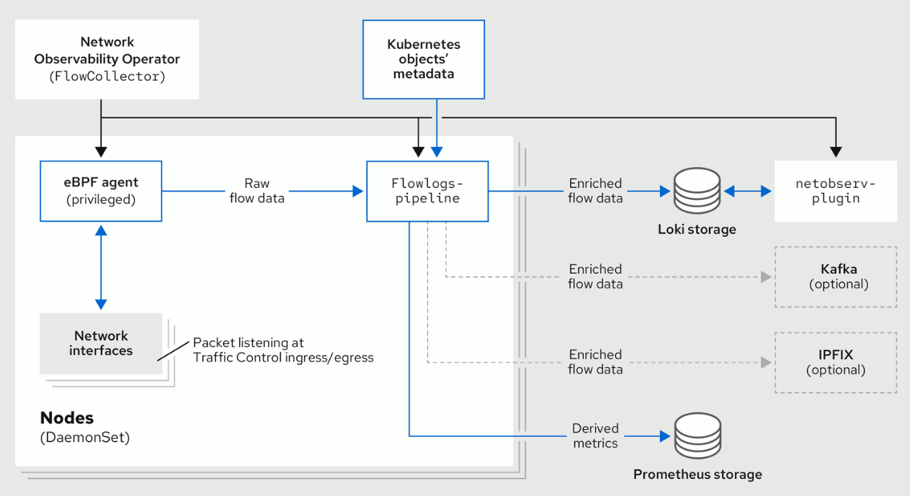

# Deploying Network Observability without Loki: an example with ClickHouse

By: Joël Takvorian

This blog post talks about a new feature that comes with Network Observability (NetObserv) 1.4: the ability to deploy it without Loki, coupled with exporting flows to an alternative storage. It clarifies what this change is and what it isn't. Then it demonstrates the optional configuration for consuming flows outside of Loki. Finally, it explores potential avenues for future development that this feature enables.

## A brief history

When we started the NetObserv project, one of the first architectural questions was, as you could expect, which storage solution to adopt. It has to be robust for a write-intensive application, with indexing capabilities on large data sets, scalable, while still allowing to run complex queries. It must be able to store structured logs and to extract time-series from them. Features like full-text indexing or data mutability aren't required. On top of that, the license must be compatible with our needs. We ended up with a shortlist that included Grafana Loki, OpenDistro, Influx and a few others. This was two years ago.

We also talked with other OpenShift teams having similar requirements, such as the Logging and the Distributed Tracing teams, and got some feedback to eventually rule out candidates with supposedly higher operational costs. And since the Logging team had already planned to invest in the Loki Operator, that was a nice opportunity to mutualize some efforts. Ok, let's be honest: that was a huge time saver especially for us, thanks so much folks!

## Why change now?

To be clear, **we aren't actually moving away from Loki**. Loki remains the one and only storage solution that we fully support at the moment, and our console plugin is entirely based on queries to Loki, in its _logql_ format. However, we have seen some people using NetObserv in a way that we didn't expect: for example, deploying it without Loki and configuring flow exporters with Kafka or IPFIX. Why? It turns out that they are more interested in the kube-enriched raw flow data than in the visualizations that NetObserv provides, and dealing with a new backend storage setup and maintenance is undesirable for them. Which, admittedly, is a quite reasonable argument.

To summarize, here's the deal:
- 💰: you save on operational aspects by not deploying Loki or any storage that would be new to you.
- 💔: you lose all the fancy dashboards that we build with so much love.
- 👩🏽‍🔧: you need to create your own consumer — Kafka or IPFIX — for doing anything with the exported flows: this is on your plate. But you will see below that it's nothing insurmountable.

## What is changed

Before 1.4, NetObserv was designed with Loki as a requirement. If you did not configure the Loki endpoint, our _flowlogs-pipeline_ component still sent flows to a default URL (and failed), and our console plugin still tried to query Loki (and failed). While the latter isn't too annoying for someone who doesn't intend to use the console plugin, the former could be the cause of performance degradation.

So this is what we did: **we "just" added an _enable_ knob for Loki**. With Loki turned off, _flowlogs-pipeline_ obviously doesn't try to send anything to it. And since the console plugin becomes useless without Loki, it isn't deployed anymore in that case.


_NetObserv architecture diagram: before and after 1.4_

As the diagram shows, if we choose to remove Loki, capabilities of the flows pipeline downstream remain:

- The ability to generate Prometheus metrics. Those metrics and their related dashboards are still accessible in the OpenShift Console, independently from our plugin.
- The ability to set up one or several exporters downstream the pipeline, such as via Kafka or to any IPFIX collector. This is then up to you to consume this data for any purpose.

## Example use case

Enough theory, let's put it into practice: we are going to set up NetObserv to export enriched flows to Kafka, and we will create a very simple consumer that stores them in a [ClickHouse database](https://clickhouse.com/). To do so, we created a sample application: [kafka-clickhouse-example](https://github.com/jotak/kafka-clickhouse-example/).

For simplicity, ClickHouse is deployed locally and [ktunnel](https://github.com/omrikiei/ktunnel) is used for reverse port-forwarding, magically bringing ClickHouse "into" the cluster. Obviously, you won't need `ktunnel` when using a real ClickHouse server.

### Prerequisites

- An OpenShift or Kubernetes cluster
- [NetObserv operator](https://github.com/netobserv/network-observability-operator) installed (do not install a `FlowCollector` yet).
- ClickHouse binary: grab it as explained in their [quick install guide](https://clickhouse.com/docs/en/install#quick-install).
- [ktunnel](https://github.com/omrikiei/ktunnel) binary.
- Some common tools such as `curl`, `kubectl`, `envsubst`...

> Note: These steps have been tested on a small OCP 4.13 cluster with 3 worker nodes. There is no one-size-fits-all configuration, so you might need to adapt some settings depending on your environment, such as [the Kafka configuration](https://github.com/jotak/kafka-clickhouse-example/blob/main/contrib/kafka.yaml).

### Start ClickHouse with ktunnel

Using the ClickHouse binary that you downloaded, run:

```bash
./clickhouse server
```

This starts a ClickHouse server that listens on `:9000` on your machine.

In another terminal, setup ktunnel:

```bash
ktunnel expose clickhouse 9000:9000
```

You should see something like this:

```
INFO[0000] Exposed service's cluster ip is: 172.30.115.68 
INFO[0000] ProgressDeadlineInSeconds is currently 600s. It may take this long to detect a deployment failure. 
INFO[0000] waiting for deployment to be ready           
INFO[0005] deployment "clickhouse" successfully rolled out 
INFO[0005] port forwarding to https://api.yourcluster.com:6443/api/v1/namespaces/default/pods/clickhouse-958f5476f-wwj6g/portforward 
INFO[0005] Waiting for port forward to finish           
INFO[0005] Forwarding from 127.0.0.1:28688 -> 28688
Forwarding from [::1]:28688 -> 28688 
INFO[2023-09-25 16:45:23.710] starting tcp tunnel from source 9000 to target localhost:9000 
```

It creates a `clickhouse` service in the `default` namespace, bridged to your local server.

### Prepare Kafka

The steps here are very similar to the [Kafka deployment script](https://github.com/netobserv/network-observability-operator/blob/release-1.4/.mk/development.mk#L54-L63) that we use in NetObserv for development and testing purposes. They use [Strimzi](https://strimzi.io/) - the upstream of AMQ Streams for OpenShift - to get Kafka in the cluster, and a topic named "flows-export" is pre-created. 

```bash
# Create a namespace for all the deployments
kubectl create namespace netobserv

# Install Strimzi (Kafka)
kubectl apply -f https://strimzi.io/install/latest?namespace=netobserv -n netobserv
export DEFAULT_SC=$(kubectl get storageclass -o=jsonpath='{.items[?(@.metadata.annotations.storageclass\.kubernetes\.io/is-default-class=="true")].metadata.name}') && echo "Using SC $DEFAULT_SC"
curl -s -L "https://raw.githubusercontent.com/jotak/kafka-clickhouse-example/main/contrib/kafka.yaml" | envsubst | kubectl apply -n netobserv -f -

# Wait that all pods are up and running, with the KafkaTopic being ready (a few minutes...)
kubectl wait --timeout=180s --for=condition=ready kafkatopic flows-export -n netobserv
kubectl get pods -n netobserv
```

When listing pods, you should see something like this:

```
NAME                                             READY   STATUS    RESTARTS   AGE
kafka-cluster-entity-operator-5f5bc5675b-lpmmc   3/3     Running   0          3m33s
kafka-cluster-kafka-0                            1/1     Running   0          4m47s
kafka-cluster-kafka-1                            1/1     Running   0          4m47s
kafka-cluster-kafka-2                            1/1     Running   0          4m47s
kafka-cluster-zookeeper-0                        1/1     Running   0          5m15s
kafka-cluster-zookeeper-1                        1/1     Running   0          5m15s
kafka-cluster-zookeeper-2                        1/1     Running   0          5m15s
strimzi-cluster-operator-6bdcd796f6-qsc4g        1/1     Running   0          17m
```

### Prepare NetObserv

Assuming you already installed the operator, now you must create a `FlowCollector` resource to start sending flow logs to Kafka. For the purpose of this article, we don't install and configure Loki but be informed that you can export flows to one or multiple endpoints and save them into Loki in parallel according to your needs.

> Note: we configure here Kafka as an **exporter**, which is unrelated to the `spec.deploymentModel: KAFKA` / `spec.kafka` settings: those ones correspond to NetObserv's internal flows processing configuration (NetObserv being both the producer and the consumer), whereas `spec.exporters` relates to NetObserv being just the producer, leaving up to us how we want to consume that data.

```bash
cat <<EOF | kubectl apply -f -
apiVersion: flows.netobserv.io/v1beta1
kind: FlowCollector
metadata:
  name: cluster
spec:
  namespace: netobserv
  deploymentModel: DIRECT
  loki:
    enable: false
  exporters:
    - type: KAFKA
      kafka:
        address: "kafka-cluster-kafka-bootstrap.netobserv"
        topic: flows-export
EOF
```

The Kafka `address` and `topic` configured here match what we deployed in the previous step.

At this point, flows should be generated, collected, enriched and sent to Kafka but with no consumer on the other end. 


### Run the consumer

Almost all pieces are up and running, now let's bring the missing one: a Kafka consumer that sends flows to ClickHouse. This is [the sample application](https://github.com/jotak/kafka-clickhouse-example/) that we mentioned above.

To deploy it:

```bash
kubectl apply -f https://raw.githubusercontent.com/jotak/kafka-clickhouse-example/main/contrib/deployment.yaml -n netobserv
```

Now, as everything works as expected (everything always works as expected), the precious records begin flowing into your database.

### Check ClickHouse content

Let's make sure the database is being populated. We can use the ClickHouse client for that purpose. From where you downloaded the `clickhouse` binary:

```bash
./clickhouse client

myhost :) SELECT fromUnixTimestamp(intDiv(start,1000)) AS start,fromUnixTimestamp(intDiv(end,1000)) as end,src_ip,dst_ip,src_name,dst_name,src_kind,dst_kind,src_namespace,dst_namespace,bytes,packets FROM flows LIMIT 100

SELECT
    fromUnixTimestamp(intDiv(start, 1000)) AS start,
    fromUnixTimestamp(intDiv(end, 1000)) AS end,
    src_ip,
    dst_ip,
    src_name,
    dst_name,
    src_kind,
    dst_kind,
    src_namespace,
    dst_namespace,
    bytes,
    packets
FROM flows
LIMIT 100

Query id: 21f7ccfc-59ec-4e80-b601-9f5220bf4ffb


┌───────────────start─┬─────────────────end─┬─src_ip──────┬─dst_ip──────┬─src_name─────────┬─dst_name────────────────────────┬─src_kind─┬─dst_kind─┬─src_namespace────────┬─dst_namespace─────┬─bytes─┬─packets─┐
│ 2023-09-26 10:10:32 │ 2023-09-26 10:10:32 │ 10.128.2.13 │ 10.128.2.10 │ prometheus-k8s-0 │ router-default-559c74465f-fh8n6 │ Pod      │ Pod      │ openshift-monitoring │ openshift-ingress │  2649 │       1 │
└─────────────────────┴─────────────────────┴─────────────┴─────────────┴──────────────────┴─────────────────────────────────┴──────────┴──────────┴──────────────────────┴───────────────────┴───────┴─────────┘
┌───────────────start─┬─────────────────end─┬─src_ip──────┬─dst_ip──────┬─src_name──────────────────────────────────┬─dst_name─┬─src_kind─┬─dst_kind─┬─src_namespace─┬─dst_namespace─┬─bytes─┬─packets─┐
│ 2023-09-26 10:10:31 │ 2023-09-26 10:10:31 │ 10.0.144.30 │ 10.0.40.195 │ ip-10-0-144-30.eu-west-3.compute.internal │          │ Node     │          │               │               │    66 │       1 │
└─────────────────────┴─────────────────────┴─────────────┴─────────────┴───────────────────────────────────────────┴──────────┴──────────┴──────────┴───────────────┴───────────────┴───────┴─────────┘
┌───────────────start─┬─────────────────end─┬─src_ip──────┬─dst_ip──────┬─src_name────────────────┬─dst_name──────────────┬─src_kind─┬─dst_kind─┬─src_namespace─┬─dst_namespace─┬─bytes─┬─packets─┐
│ 2023-09-26 10:10:30 │ 2023-09-26 10:10:30 │ 10.129.0.55 │ 10.129.2.21 │ flowlogs-pipeline-hz8mz │ kafka-cluster-kafka-1 │ Pod      │ Pod      │ netobserv     │ netobserv     │  4309 │       4 │
└─────────────────────┴─────────────────────┴─────────────┴─────────────┴─────────────────────────┴───────────────────────┴──────────┴──────────┴───────────────┴───────────────┴───────┴─────────┘
┌───────────────start─┬─────────────────end─┬─src_ip───────┬─dst_ip──────┬─src_name───────────────────────────────────┬─dst_name──────────────────────────────────┬─src_kind─┬─dst_kind─┬─src_namespace─┬─dst_namespace─┬─bytes─┬─packets─┐
│ 2023-09-26 10:10:31 │ 2023-09-26 10:10:31 │ 10.0.200.252 │ 10.0.211.51 │ ip-10-0-200-252.eu-west-3.compute.internal │ ip-10-0-211-51.eu-west-3.compute.internal │ Node     │ Node     │               │               │   124 │       1 │
└─────────────────────┴─────────────────────┴──────────────┴─────────────┴────────────────────────────────────────────┴───────────────────────────────────────────┴──────────┴──────────┴───────────────┴───────────────┴───────┴─────────┘
┌───────────────start─┬─────────────────end─┬─src_ip──────┬─dst_ip──────────┬─src_name──────────────────────────────────┬─dst_name─┬─src_kind─┬─dst_kind─┬─src_namespace─┬─dst_namespace─┬─bytes─┬─packets─┐
│ 2023-09-26 10:10:33 │ 2023-09-26 10:10:33 │ 10.0.144.30 │ 169.254.169.254 │ ip-10-0-144-30.eu-west-3.compute.internal │          │ Node     │          │               │               │   304 │       1 │
└─────────────────────┴─────────────────────┴─────────────┴─────────────────┴───────────────────────────────────────────┴──────────┴──────────┴──────────┴───────────────┴───────────────┴───────┴─────────┘
┌───────────────start─┬─────────────────end─┬─src_ip──────┬─dst_ip──────┬─src_name─────────┬─dst_name──────────────────────────────────┬─src_kind─┬─dst_kind─┬─src_namespace────────┬─dst_namespace─┬─bytes─┬─packets─┐
│ 2023-09-26 10:10:34 │ 2023-09-26 10:10:34 │ 10.129.2.14 │ 10.0.211.51 │ prometheus-k8s-1 │ ip-10-0-211-51.eu-west-3.compute.internal │ Pod      │ Node     │ openshift-monitoring │               │    66 │       1 │
└─────────────────────┴─────────────────────┴─────────────┴─────────────┴──────────────────┴───────────────────────────────────────────┴──────────┴──────────┴──────────────────────┴───────────────┴───────┴─────────┘
┌───────────────start─┬─────────────────end─┬─src_ip──────┬─dst_ip─────┬─src_name────────────────────────────┬─dst_name──────────────────────────────────┬─src_kind─┬─dst_kind─┬─src_namespace────────────────┬─dst_namespace─┬─bytes─┬─packets─┐
│ 2023-09-26 10:10:33 │ 2023-09-26 10:10:33 │ 10.129.0.13 │ 10.129.0.2 │ controller-manager-565b9fb799-vz9w9 │ ip-10-0-211-51.eu-west-3.compute.internal │ Pod      │ Node     │ openshift-controller-manager │               │    66 │       1 │
└─────────────────────┴─────────────────────┴─────────────┴────────────┴─────────────────────────────────────┴───────────────────────────────────────────┴──────────┴──────────┴──────────────────────────────┴───────────────┴───────┴─────────┘
```

Here we go!


### OK, so what's in the consumer app, really?

It's pretty simple, and you don't need to be an expert in Go to read that code, so you can easily adapt it to your needs.

> Note: all the code snippets below are taken from [this repository](https://github.com/jotak/kafka-clickhouse-example/).

It reads messages from Kafka:

```
// ... running in a loop ...

		m, err := r.ReadMessage(context.Background())
		if err != nil {
			break
		}
		if flow, err := decode(m.Value); err != nil {
			klog.Errorf("failed to decode: %v", err)
		} else {
			out <- flow
		}

// ...

func decode(b []byte) (map[string]interface{}, error) {
	var rawLine map[string]interface{}
	err := json.Unmarshal(b, &rawLine)
	return rawLine, err
}
```

It gets fields from deserialized JSON:

```
	if v, ok := rawFlow[fields.Bytes]; ok {
		bytes = int(v.(float64))
	}
	if v, ok := rawFlow[fields.Packets]; ok {
		packets = int(v.(float64))
	}
	// etc.
```

And it executes the insert query:

```
	if err := conn.Exec(
		context.Background(),
		"INSERT INTO flows VALUES (?,?,?,?,?,?,?,?,?,?,?,?)",
		flowStart, flowEnd, srcAddr, dstAddr, srcName, dstName, srcKind, dstKind, srcNamespace, dstNamespace, bytes, packets,
	); err != nil {
		klog.Warnf("Insertion error: %v", err)
	}
```

That's about it.

It only maps a subset of the available flow data. You can check the [JSON reference](https://docs.openshift.com/container-platform/latest/networking/network_observability/json-flows-format-reference.html) to learn about all the fields.

If you want to adapt it in a secure environment, you need to configure the [kafka-go client](https://github.com/segmentio/kafka-go#tls-support) for TLS/mTLS/SASL, and the [clickhouse-go client](https://github.com/ClickHouse/clickhouse-go#tlsssl) for TLS and setting up credentials.

## What's next?

We hope that you enjoyed reading this post and that it opens up new horizons about what you can do with NetObserv.

What are our next steps regarding storage? To be honest, nothing yet acted in the roadmap at the time of writing, and this is why we'd love to get your feedback.

Some ideas: we could improve the storage-less experience by still enabling our console plugin, with the same dashboards, flow table, topology as with Loki - the only difference being that it would be limited in terms of querying past data, only live flows would be accessible. That would probably involve using Kafka as a flow forwarder.

We could also investigate other storage options. But as you can imagine, maintaining several options in parallel comes at a cost. Especially as the query languages are far from being standardized in the observability landscape. Well... at least at the moment: we keep an eye on an initiative that could be a game changer for us: [a query standard for observability](https://docs.google.com/document/d/1JRQ4hoLtvWl6NqBu_RN8T7tFaFY5jkzdzsB9H-V370A/edit). Think like OpenTelemetry, but for queries. How nice would it be?

Finally, if you feel inspired by this flow consumer app, but you would expect something directly usable out of the box, production-ready... Then, why not collaborate in the open? We would love to see open-source contributions on this field. We could for instance create new repositories for community-maintained connectors, hosted on NetObserv's GitHub, and would of course provide all the help and expertise that we can, if there is demand for that.

Any other ideas, or something to say? Don't hesitate to comment or ask questions on [our discussion board](https://github.com/netobserv/network-observability-operator/discussions)! A thread has been created specifically for this blog post: [here](https://github.com/netobserv/network-observability-operator/discussions/438).
