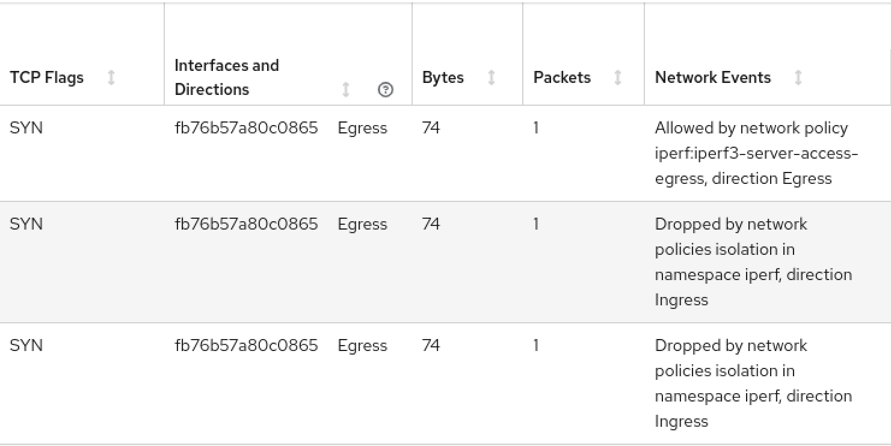
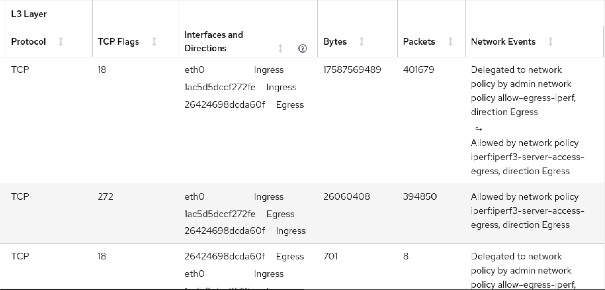
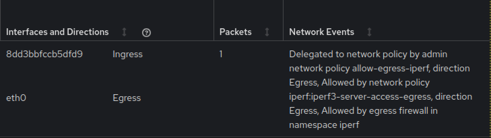
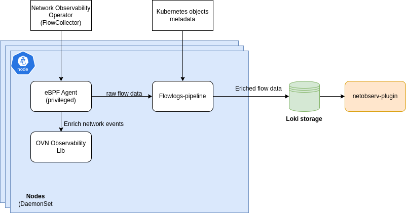

# <div align="center">Monitoring OVN Networking Events using Network Observability</div>

<p align="center">
  
</p>

By: Mohamed S. Mahmoud

Network security and performance maintenance crucially depend on monitoring network events triggered
by OVN (Open Virtual Network), including network policies, admin network policies, and egress firewalls.
You can achieve this using network observability eBPF agent, which runs in the Linux kernel and can trace
various network activities with minimal performance overhead, allowing you to observe and capture detailed
information about network traffic and events in real-time.

## Key Components for Network Observability with eBPF

1- eBPF network events monitoring `Kprobe` eBPF hook

Network events monitoring using eBPF kernel probes (kprobes) provides deep, kernel-level insights into
network stack behavior. The NetObserv eBPF agent leverages the [psample_sample_packet](https://github.com/torvalds/linux/blob/e32cde8d2bd7d251a8f9b434143977ddf13dcec6/net/psample/psample.c#L363) entry point to efficiently
capture packet metadata and identify policy violations with minimal overhead.

The hook implemented in the NetObserv eBPF agent can capture multiple events within the same network flow
and generate a list of network events that applied to that flow, with a limit of up to four events per flow.

2- [ovn-kubernetes observability library](https://github.com/ovn-org/ovn-kubernetes/tree/master/go-controller/observability-lib)

The eBPF agent captures network events as an array of bytes, which is not very user-friendly.
This library provides functionality to convert these events into human-readable strings, making
them easily understandable for customers.

## Use Cases for Network Observability with eBPF

1. Monitor [network policies](https://kubernetes.io/docs/concepts/services-networking/network-policies/)

When you apply OVN network policies (like Kubernetes NetworkPolicy), eBPF agent can monitor allowed
and/or blocked traffic, detecting whether packets are allowed or blocked based on network policies.
An example of these network policies follows:

```yaml
kind: NetworkPolicy
apiVersion: networking.k8s.io/v1
metadata:
  name: iperf3-server-access-ingress
  namespace: iperf
spec:
  podSelector:
    matchLabels:
      app: iperf3-server
  ingress:
  - ports:
    - port: 5501
    from:
    - podSelector:
        matchLabels:
          app: iperf3-client
---
kind: NetworkPolicy
apiVersion: networking.k8s.io/v1
metadata:
  name: iperf3-server-access-egress
  namespace: iperf
spec:
  podSelector:
    matchLabels:
      app: iperf3-client
  egress:
  - ports:
    - port: 5201
      protocol: TCP
  podSelector: {}
  policyTypes:
  - Egress
```



_Screen capture of the traffic flows in the NetObserv console plugin,
with a network events column showing traffic allowed or denied by network policy rules_

2. Monitor [admin network Policies](https://network-policy-api.sigs.k8s.io/api-overview/#the-adminnetworkpolicy-resource)

An Admin network Policy is a high-level security policy designed to provide cluster administrators with
more control over network traffic in Kubernetes environments.
eBPF agent can monitor allowed/blocked Traffic: Detect whether packets are allowed or blocked based on
admin network policies.

An Example of admin network policy and egress network policy to show multiple events use case :

```yaml
apiVersion: policy.networking.k8s.io/v1alpha1
kind: AdminNetworkPolicy
metadata:
  name: allow-egress-iperf
spec:
  egress:
  - action: Pass
    to:
    - namespaces: {}
  priority: 10
  subject:
    namespaces:
      matchLabels:
        kubernetes.io/metadata.name: iperf

---

kind: NetworkPolicy
apiVersion: networking.k8s.io/v1
metadata:
  name: iperf3-server-access-egress
  namespace: iperf
spec:
  podSelector:
    matchLabels:
      app: iperf3-client
  egress:
  - ports:
    - port: 5201
      protocol: TCP
  podSelector: {}
  policyTypes:
  - Egress

```



_Screen capture of the traffic flows in the NetObserv console plugin, with a network events column
showing the delegation by the admin policy resulting in traffic allowed or denied_

3. Monitor [egress firewall traffic](https://docs.openshift.com/container-platform/4.17/networking/network_security/egress_firewall/configuring-egress-firewall-ovn.html)

For egress firewall monitoring, the eBPF agent can do the following:

Trace egress traffic: Track outbound traffic and see whether it adheres to egress firewall rules.
Detect unauthorized outbound connections: You can flag outbound traffic that violates egress rules.

In the following example, there are three events, one for network policy, another for admin network policy and the third for egress firewall

```yaml
apiVersion: k8s.ovn.org/v1
kind: EgressFirewall
metadata:
  name: default
  namespace: iperf
spec:
  egress:
  - to:
      cidrSelector: 8.8.8.8/24
    type: Allow
  - to:
      cidrSelector: 0.0.0.0/0
    type: Deny

---
apiVersion: policy.networking.k8s.io/v1alpha1
kind: AdminNetworkPolicy
metadata:
  name: allow-egress-iperf
spec:
  egress:
  - action: Pass
    to:
    - namespaces: {}
  priority: 10
  subject:
    namespaces:
      matchLabels:
        kubernetes.io/metadata.name: iperf

---
kind: NetworkPolicy
apiVersion: networking.k8s.io/v1
metadata:
  name: iperf3-server-access-egress
  namespace: iperf
spec:
  podSelector:
    matchLabels:
      app: iperf3-client
  egress:
  - ports:
    - port: 5201
      protocol: TCP
  podSelector: {}
  policyTypes:
  - Egress

```



_Screen capture of the traffic flows in the NetObserv console plugin,
with a network events column showing traffic allowed or denied by egress firewall rules_

## Integration with the Network Observability stack

- `eBPF Agent`:

The agent manages a new `kprobe` hook through a configuration option.
It also registers with the OVN observability library, allowing eBPF-generated events to be enriched
into meaningful strings.

- `Agent User Space`:

The Agent user space handles the aggregation of events for processing.

- `Flowlogs Pipeline`:

Generated flows are transmitted over gRPC to the flowlogs-pipeline,
where the flow content is enriched with Kubernetes metadata.

- `Loki storage and Console-plugin`:

The enriched flows are then sent to Loki storage, making them available for
consumption by the NetObserv console plugin. The new events are displayed in the console.

- `New Filtering Capability`:

A filter is introduced to filter flows based on network event enrichment.



## Configuration

- Enable the `OVNObservability` feature in the `FeatureGate` custom resource.

```shell
$ oc edit featuregates.config.openshift.io cluster
```

```yaml
spec:
  featureSet: TechPreviewNoUpgrade
enabled:
- name: OVNObservability
```

Note:
 The above FeatureGate might be on by default at the time this feature becomes GA.

- Enable Network events in the Network Observability `FlowCollector` custom resource.

```yaml
apiVersion: flows.netobserv.io/v1beta2
kind: FlowCollector
metadata:
  name: cluster
spec:
  agent:
    type: eBPF
    ebpf:
      sampling: 1
      privileged: true
      features:
      - "NetworkEvents"
```

Note:

- in the above example we set `sampling` to 1 to be able to capture all network events without missing any.

- `privileged` is set to `true` because the `OVN observability` library needs to access local OVS socket and OVN databases.

## Availability

The networking events monitoring feature is available as Developer Preview for OCP 4.17 z-stream and NetObserv release 1.7,
and is planned for GA in OCP 4.18 and NetObserv release 1.8.

## Conclusion

Relying on eBPF technology for network observability, particularly in environments governed by OVN network policies and egress firewalls,
offers deep, real-time insights into network traffic.
Users can monitor policy compliance, detect violations, and track detailed network flows.
This helps you maintain a secure, high-performing network environment.

## Feedback

We hope you liked this article !
Netobserv is an OpenSource project [available on github](https://github.com/netobserv).
Feel free to share your [ideas](https://github.com/netobserv/network-observability-operator/discussions/categories/ideas), [use cases](https://github.com/netobserv/network-observability-operator/discussions/categories/show-and-tell) or [ask the community for help](https://github.com/netobserv/network-observability-operator/discussions/categories/q-a).
