# Network Observability Real-Time Per Flow Packets Drop


By: Amogh RD, Julien Pinsonneau and Mohamed S. Mahmoud

In OCP ensuring efficient packet delivery is crucial for maintaining smooth
communication between applications. However, due to various factors such
as network congestion, misconfigured systems, or hardware limitations,
packets might occasionally get dropped. Detecting and diagnosing these
packet drops is essential for optimizing network performance and
maintaining a high quality of service.
This is where eBPF (extended Berkeley Packet Filter) comes into play
as a powerful tool for real-time network performance analysis.
In this blog, we'll take a detailed look at how network observability
using eBPF can help in detecting and understanding packet drops,
enabling network administrators and engineers to proactively
address network issues.

## Detecting Packet Drops with eBPF

eBPF enables developers to set up tracepoints at key points within the network
stack. These tracepoints can help intercept packets at specific events,
such as when they are received, forwarded, or transmitted.
By analyzing the events around packet drops, you can gain insight into the
reasons behind them.
In network observability we are using `tracepoint/skb/kfree_skb` tracepoint hook
to detect when packets are dropped, the reason for packets drop and reconstruct
the flow and enrich it with drop metadata such as packets and bytes statistics,
for TCP only the latest TCP connection state as well as the TCP connection flags
are added.
Packets drop ebpf hook supports TCP, UDP, SCTP, ICMPv4 and ICMPv6 protocols.
There are two main categories for packet drops, core subsystem drops which cover
most of the host drop reasons; for the complete list please refer to
https://github.com/torvalds/linux/blob/master/include/net/dropreason-core.h
and OVS based drops which is a recent kernel enhancement; for reference please 
checkout the following link
https://git.kernel.org/pub/scm/linux/kernel/git/netdev/net-next.git/tree/net/openvswitch/drop.h.

## Kernel support

The drop cause tracepoint API is a recent kernel feature only available from RHEL9.2 
kernel version. Older kernel will ignore this feature if its configured.

## How to enable packet drops

By default packets drop detection is disabled because it requires
`privileged` access to the host kernel. To enable the feature we need 
to create a flowcollector object with the following fields enabled in eBPF config
section

```yaml
apiVersion: flows.netobserv.io/v1beta1
kind: FlowCollector
metadata:
  name: cluster
spec:
  agent:
    type: EBPF
    ebpf:
      privileged: true
      features:
        - PacketsDrop
```

## A quick tour in the UI

Once `PacketsDrop` feature enabled, the Console plugin will automatically adapt to provide
additionnal filters and show informations across views.

Open your OCP Console and move to 
`Administrator view` -> `Observe` -> `Network Traffic` page as usual.

A new query option will show to filter flows by their drop status:

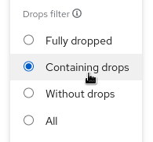
- Fully dropped shows the flows that have 100% dropped packets
- Containing drops shows the flows having at least one packet dropped
- Without drops show the flows having 0% dropped packets
- All shows everything

Two new filters, `Packet drop TCP state` and `Packet drop latest cause` will be available 
in the common section:


The first one will allow you to set TCP state filter:

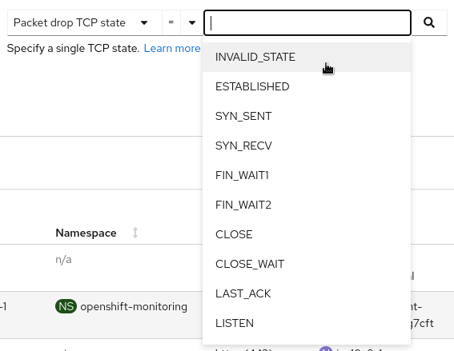

- A _LINUX_TCP_STATES_H number like 1, 2, 3
- A _LINUX_TCP_STATES_H TCP name like `ESTABLISHED`, `SYN_SENT`, `SYN_RECV`

The second one will let you pick causes to filter on:

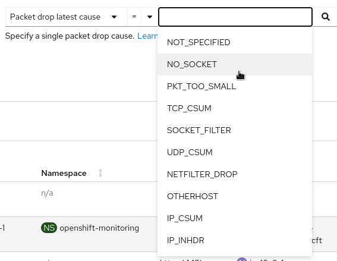

- A _LINUX_DROPREASON_CORE_H number like 2, 3, 4
- A _LINUX_DROPREASON_CORE_H SKB_DROP_REASON name like `NOT_SPECIFIED`, 
`NO_SOCKET`, `PKT_TOO_SMALL`

### Overview
New graphs will be introduced in the `advanced options` -> `manage panels` popup:


- Top X flow dropped rates stacked
- Total dropped rate
- Top X dropped state
- Top X dropped cause
- Top X flow dropped rates stacked with total

Select the desired graphs to render them in the overview panel:

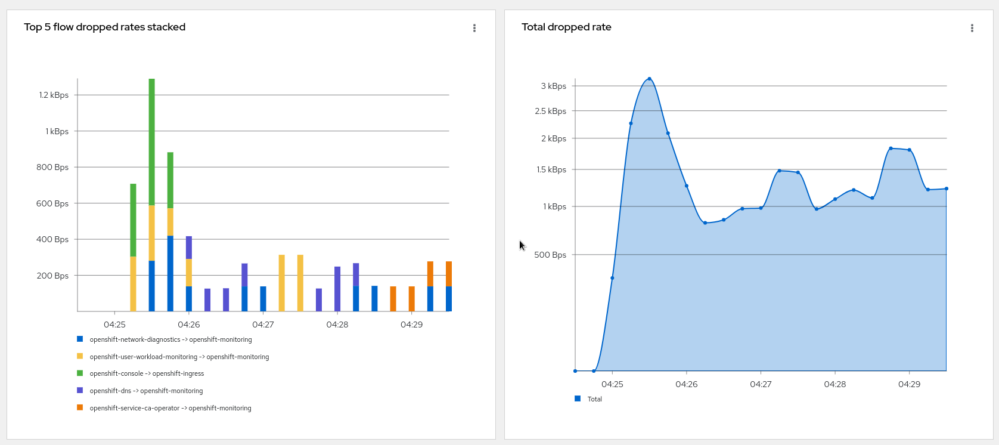
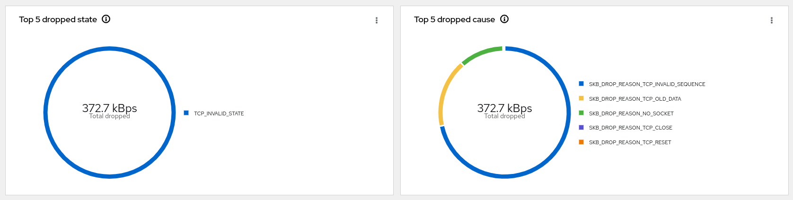
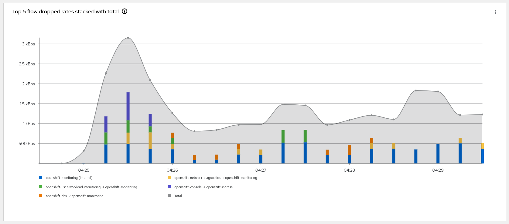

Note that you can compare the top drops against total dropped or total traffic in the 
last graph using the kebab menu
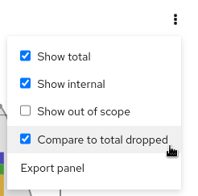

### Traffic flows
The table view shows the number of `bytes` and `packets` sent in green and the related numbers
dropped in red. On top of that, you can get details about the drop in the side panel that will
bring you to the proper documentation.

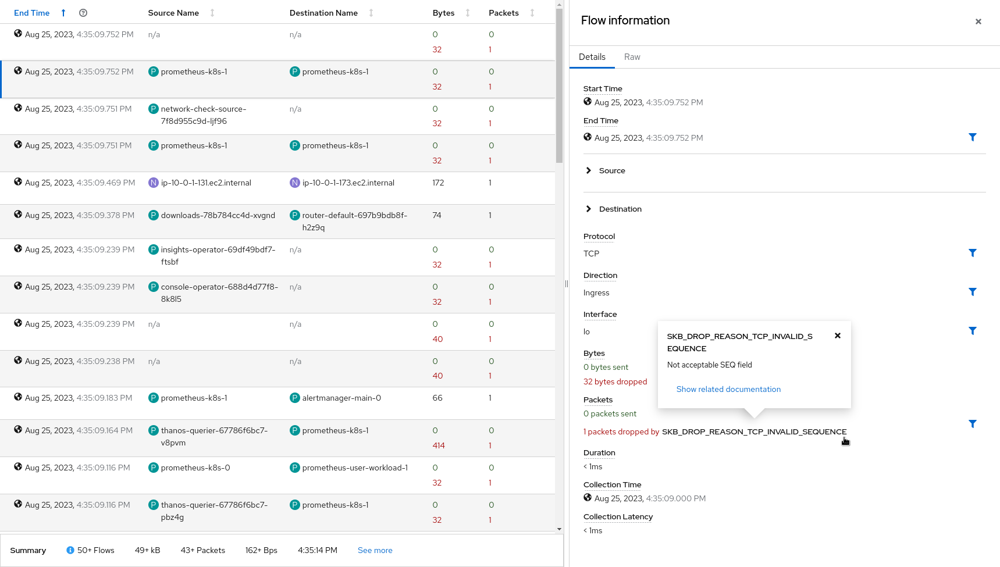

### Topology
Last but not least, the topology view display edges containing drops in red. That's useful 
especially when digging on a specific drop reason between two resources.

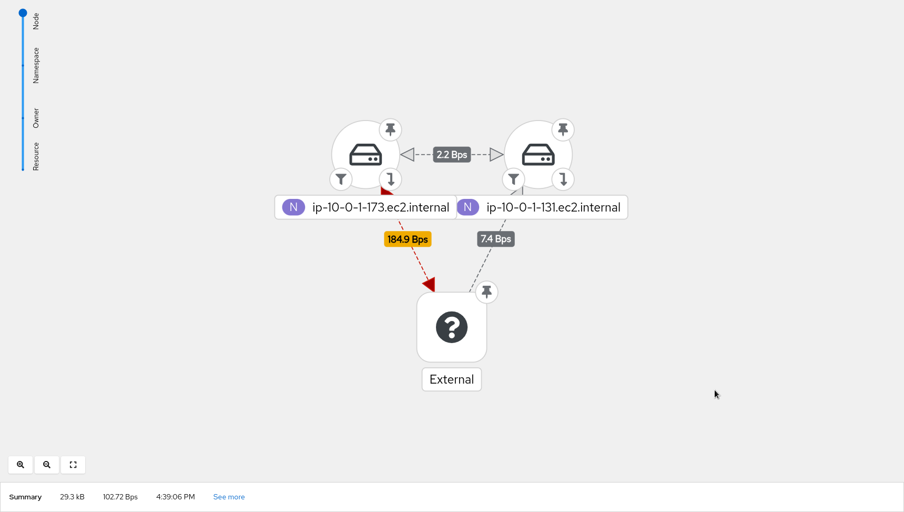

## Potential use-case scenarios
- `NO_SOCKET` drop reason: There might be packet drops observed due to the destination port being not reachable. This can be emulated by running a curl command on a node to an unknown port `while : ; do curl <another nodeIP>:<unknown port>; sleep 5; done`.
The drops can be observed on the console as seen below:

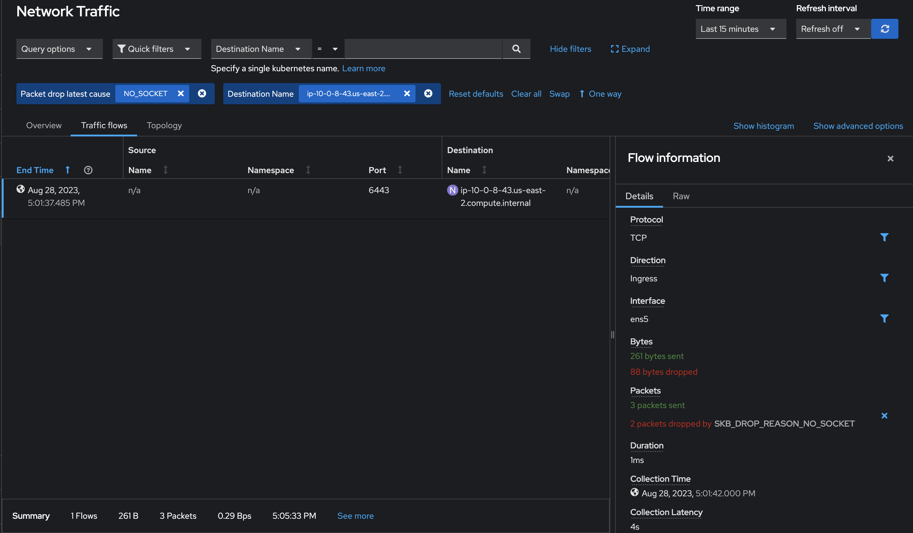

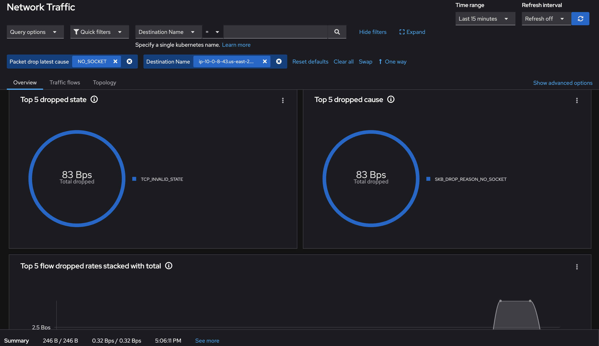

- `OVS_DROP_LAST_ACTION` drop reason: OVS packet drops can be observed on RHEL9 and above. It
can be emulated by running the iperf command with network-policy set to drop on a particular port. These drops can be observed on the console as seen below:

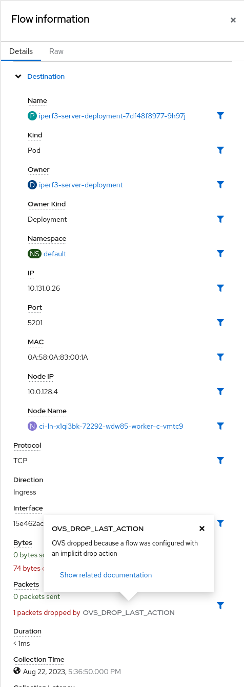


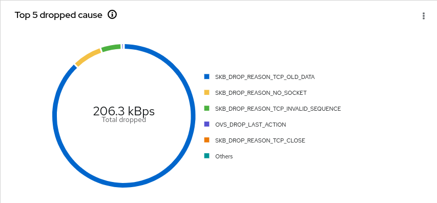

## Resource impact of using PacketDrop
The performance impact of using PacketDrop enabled with the Network Observability operator
is on the flowlogs-pipeline(FLP) component. FLP uses higher CPU(about a 22% increase) and more memory(about a 9% increase) than baseline whereas there is not much considerable impact(less than 3% increase) on other components of the operator.
