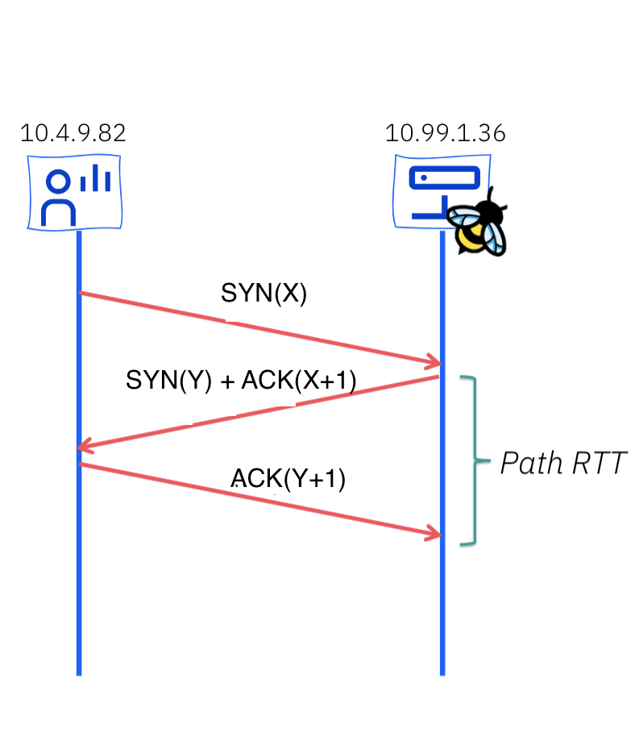

# Network Observability TCP Handshake Round Trip Time Developer Preview


By: Dushyant Behl and Julien Pinsonneau

In OCP, ensuring efficient packet delivery is crucial for maintaining smooth
communication between applications. However, due to various factors such
as network congestion, misconfigured systems, or hardware limitations,
connections may become slow, impacting overall performance.
Round Trip Time (RTT) is the duration, usually measured in milliseconds, from when
a client sends a request to when it receives a response from a server.
Mesuring RTT is important for monitoring network health and diagnosing issues.

## RTT calculation using eBPF

RTT calculations between a server and a client requires sending a packet from the
server to the client and then back from client to the server.
RTT is then calculated as the time measured between sending and receiving the packet back.
RTT calculations gives a very good estimate on how the network is behaving in between
two hops. In netobsev ebpf-agent, we use the same idea for calculating RTT but we do it
for TCP connections which is also called TCP Based RTT calculations. 



In TCP, as shown in the diagram above, at the start of the connection,
a client sends a SYN packet to the server with a random sequence number (X) and the 
server responds with an ACK (X+1), along with the ACK, the server also sends a SYN
packet of its own with a different sequence number (Y) to which client resonds
with an ack (Y+1). This is what is called a three-way-handshake for establishing a 
TCP connection and we use these SYN/ACK packet pairs at the start of the connection to
calculate RTT between the server and the client.

In our implementation,

1. ebpf-agent keeps track of the SYN/ACK packet pairs crossing through the agent at the start of every TCP connection.

2. For every SYN packet that gets detected at the `flow_monitor` hookpoint, the agent will capture standard 4-tuple information (src/dst ip addresses and ports), packet sequence identifier and the interface it was detected on and saves it into a `flow_sequences` hashmap along with the timestamp of the packet detection.

1. Now for every ACK packet that gets detected by the agent at the `flow_monitor` hookpoint, it checks by reversing the flow direction, if the 4-tuple information, the identifier (sequence id of ACK - 1) along with the interface id, is present in the `flow_sequences` hashmap, if so it will calculate the handshake RTT as,
`rtt = ack-timestampack - syn-timestamp(from map)`

We present the calculated RTT as part of the flow log information exported by the agent. Agent will report actual RTT for the flow if it is calculated and present (for tcp handshake packets), zero if it is not calculated (for non handshake packets or any other protocol)

Please note that the RTT calculations can be done on both the endpoints (client and server) as both send a SYN and receive an ACK in the 3-way TCP handshake. 

Currently our approcah calculates RTT only for the TCP handshakes packets so flows which are non TCP will not show RTT information. 
Also, in the ebpf-agent we implement a sampling strategy which keeps one out of n (configurable) packets in the flow, so the design of RTT calculations currently require a high sampling rate to be used as a low sampling strategy can miss either SYN, ACK or both packets leading to no calculation of RTT.

We plan to implement a different sampling strategy to bypass this issue and implement support for more protocols in the future.

## Potential Use Cases

Flow RTT capture from eBPF `flow_monitor` hookpoint can serve various purposes:

- Network Monitoring: Gain insights into TCP handshakes, helping
  network administrators identify unusual patterns, potential bottlenecks, or
  performance issues.

- Troubleshooting: Debug TCP-related issues by tracking latency and identifying
  misconfigurations.

## How to enable RTT

To enable this feature we need to create a flow collector object with the following
fields enabled in eBPF config section as below:

```yaml
apiVersion: flows.netobserv.io/v1beta1
kind: FlowCollector
metadata:
  name: cluster
spec:
  agent:
    type: EBPF
    ebpf:
      sampling: 1
      features:
        - FlowRTT
```

Sampling 1 will ensure we capture both SYN and ACK packets to calculate RTT.

## A quick tour in the UI

Once the `FlowRTT` feature is enabled, the OCP console plugin automatically adapts
to provide additional filter and show information across Netflow Traffic page views.

Open your OCP Console and move to
`Administrator view` -> `Observe` -> `Network Traffic` page as usual.

A new filter, `Flow RTT` is available in the common section:


It will allow you capture any flow having a RTT more than a specific time in nanoseconds.

### Overview

New graphs are introduced in the `advanced options` -> `manage panels` popup:


- Top X average flow RTT (donut)
- Top X average flow RTT (lines)


These two graphs will help you to identify the slowest TCP flows and their trends
over time. Use the filters to drill down into specific pods, namespaces or nodes.

### Traffic flows

The table view shows the `Flow RTT` in both column and side panel.


### Topology

Last but not least, the topology view displays average `RTT` latency on edges.
Clicking on a node or an edge will allow you to see per direction metrics and
the related graph.


### Future improvments

Here is a non exhaustive list of future improvements coming for a full featured
Round Trip Time analysis:

- Max / P90 / P99 graphs
- Latest / Max RTT in topology view
- Prometheus metrics and alerting

## Feedback

We hope you liked this article !

Netobserv is an OpenSource project [available on github](https://github.com/netobserv).
Feel free to share your [ideas](https://github.com/netobserv/network-observability-operator/discussions/categories/ideas), [use cases](https://github.com/netobserv/network-observability-operator/discussions/categories/show-and-tell) or [ask the community for help](https://github.com/netobserv/network-observability-operator/discussions/categories/q-a).
