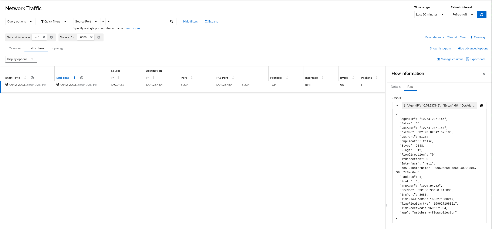

# Network Observability secondary interface support

By: Mohamed S. Mahmoud

Network observability for secondary interfaces with Multus and SR-IOV plugins
in Kubernetes can be a complex task, but it's crucial for monitoring and
troubleshooting network issues in a Kubernetes cluster.

## Overview of how you can achieve network observability for secondary interface

<p align="center">
  
</p>

1. **Multus CNI Plugin**: Multus is a CNI (Container Network Interface) plugin
    for Kubernetes that allows you to attach multiple network interfaces to pods.
    In Openshift Multus is used to attach SR-IOV vfs to your pods.
    For reference and more details about Multus CNI please refer to
   [Multus OCP documentation](https://docs.openshift.com/container-platform/4.13/networking/multiple_networks/understanding-multiple-networks.html)

2. **SR-IOV Plugin**: SR-IOV (Single Root I/O Virtualization) is a technology that
   enables the partitioning of a single PCIe network adapter into multiple virtual
   functions (VFs).
   Pods can then use these VFs as secondary network interfaces, achieving higher
   network performance and isolation.
   For reference and more details about SR-IOV pls refer to
   [SR-IOV OCP documentation](https://docs.openshift.com/container-platform/4.13/networking/hardware_networks/configuring-sriov-device.html)

## Network observability eBPF agent enhancements to support the secondary interface

To ensure network observability for secondary interfaces in this setup, and make
the eBPF agent network namespace aware, eBPF agents need to implement the
following steps:

1. Using fsNotify Package:
   Utilize the fsNotify package to be notified when new network namespaces are created.
   This allows the eBPF agent to keep track of network namespace creation events.

2. Using netlink Package:
   Employ the netlink package to register when the network interfaces are created or deleted
   within each network namespace. This will enable the eBPF agent to monitor the interface
   changes on a per-namespace basis.

3. Attach/Detach eBPF TC Hooks:
   Add support to the eBPF agent to attach and detach eBPF Traffic Control (TC) hook
   for network interfaces in non-default network namespaces. This step is crucial for
   monitoring and controlling network traffic within these network namespaces.

## Configuring SR-IOV objects

1. Install the SR-IOV operator in the environment.
2. Identify the SR-IOV capable device on the node.
3. Label the node which has SR-IOV interface with the label
  `feature.node.kubernetes.io/network-sriov.capable=true`
4. Create the `SriovNetworkNodePolicy` object

```yaml
apiVersion: sriovnetwork.openshift.io/v1
kind: SriovNetworkNodePolicy
metadata:
  name: mypolicy
  namespace: openshift-sriov-network-operator
spec:
  resourceName: netdeviceresource
  nodeSelector:
    feature.node.kubernetes.io/network-sriov.capable: "true"
  priority: 99
  numVfs: 50
  nicSelector:
    pfNames: ["ens7f0np0#25-49"]
  deviceType: netdevice
```

5. Create the `SriovNetwork` object. This will create net-attach-def in
  the `openshift-sriov-network-operator` namespace.

```yaml
apiVersion: sriovnetwork.openshift.io/v1
kind: SriovNetwork
metadata:
  name: sriov-test
  namespace: openshift-sriov-network-operator
spec:
  resourceName: netdeviceresource
  networkNamespace: test
  ipam: '{ "type": "static", "addresses": [{"address": "192.168.122.71/24"}]}'
```

6. Create a test pod using the `SRIOVNetwork` object created above and
   denoted by annotation, `k8s.v1.cni.cncf.io/networks: "sriov-test"`

```yaml
apiVersion: v1
kind: Pod
metadata:
  name: httpd-2
  namespace: openshift-sriov-network-operator
  labels:
    app: sriov
  annotations:
    k8s.v1.cni.cncf.io/networks: "sriov-test"
spec:
  containers:
  - name: httpd
    command: ["sleep", "30d"]
    image: registry.redhat.io/rhel8/support-tools
    ports:
    - containerPort: 8080
    securityContext:
      allowPrivilegeEscalation: false
      seccompProfile:
        type: RuntimeDefault
      capabilities:
        drop:
        - ALL
```

## Configuring the network observability operator to work with SR-IOV

1. Deploy the network observability operator.

2. Create the `FollowCollector` object with `privileged` set to `true`.

```yaml
apiVersion: flows.netobserv.io/v1beta1
kind: FlowCollector
metadata:
  name: cluster
spec:
  agent:
    type: EBPF
    ebpf:
      privileged: true
```

Network observability operator will deploy it's components (eBPF agent, flowlogs pipeline and
console plugin), the eBPF agent will start discovering all the interfaces and attach the eBPF
hooks, flows start being collected

## Sample Network observability raw flow output by filtering on Pod VF interface `net1`

By opening the console plugin and looking in the Traffic Flows table and filter by
`Network interface name == net1`  like the following for TCP flow 
packets as an example



## Feedback

Netobserv is an OpenSource project [available on github](https://github.com/netobserv).
Feel free to share your
[ideas](https://github.com/netobserv/network-observability-operator/discussions/categories/ideas), [use cases](https://github.com/netobserv/network-observability-operator/discussions/categories/show-and-tell) or [ask the community for help](https://github.com/netobserv/network-observability-operator/discussions/categories/q-a).