# What's New in Network Observability 1.5

Network Observability 1.5 is the next version of the operator from Red Hat that focuses on providing insights into networking.  There's an upstream version that runs on plain Kubernetes, but this blog will focus on using OpenShift Container Platform (OCP) and the OpenShift web console for the user interface.

I will highlight the most important new features of this release so if you want a summary of all the changes including bug fixes, check out the [release notes](https://docs.openshift.com/container-platform/4.15/network_observability/network-observability-operator-release-notes.html).  If you want some background of this product, read the [OpenShift documentation](https://docs.openshift.com/container-platform/4.15/network_observability/network-observability-overview.html) and various [Red Hat blogs](https://www.redhat.com/en/blog) on this topic, including my blog on the previous [1.4 release](https://www.redhat.com/en/blog/whats-new-in-network-observability-1.4).

To get started, you should have an OpenShift cluster.  You will need to log in with a cluster-admin role.  Follow the steps at this [link](https://docs.openshift.com/container-platform/4.15/network_observability/installing-operators.html) to install **Network Observability** provided by Red Hat in **OperatorHub** on the OpenShift web console.

## Feature Highlights

Version 1.5 has significant improvements in ease-of-use and a number of features related to metrics.  The Flow Round Trip Time (RTT) feature that was in Technical Preview is now in General Availability (GA), which means it is fully supported.

If you've used Network Observability before, the first thing you might have noticed after installing the operator is that there are two APIs available instead of one (Figure 1).

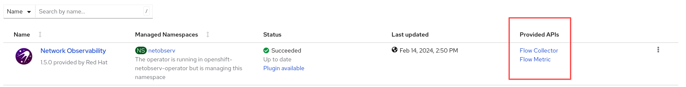
_<div style="text-align: center">Figure 1: Network Observability Operater and APIs</div>_

FlowMetrics is a dev preview feature which I will cover at the end, so let's start with FlowCollector.

### FlowCollector API

FlowCollector is the heart of network observability.  Creating a FlowCollector instance deploys an [eBPF](https://en.wikipedia.org/wiki/EBPF) agent for generating network flows, optionally supporting Kafka to improve scalability and reliability, a flowlogs pipeline for collecting, enriching, and storing the flow data and metrics, and a UI plugin for OpenShift web console to display graphs, tables, and topology.

In 1.5, the FlowCollector API version was upgraded to *flows.netobserv.io/v1beta2* from v1beta1.  In web console, the UI or "Flow view" to create an instance gets a facelift.  The custom resource has the following top level categories:

1. Name and Labels
2. Loki client settings
3. Console plugin configuration
4. Namespace
5. Deployment model
6. Agent configuration
7. Processor configuration

The first significant change is in "Loki client settings".  When you click and open this, you get the following:

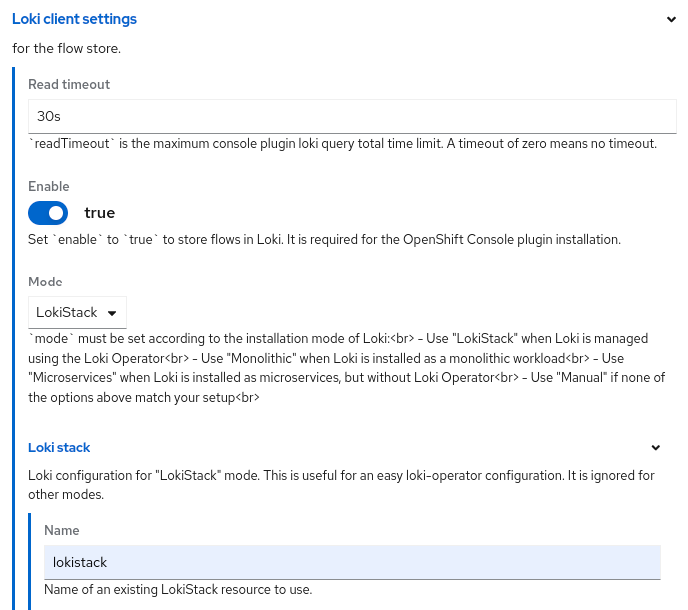
_<div style="text-align: center">Figure 2: Loki client settings</div>_

One of the new fields is "Mode" where you select how you installed Loki.  The most common is "LokiStack", which means you installed the Loki Operator and created a LokiStack instance.  Under the "Loki stack" section, make sure the **Name** matches the LokiStack name you gave it.  The nice part is that it will go and figure out the LokiStack gateway URL for you and give it proper authorization.

Parameters are now exposed under "Console plugin configuration", particularly "Quick filters" (Figure 3).  Network Observability predefines some filters as defaults which can be changed.  While this was possible before, now you can do it in the UI.

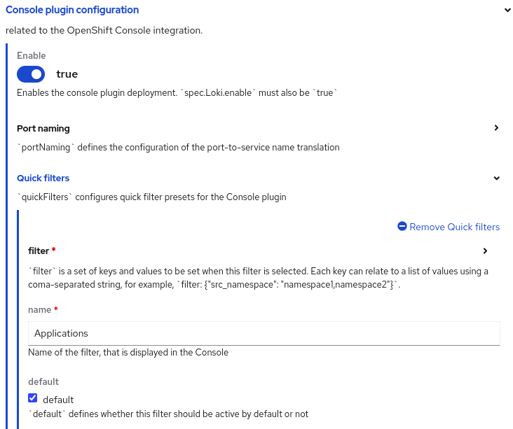
_<div style="text-align: center">Figure 3: Console plugin configuration</div>_

Under "Agent configuration", there is no longer an agent type because the only supported agent is *eBPF*.  It is still possible to configure *IPFIX* through YAML, but support for OpenShift SDN as the Container Network Interface (CNI) which IPFIX requires, is also deprecated in OpenShift 4.15.

In "Processor configuration", the changes are to enable availability zones, cluster ID, and a "Metrics configuration" section to select a list of predefined metrics under the "include list" (Figure 4).

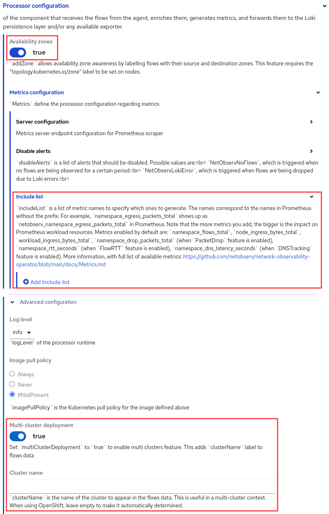
_<div style="text-align: center">Figure 4: Processor configuration</div>_

The full list of predefined metrics is [here](https://github.com/netobserv/network-observability-operator/blob/main/docs/Metrics.md).  When you include a metric, it stores it in Prometheus and is available as a Prometheus metric prefixed with "netobserv_".  For example, if you add the metric *namespace_egress_bytes_total*, then go to **Observe > Metrics** and enter the PromQL `sum(rate(netobserv_namespace_egress_bytes_total[1m]))`.  This should display a single line that is the sum of the average number of egress bytes over one-minute intervals.  Select a refresh time in the upper right dropdown if you want the graph to be updated periodically.

Availability zones and cluster ID will be covered in the traffic flow table section below.

## UI Changes and Features

The new features and enhancements will be covered by going over the changes in the Network Observability UI, starting with the three tabs in **Observe > Network Traffic**, namely *Overview*, *Network Traffic*, and *Topology*.

### Overview tab

Graphs for Flow RTT and DNS Tracking, including support for DNS TCP (previously only DNS UDP), were added.  There are graphs for:

- Top 5
- Bottom 5
- 90th percentile or the top 10% (P90)
- 99th percentile or the top 1% (P99)

#### Manage panels selection

With so many graphs to choose from, the **Manage panels** dialog, found under "Show advanced options", now provides a simple filter (Figure 5).  Click one or more buttons to filter on the selection.

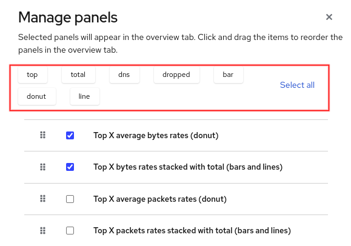
_<div style="text-align: center">Figure 5: Manage panels</div>_

#### Graph types

If you click **⋮** in the upper right corner of the graph, there will be various options depending on the type of graph.  For example, the ***TCP handshake Round Trip Time*** graph shows a donut chart but can be changed to use a lines graph (Figure 6).

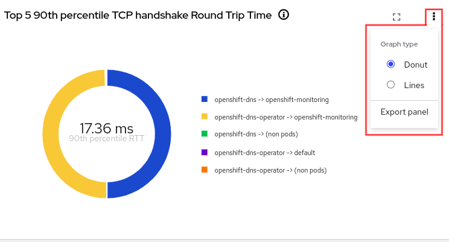 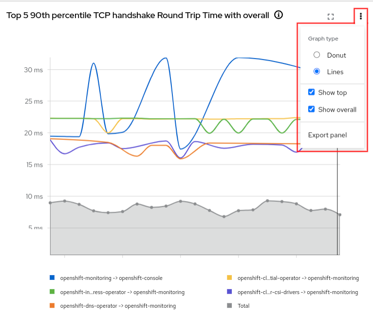
_<div style="text-align: center">Figure 6: Options - Graph type</div>_

#### Single graph focus

In Overview, it displays all graphs on a scrollable panel.  If you click the "Focus" icon in the upper right corner next to **⋮**, it displays one graph and gives a preview of all the other graphs on a scrollable panel on the right side (Figure 7).  If you click a preview graph, it becomes the graph in focus.  This feature can also be toggled in the "Display options" dropdown.

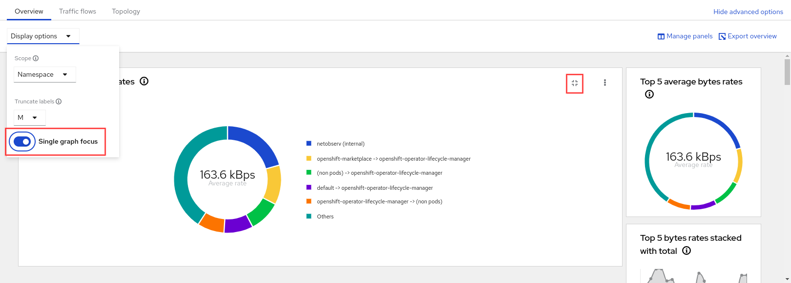
_<div style="text-align: center">Figure 7: Single graph focus</div>_

### Traffic flows tab

These are the new labels in the flow data.

1. Differentiated Services Code Point (DSCP)<br>
This is a 6-bit value in the IP packet header that indicates the priority of a packet to provide quality of service (QoS), particularly for time-sensitive data such as voice and video.  The value "Standard" translates to 0 or best effort.  In other words, the traffic is not getting any special treatment.

    - Column: DSCP
    - Label: Dscp

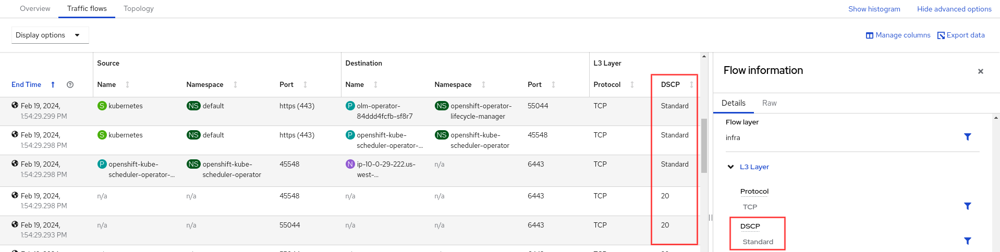
_<div style="text-align: center">Figure 8: DSCP</div>_

2. Availability Zones<br>
A region defines a geographical area and consists of one or more availability zones.  For example, if a region is named us-west-1, then the zones might be us-west-1a, us-west-1b, and us-west-1c, where each zone might have one or more physical data centers.

    - Columns: Source Zone, Destination Zone
    - Labels: SrcK8S_Zone, DstK8S_Zone

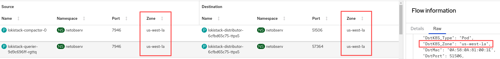
_<div style="text-align: center">Figure 9: Availability Zone</div>_

3. Cluster ID<br>
The cluster ID is the same value shown in the **Home > Overview**, Details section.

    - Column: Cluster
    - Label: K8S_ClusterName

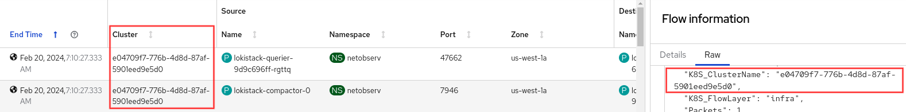
_<div style="text-align: center">Figure 10: Cluster ID</div>_

#### Manage columns selection

Like the **Manage panels** dialog, the **Manage columns** dialog, found under "Show advanced options", alos provides a simple filter (Figure 11).  Click one or more buttons to filter on the selection.

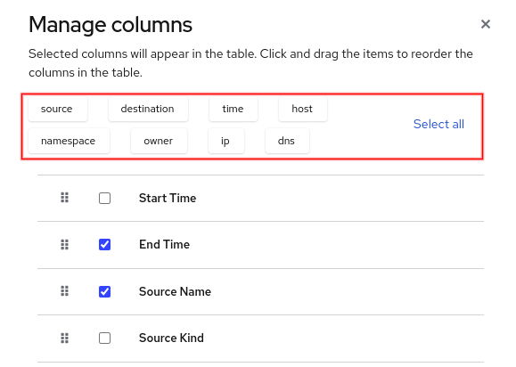
_<div style="text-align: center">Figure 11: Manage columns</div>_

### Topology tab

Topology also supports the same data in the **Overview** graphs for its edge labels, such as P90 (90th percentile) and P99 (99th percentile)

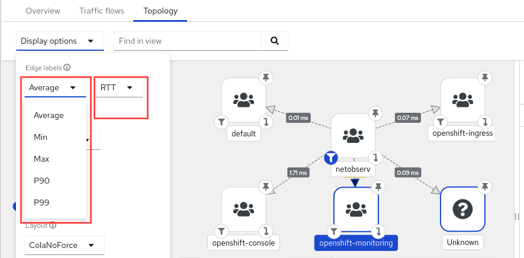
_<div style="text-align: center">Figure 12: Topology changes</div>_

### Filter

At the top of the screen is the filter used by all three tabs.  A dropdown button was added to show recently-used entries and to do auto-completion (Figure 13).

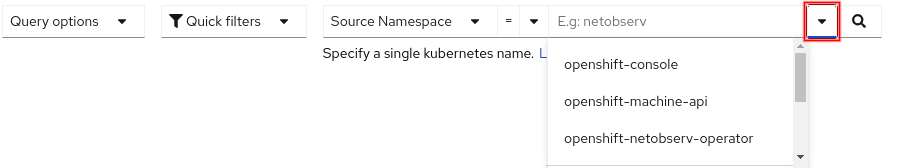
_<div style="text-align: center">Figure 13: Filter</div>_

## FlowMetrics API

The FlowMetrics API allows you take any combination of [flow data labels](https://docs.openshift.com/container-platform/4.14/network_observability/json-flows-format-reference.html) and turn it into a Prometheus metric.  In other words, you can create your own custom metric and then even create alerts and external notifications based on them.  This is a development preview feature.  Please be aware that generating too many metrics or not understanding how performance is impacted by querying these metrics can result in over utilization of resources and storage and cause instability.

To create a metric, go to **Operators > Installed Operator** and for the *Network Observability* row, click "Flow Metric" in the **Provided APIs** column (Figure 1).  Click the **Create FlowMetric** button to begin.

Minimally, you need to provide a metric name and specify the type, although you will likely need to use filters and possibly labels.  Prometheus provides some [best practices on naming](https://prometheus.io/docs/practices/naming/).  Just remember that the actual Prometheus metric name is prefixed with "netobserv_".  There is also information on the various [metric types](https://prometheus.io/docs/concepts/metric_types/).  FlowMetrics only supports Counter and Histogram and not Gauge or Summary.

As an example, let's create a metric that reports the number of bytes coming externally to a namespace of our choosing.  To achieve this, use a label for the destination namespace which is called *DstK8S_Namespace*.  The traffic will be considered external if the source name doesn't exist.  Enter the following values in the Form view for FlowMetric.  Also, make sure you remove the pre-existing filters.  Note: This is what you enter in the UI; it is not YAML.

```
metricName: ingress_external_bytes_total
type: Counter
direction: Ingress
filters:
  field: SrcK8S_Name
  matchType: Absence
  value: <blank>
labels:
  - DstK8S_Namespace
```

When you create this instance or make any changes to FlowMetric, the flowlogs-pipeline pods will restart automatically.  Now go to **Observe > Metrics** and enter `netobserv_ingress_external_bytes_total` (don't forget the prefix "netobserv_").  Because of the label, it separates out each destination namespace in its own graph line.  Try out the other PromQL queries below.

1. Graph the number of bytes incoming on namespace "openshift-ingress".  You can replace with any namespace.
`netobserv_ingress_external_bytes_total{DstK8S_Namespace="openshift-ingress"}`

2. In some cases like "openshift-dns", you might get more than one graph line because it's running on multiple pods.  Use `sum` to combine them into one graph line.
`sum(netobserv_ingress_external_bytes_total{DstK8S_Namespace="openshift-dns"})`

3. Graph the average rate over a 5-minute interval.
`sum(rate(netobserv_ingress_external_bytes_total{DstK8S_Namespace="openshift-ingress"}[5m]))`

## Conclusion

Hopefully, you are excited as I am on all the changes in this release.  I hope you get the chance to try it out, and let us know what you think!  You can always reach the NetObserv team on this [discussion board](https://github.com/netobserv/network-observability-operator/discussions).
