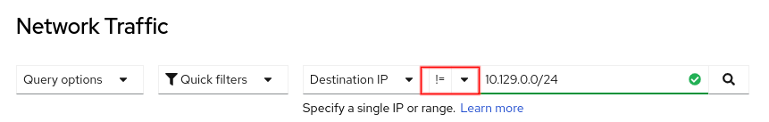
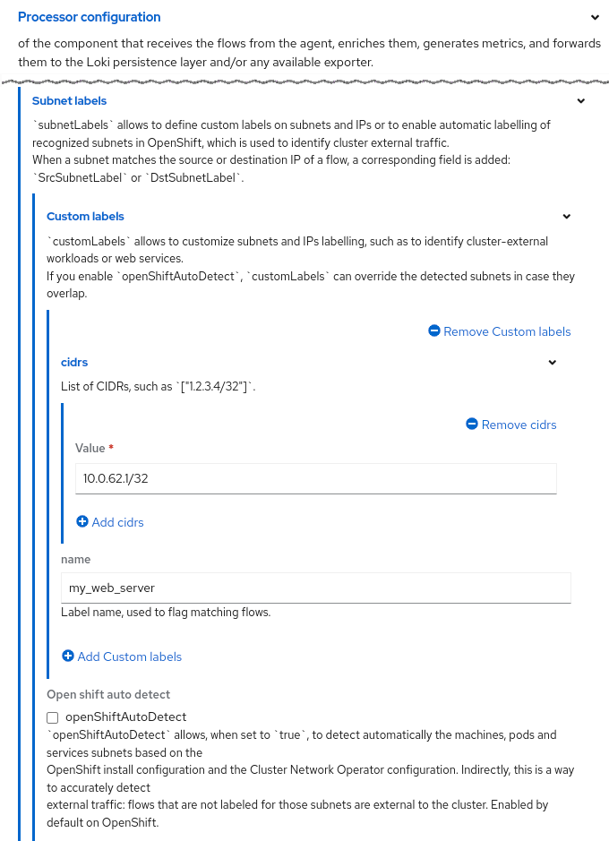
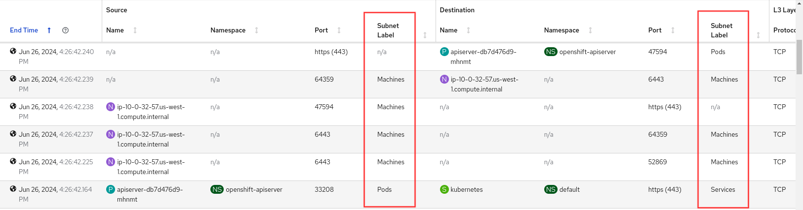
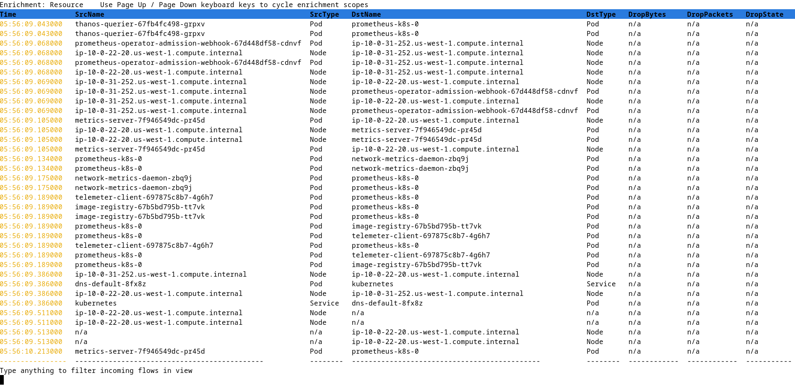

# What's new in Network Observability 1.6

Network Observability 1.6 was released on June 2024.  Even though this is considered a minor version upgrade from 1.5, it is a significant release that could lower the barrier to adoption into production.

But before we go further, for those of you new to Network Observability, NetObserv, for short, is an optional operator that provides a slew of capabilities to track and provide insight into your network traffic flows.  While it works on any Kubernetes cluster, it works even better in an OpenShift environment, which is what I will focus on in this article.  I will only discuss the new features in this release so if you want the full feature list, read the documentation on [About Network Observability](https://docs.openshift.com/container-platform/4.16/observability/network_observability/network-observability-overview.html).


## Graphs and Logs Without Loki and Storage

Prior to 1.4, NetObserv required an external component called Loki as well as storage, such as an S3 bucket, to store logs.  These flow logs allowed NetObserv to provide a rich UI to display graphs, tables, and a topology.  The CPU and memory resources required by Loki can be significant, particularly if you have lots of traffic and are sampling all data, not to mention the storage required.  In 1.4 and 1.5, if you have your own observability platform and only need the flow logs data, you can simply export this data and not install Loki or provide storage.  When you do this, you essentially get no UI besides some minimal flow metrics in **Observe > Dashboards**, because the expectation is that your platform will provide the features and the visuals.

This release changes that premise.  It brings back the graphs in the **Overview** panel and the topology in the **Topology** panel.  This is huge because the core of Network Observability is now fully functional at a fraction of the resources required when Loki is used!  It achieves this by creating Prometheus metrics from the flows and storing them at 15-second intervals.

So what's the catch?  Without storing the flow logs as JSON data, there is some impact.  The most notable is that there won't be a traffic flows table, because flows are no longer stored (Figure 1).


_<div style="text-align: center">Figure 1: Traffic flows grayed out</div>_

The other item is that metrics don't have information at the pod level so for example, in the topology, the **Zone** and **Cluster** scopes do not exist (Figure 2).


_<div style="text-align: center">Figure 2: Topology - No "Resources"</div>_

A couple of other features, namely packet drop reason and multi-tenancy, are not supported but are planned for a following release.  If you need any of these capabilities, then go ahead and install Loki and provide storage as usual.

Let's walk through how to configure a Loki-less setup.  Install the Network Observability Operator.  In **Operators > Installed Operators**, click the **Flow Collector** link, and then **Create FlowCollector**.  Click **Loki client settings** to open this up (Figure 3).


_<div style="text-align: center">Figure 3: Loki client settings</div>_

Set **Enable** to false, since Loki is enabled by default.  That's it!

There is one other note worth mentioning.  Even if you do install Loki, in the Web console, **Observe > Network Traffic**, it favors using metrics instead of Loki for querying whenever possible.  By doing this, not only is the user experience faster, but it is also possible to query data over a period of weeks or months.  This behavior is configurable in the **Prometheus**, **Querier** in the **Enable** setting (Figure 4).


_<div style="text-align: center">Figure 4: Prometheus settings</div>_


## eBPF Agent Enhancements

The eBPF Agent probes the network interfaces and generates flows when it sees network traffic.  There were a number of eBPF Agent enhancements made.  Let's go through them one-by-one.

### Deploy on specific nodes

By default, the eBPF Agent is deployed on each node using a DaemonSet.  If you know for sure that you do not need to run it on all nodes, you can control which nodes to deploy it on.  This is actually a [Kubernetes feature](https://kubernetes.io/docs/concepts/scheduling-eviction/assign-pod-node/) in the scheduler that is now implemented in the eBPF Agent.  There are many ways to do this, and the following method uses node affinity to deploy the eBPF Agent only on pods with a specific label.

```
  agent:
    ebpf:
      advanced:
        scheduling:
          affinity:
            nodeAffinity:
              requiredDuringSchedulingIgnoredDuringExecution:
                nodeSelectorTerms:
                - matchExpressions:
                  - key: ebpf-agent
                    operator: In
                    values:
                    - "true"  # make sure this has quotes
```

If you have **oc** installed on your computer, enter `oc edit flowcollector`.  Look for the `ebpf` section and add the lines above starting at `advanced`.  You can also do this in Web console.  Go to **Operators > Installed Operators**.  Look for the **Network Observability** row, click the **Flow Collector** link and then the **cluster** link.  Because this is an advanced feature, it is not in Form view, so click the **YAML** tab to edit the manifest.

Now this only deploys on nodes with the `ebpf-agent=true` label.  Set this label by replacing *node-name* with your node name below.

```
oc label nodes node-name ebpf-agent=true
```

### Flow filter at eBPF level

Network Observability always had great filtering capability in the **Network Traffic** panel.  However, that is done at the UI level, meaning the flows are still generated and stored, and hence resources are being consumed.  If resources are a major concern, consider this feature ***if*** the filtering fits your requirements.

To generate flows (or not generate flows) for very specific data, you can specify a single filter to do this.  Here's an example to only generate flows for network traffic on TCP port 6443.

```
  agent:
    ebpf:
      flowFilter:
        enable: true
        action: Accept
        cidr: 0.0.0.0/0  # refers to any traffic
        ports: 6443
        protocol: TCP
```

Enter `oc edit flowcollector`.  Again, look for the `ebpf` section and add the rest of the lines starting at `flowFilter`.  The `cidr` specifies a network address and prefix.  The example refers to any traffic, but for a specific network, use a value like `10.0.62.0/24`.  The feature is limited to one filter and many of the attributes can only have one value.  For more details, see the [flowFilter reference](https://github.com/netobserv/network-observability-operator/blob/main/docs/flowcollector-flows-netobserv-io-v1beta2.adoc#specagentebpfflowfilter).

### eBPF Agent metrics

You can view statistics for eBPF Agent.  This is in Web console under **Observe > Dashboards**.  Select **NetObserv / Health** in the Dashboard dropdown (Figure 5).  There are graphs for eviction rates, dropped flow rates, and more.


_<div style="text-align: center">Figure 5: eBPF Agent statistics</div>_

### Other eBPF changes

Here are a few other minor eBPF changes.

1. Option to alert if it's dropping flows<br>
There is a new option in the FlowCollector to control whether an alert is shown if it's dropping flows (Figure 6).  By default, this is enabled.


_<div style="text-align: center">Figure 6: eBPF Agent configuration - Disable alerts</div>_

2. Use enhanced TCx hook<br>
Internally, the eBPF Agent uses the Traffic Control (TC) hook to probe the ingress and egress traffic on the interfaces.  In OCP 4.16, which upgrades RHEL to 9.4, it leverages the enhanced TCx hook for performance gains.

3. Mapping performance improvement<br>
With RHEL 9.x, it leverages a new map (hash table) method for flows and packets to achieve significant performance improvement.

4. DNS Tracking improvement<br>
Previously with the *DNSTracking* feature, it was unlikely to generate DNS statistics if sampling was configured to be greater than 1, because the probe expected to catch both the request and the response.  However, the request and response is only necessary to calculate DNS latency.  Therefore, this has been improved so that it still saves the DNS id and flags even if it only receives the response.  Note that there is no information saved on the request.


## Flow Collector Enhancements

A few enhancements were made in Flow Collector.  They are:

1. Filter on not 'ip'<br>
In **Observe > Network Traffic**, for the IP-related filter fields, such as SourceIP, Destination IP, Source Node IP, and Destination Node IP, you can filter by *not* matching or excluding that IP or range (Figure 7).


_<div style="text-align: center">Figure 7: Not 'ip' filter</div>_

2. De-duplication of flows<br>
    When a flow is a duplicate on another interface, instead of saving multiple copies of that flow data, only one is stored now.  It keeps track of the list of interfaces that refer to the flow data.  This greatly reduces the amount of storage.

    The raw JSON fields have been renamed and pluralized to `Interfaces` and `IfDirections`, since the type changed to a list from a single value.  Note the use of square brackets for the lists below.

    ```
      "IfDirections": [
        0
      ],
      "Interfaces": [
        "br-ex"
      ],
    ```

3. Subnet labels<br>
    You can define a list of names for CIDRs (IP ranges and/or hosts).  When the CIDR matches, the name appears in the flow data as the `SrcSubnetLabel` or `DestSubnetLabel` field.  Here is an example.

    ```
      processor:
        subnetLabels:
          customLabels:
          - cidrs:
            - 200.1.1.1/32  # provide a name for this host
            name: Ext_server
          openShiftAutoDetect: true  # this is the default
    ```

    Enter `oc edit flowcollector`.  Look for the `processor` section and add the rest of the lines starting at `subnetLabels`.  The Form view in Web console looks like Figure 8.


    _<div style="text-align: center">Figure 8: Subnet labels configuration</div>_

   By default, the OpenShift auto-detect mode is enabled to identify internal CIDRs as `Pods`, `Services`, `Machines` or `n/a` for not applicable.  While CIDRs can be internal or external, they are typically external to allow you to provide a custom name for them.  If you use a naming convention such as prefixing "Ext_" for all cluster-external traffic, then you can create a custom metric for this.  Here's a PromQL that displays a graph of external traffic in bytes over a 1-minute period.

   ```
   sum(rate(netobserv_workload_egress_bytes_total{DstSubnetLabel=~"|Ext_.*"}[1m]))
   ```

   This assumes the `workload_egress_bytes_total` metric has been included in `processor.metrics.includeList`.  See my [Network Observability 1.5 blog](https://developers.redhat.com/articles/2024/03/20/whats-new-network-observability-15) on how to do this.

   In the Traffic flow table, this is what you see if you add the Subnet Label columns (Figure 9).


    _<div style="text-align: center">Figure 9: Subnet Label columns</div>_


## Custom Metrics

In my [Network Observability 1.5 blog](https://developers.redhat.com/articles/2024/03/20/whats-new-network-observability-15), I covered the development preview of the FlowMetrics API.  While it's possible to take any [flow data labels](https://docs.openshift.com/container-platform/4.16/observability/network_observability/json-flows-format-reference.html) and turn it into a Prometheus metric, that web page was updated to indicate which fields can be safely used as labels to avoid high cardinality.

This feature is now GA, and includes more filtering options (see [reference](https://github.com/netobserv/network-observability-operator/blob/main/docs/FlowMetric.md)) and support for [dashboards in OpenShift](https://github.com/netobserv/network-observability-operator/blob/main/docs/Metrics.md#charts-openshift-only).  That link also has many more examples of using custom metrics.


## Network Observability CLI

This release has yet another significant technical preview feature called Network Observability CLI (NetObserv CLI).  It is a kubectl plug-in that effectively installs Network Observability from the command line but is text-based only.  When you exit the program, it cleans up and removes itself.  In other words, you can now run Network Observability on-demand!

While it reuses much of the NetObserv code, it is separate from the Network Observability Operator.  This means even if you have NetObserv running, you can still run the NetObserv CLI independently.  For this preview, it only supports nodes running `x86_64` architecture.

It is also not just a subset of features of the Network Observability Operator.  There is an option to capture packets and save them in a pcap file to be used by a network analysis tool like Wireshark!  Here is a sample screenshot of NetObserv CLI that is filtering and displaying traffic on port 443 (Figure 10).


_<div style="text-align: center">Figure 10: Network Observability CLI</div>_

Follow the steps to [install the Network Observability CLI](https://docs.openshift.com/container-platform/4.16/observability/network_observability/netobserv_cli/netobserv-cli-install.html#network-observability-cli-install_netobserv-cli-install).

To get help, enter:

```
oc netobserv help
```

Figure 10 was run using:

```
oc netobserv flows --enable_filter=true --protocol=tcp --port=443
```

To stop the program, press ctrl-C.  More information about NetObserv CLI will be provided in a future blog.  In the meantime, enjoy!


## Closing

If you are hesitant about deploying Network Observability, fear not.  With Network Observability CLI, you can experiment and have it completely removed when you are done using it.  The second option lets you install Network Observability without Loki, while still providing the majority of the features of this operator.

What are you waiting for?  Give it a try, and let us know what you think on the [discussion board](https://github.com/netobserv/network-observability-operator/discussions).

---

Special thanks to Joel Takvorian, Julien Pinsonneau, and Sara Thomas for providing information for this article.
