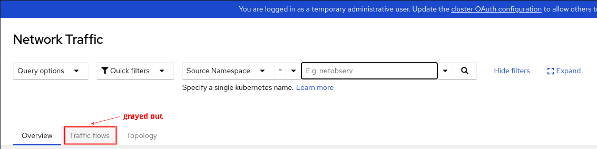
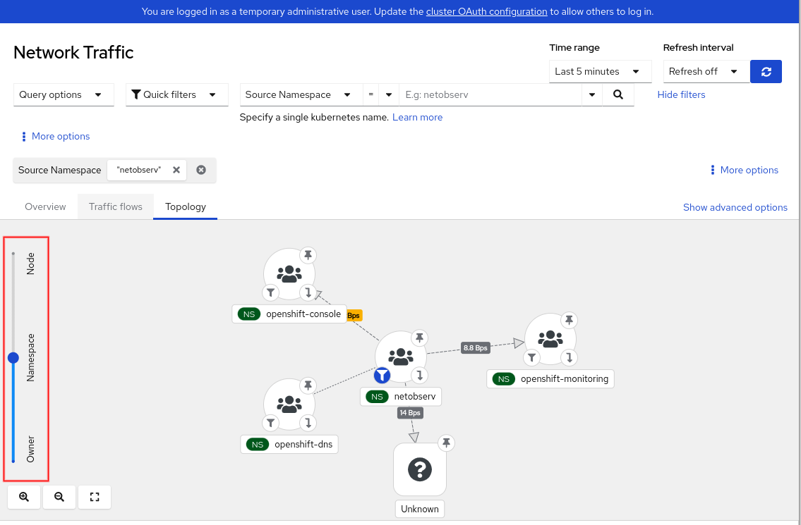
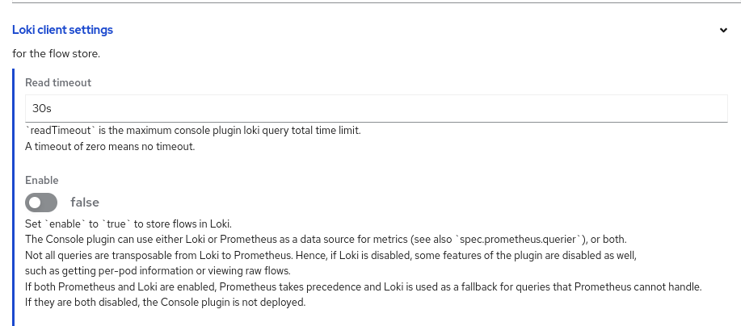
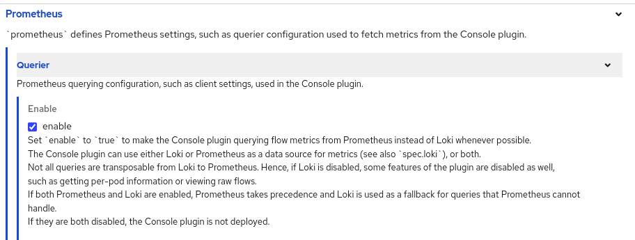
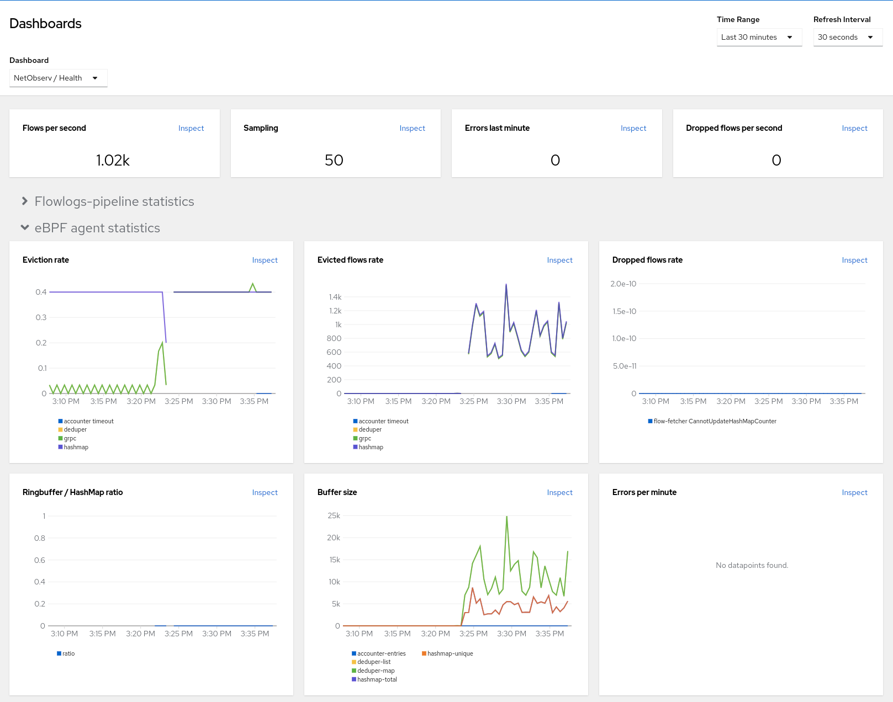
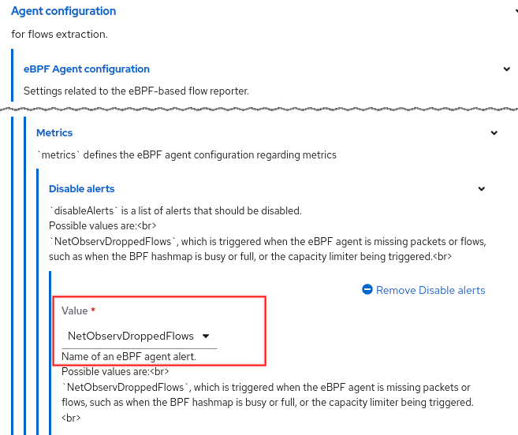

# What's new in Network Observability 1.6

Network Observability 1.6 was released on June 17, 2024.  Despite the usual bump in the minor version from 1.5, this is a significant release that could lower the barrier to adoption into production.

But before we go further into this, for those of you new to Network Observability, NetObserv, for short, is an optional operator that provides a slew of capabilities to track and provide insight into your network traffic flows.  While it works on any Kubernetes cluster, it works even better in an OpenShift environment, which is what I will focus on in this article.  I will only discuss the new features in this release so if you want the full feature list, read the documentation on [About Network Observability](https://docs.openshift.com/container-platform/4.16/observability/network_observability/network-observability-overview.html).

## Graphs and Logs Without Loki and Storage
Let's get right to the crux of the issue.  Prior to 1.4, NetObserv required an external component called Loki as well as storage, such as an S3 bucket, to store logs.  These flow logs allowed NetObserv to provide a rich UI to display graphs, tables, and a topology.  The resources required by Loki can be significant, particularly if you have lots of traffic and are sampling all data, not to mention the storage required.  In 1.4 and 1.5, if you have your own observability platform and only need the flow logs data, you can simply export this data and not install Loki or provide storage.  When you do this, you essentially get no UI besides some minimal flow metrics in **Observe > Dashboards**, because the expectation is that your platform will provide the features and the visuals.

This release changes that premise.  It brings back the graphs in the **Overview** panel and the topology in the **Topology** panel.  This is huge because the core of Network Observability is now fully functional at a fraction of the resources required when Loki is used!  It achieves this by creating Prometheus metrics from the flows and storing them at 5-minute intervals.

So what's the catch?  Without storing the flow logs as JSON data, there will be some impact.  The most notable is that there won't be a traffic flows table, because flows are no longer stored (Figure 1).


_<div style="text-align: center">Figure 1: Traffic flows grayed out</div>_

The other point to understand is that the metrics don't have information at the pod level so for example, in the topology, the **Resource** scope, which shows the pod to pod/service communication, will not exist (Figure 2).


_<div style="text-align: center">Figure 2: Topology - No "Resources"</div>_

A couple of other features, namely packet drop reason and multi-tenancy, are not supported but will be addressed in a follow on release.  If you need any of these capabilities, then go ahead and install Loki and provide storage as usual.

Let's walk through how to configure a Loki-less setup.  Install the Network Observability Operator.  In **Operators > Installed Operators**, click the **Flow Collector** link, and then **Create FlowCollector**.  Click **Loki client settings** to open this up (Figure 3).


_<div style="text-align: center">Figure 3: Loki client settings</div>_

By default, Loki is enabled so set **Enable** to false.  That's it!

There is one other note worth mentioning.  Even if you do install Loki, by default, it will favor using the metrics instead of Loki for querying whenever possible.  By doing this, not only will it be faster, but it will be possible to query data over a period of weeks or months.  This behavior can be changed under **Prometheus**, **Querier** in the **Enable** setting (Figure 4).


_<div style="text-align: center">Figure 4: Prometheus settings</div>_

## eBPF Agent Enhancements

The eBPF Agent probes the network interfaces and generates flows when it sees network traffic.  There were a number of eBPF Agent changes in this release.  Let's go through them one-by-one.

### Deploy on specific nodes
By default, the eBPF Agent is deployed on each node using a DaemonSet.  If it's certain that you don't need it to run on some nodes, you can control which nodes to deploy it on.  This is actually a [Kubernetes feature](https://kubernetes.io/docs/concepts/scheduling-eviction/assign-pod-node/) in the scheduler that is now implemented in the eBPF Agent.  There are many ways to do this, and the following uses node affinity to deploy the eBPF Agent only on pods with a specific label.

```
  agent:
    ebpf:
      advanced:
        scheduling:
          affinity:
            nodeAffinity:
              requiredDuringSchedulingIgnoredDuringExecution:
                nodeSelectorTerms:
                - matchExpressions:
                  - key: ebpf-agent
                    operator: In
                    values:
                    - "true"  # make sure this has quotes
```

If you have **oc** installed on your computer, enter `oc edit flowcollector -n netobserv-privileged`.  Look for the `ebpf` section and add the lines above starting at `advanced`.  You can also do this in Web console.  Go to **Operators > Installed Operators**.  Look for the **Network Observability** row, click the **Flow Collector** link and then the **cluster** link.  Because this is an advanced feature, it is not in Form view, so click the **YAML** tab to edit the manifest.

Now this will only deploy on nodes with the `ebpf-agent=true` label.  Set this label by replacing *node-name* with your node name below.

```
oc label nodes node-name ebpf-agent=true
```

### Filter at eBPF level
Network Observability always had great filtering capability in the **Network Traffic** panel.  However, that is done at the UI level, meaning the flows are still generated and stored, and hence resources are being used.  If resources are a major concern, consider this feature *if* the filtering suits your requirements.

If you want to generate flows (or not generate flows) for very specific data, you can specify a single filter to do this.  Here's an example to only generate flows for network traffic on TCP port 6443.

```
  agent:
    ebpf:
      flowFilter:
        enable: true
        action: Accept
        cidr: 0.0.0.0/0  # refers to any traffic
        ports: 6443
        protocol: TCP
```

Enter `oc edit flowcollector -n netobserv-privileged`.  Again, look for the `ebpf` section and add the rest of the lines starting at `flowFilter`.  The `cidr` specifies a network address and prefix.  The example refers to any traffic, but for a specific network, use something like 10.0.62.0/24.  The feature is limited to one filter and many of the attributes can only have one value.

### eBPF Agent metrics
Statistics for eBPF Agent were added. This is in Web console under **Observe > Dashboards**.  Select **NetObserv / Health** in the Dashboard dropdown (Figure 5).  This has graphs for eviction rates, dropped flow rates and more.


_<div style="text-align: center">Figure 5: eBPF Agent statistics</div>_

### Other eBPF changes
Here are a few other minor eBPF changes.

1. Option to alert if it's dropping flows<br>
There is a new option in FlowCollector to control whether an alert is shown if it's dropping flows (Figure 6).  By default, this is enabled.


_<div style="text-align: center">Figure 6: eBPF Agent configuration - Disable alerts</div>_

2. Use enhanced TCx hook<br>
Internally, the eBPF Agent uses the Traffic Control (TC) hook to probe the ingress and egress traffic on the interfaces.  In OCP 4.16, which upgrades RHEL to 9.4, it can leverage the enhanced TCx hook for performance gains.

3. Always save DNS flags<br>
If the *DNSTracking* feature is enabled, regardless of the sampling setting, it always saves the DNS id and flags.  Previously, it would discard this data if the flow doesn't exist.

