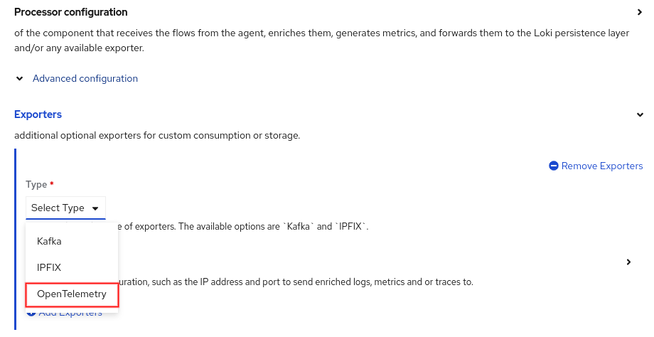
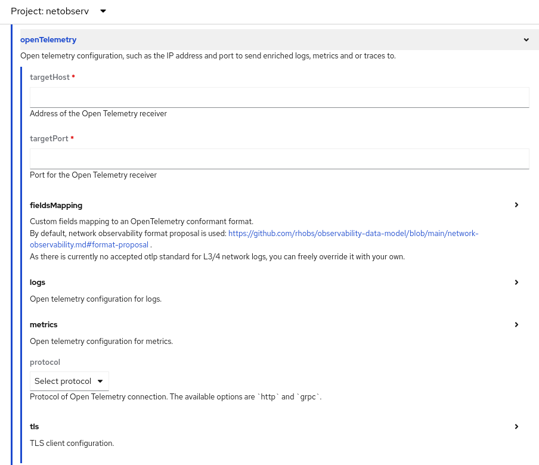
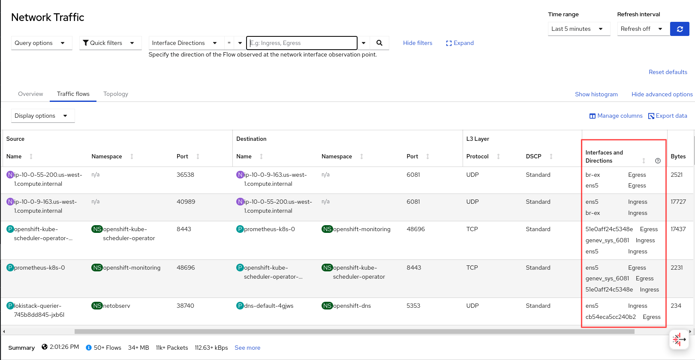
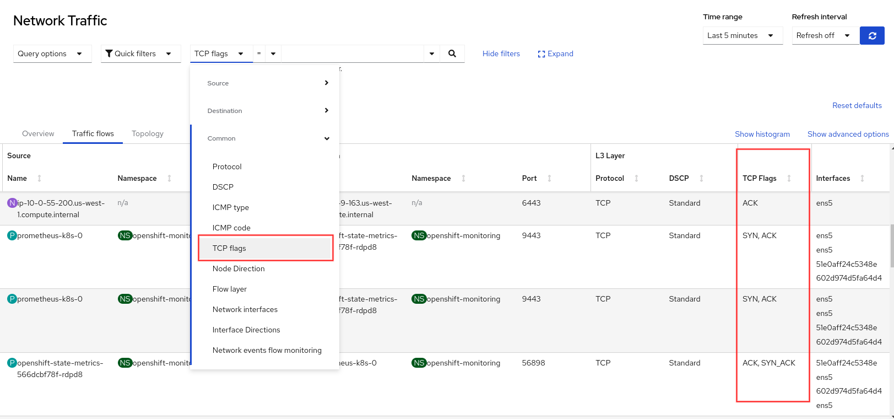
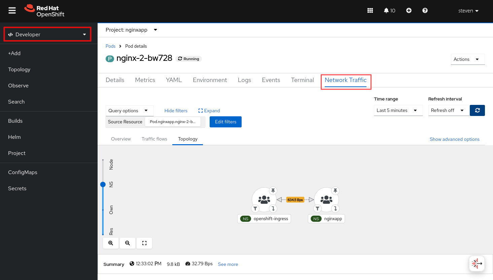
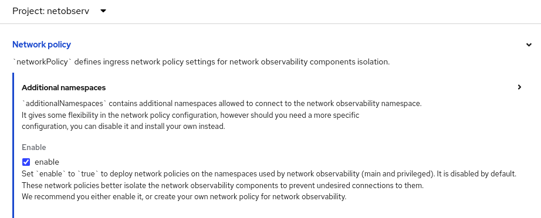
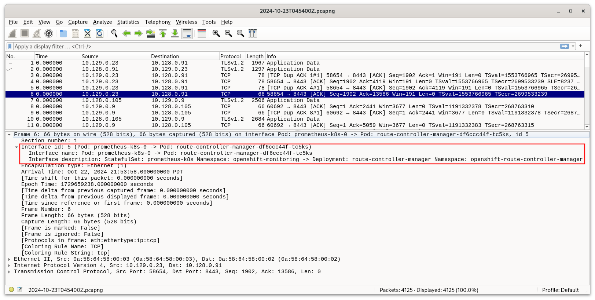

# What's new in Network Observability 1.7

Network Observability 1.7 aligns with OpenShift Console Platform (OCP) 4.17, although it is compatible all the way back to 4.13.  Network Observability is an optional operator that provides insights into your network traffic and can help you troubleshoot networking issues.  There is an upstream version that runs on bare Kubernetes, but this blog focuses on the downstream version on OCP where you get the most benefit.

It was only a few months ago when 1.6 was released, and you can read all about it in my [last blog](https://developers.redhat.com/articles/2024/08/12/whats-new-network-observability-16).  There are a number of features added in this release.  The most notable ones are:

- Export data using OpenTelemetry Protocol (OTLP)
- Enhance secondary interface support
- eBPF Agent enhancements
- Network Observability in Developer perspective
- Security features
- Network Observability CLI enhancements

## Export data using OpenTelemetry Protocol (OTLP)

OpenTelemetry is a popular open source framework for managing telemetry data.  Network Observability can now export flow logs and flow metrics using the OpenTelemetry Protocol (OTLP).

To do this, after you install the Network Observability operator, go to **Operators > Installed Operators**.  On the Network Observability row, click the **Flow Collector** link under the **Provided APIs** column.  Click **Create FlowCollector**.  At the bottom, click **Advanced configuration** to reveal the **Exporters** section (Figure 1).


<p style="text-align: center">Figure 1: Exporters - OpenTelemetry</p>

By default, the field names follow the [OpenTelemetry Semantic Conventions](https://opentelemetry.io/docs/specs/semconv/).  The [Network flows format reference](https://docs.openshift.com/container-platform/4.17/observability/network_observability/json-flows-format-reference.html) shows the field mapping in the new **OpenTelemetry** column.  In case you prefer a different name, any of the fields can be renamed to your liking under the **fieldMapping** section (Figure 2).


<div style="text-align: center">Figure 2: OpenTelemetry configuration</div>


## Enhanced secondary interface support

There are several use cases for wanting a secondary interface on a pod.

1. Partition a NIC in SR-IOV and use the Multus and SR-IOV CNI plugins to attach an SR-IOV virtual function to your pod.  Network Observability supported this in 1.4.

2. Create a [User Defined Network (UDN)](https://docs.openshift.com/container-platform/4.17/networking/multiple_networks/understanding-user-defined-network.html).  UDN provides isolation and segmentation to your traffic, and is a Tech Preview in OCP 4.17.  The pods have a secondary interface to connect to UDN.

3. Create a secondary overlay network in [OpenShift Virtualization](https://docs.openshift.com/container-platform/4.17/virt/about_virt/about-virt.html) to allow east-west traffic between virtual machines (VMs).  The VMs have a secondary interface to connect to the overlay network.

Network Observability 1.7 supports all three scenarios.  Just enable **privileged** mode in eBPF Agent when you create the FlowCollector resource.  This is under the **Agent configuration > eBPF Agent configuration**.  NetObserv handles the rest by tracking the secondary interfaces that come and go, and identifying which namespace and pod they belong to.  In **Observe > Network Traffic**, Traffic flows table, click **Show advanced options** on the right side, then **Manage columns**, and add the column **Interfaces and Directions** (Figure 3).


<div style="text-align: center">Figure 3: Traffic flows - Interfaces</div>


## eBPF Agent enhancements

These are the other smaller but useful enhancements made to the eBPF Agent, the component that collects and aggregates flows in Network Observability.

- The eBPF flow filter allows simple filtering at the core level where it decides what flows to collect.  Here are the changes.
    - `ports`, `sourcePorts` or `destPorts`: Supports up to two TCP, UDP or SCTP ports.  Previously, it allowed only one port.
    - If `ports` is specified but not `protocol`, it filters on TCP and UDP flows.
    - `tcpFlags`: Filter the flows with this TCP flag.  It must be one of "SYN", "SYN-ACK", "ACK", "FIN", "RST", "URG", "ECE", "CWR", "FIN-ACK", or "RST-ACK".

- The Kubernetes service for DNS does a reverse proxy and maps to an internal port at the pod running DNS.  For the DNS Tracking feature to work end-to-end, specify the internal port value using the environment variable `DNS_TRACKING_PORT`.

Figure 4 shows an example use-case scenario that only collects DNS traffic on ports 53 and 5353.  OVN, which is the default CNI for OpenShift, maps the internal `DNS_TRACKING_PORT` to 5353.  If the DNS Tracking feature is enabled, it displays data for DNS latency, response code, and error on a per-flow basis in the Traffic flows table.
```
  agent:
    ebpf:
      flowFilter:
        enable: true
        ports: 53,5353  # only have flows for these two ports
      advanced:
        env:
          DNS_TRACKING_PORT: "5353"  # must be a string
      sampling: 1
      features:
        - DNSTracking
```
<p style="text-align: center">Figure 4: eBPF flow filter for DNS traffic</p>

Assuming you have **oc** installed on your computer, enter `oc edit flowcollector`.  Look for the `ebpf` section and add the lines in Figure 4.

Figure 5 shows an example where the eBPF Agent collects only TCP flows that have the SYN flag, which are flows that initiate a TCP connection.  By not specifying `protocol`, it will also collect UDP.

```
  agent:
    ebpf:
      flowFilter:
        enable: true
        tcpFlags: SYN
      sampling: 1
```
<p style="text-align: center">Figure 5: eBPF flow filter for TCP SYN and UDP traffic</p>

In the Traffic flows table, you can add the **TCP flags** column.  You can also filter on this column (Figure 6).


<div style="text-align: center">Figure 6: Traffic flows - TCP flags</div>


## Network Observability in Developer perspective

For the first time, NetObserv is providing observability in the Developer perspective!  If you are in Administrator perspective, click **Administrator** in the upper left corner and select **Developer**.  Click **Project** and select a project in the drop down near the top of the page.  In the **Inventory** section, click **Pods** or **Service**.   Click a particular item on a row.  There will be a **Network Traffic** tab.  Click this link to bring up the familiar page with *Overview*, *Traffic flows*, and *Topology* tabs filtered to this pod or service (Figure 7).


<div style="text-align: center">Figure 7: Network Observability in Developer perspective</div>


## Security features

There are two security-related features in this release.

### FIPS compliance

Network Observability 1.7 is compliant with FIPS 140-3, ensuring that it meets security requirements for cryptographic modules.  This means it can be used when OpenShift is in [FIPS mode](https://docs.openshift.com/container-platform/4.17/installing/overview/installing-fips.html).

### Lock down access to Network Observability

For added security, it is simple to lock down access to Network Observability so only known components can access it.  When you create the FlowCollector resource, enable this feature (Figure 8).  This creates a Kubernetes network policy in the *netobserv* and *netobserv_privileged* namespaces to restrict its access.  Although this is disabled by default, it is recommended to enable this or create your own network policies.


<div style="text-align: center">Figure 8: Network policy</div>


## Network Observability CLI enhancements

Network Observability CLI (NetObserv CLI) is a kubectl plug-in that installs a separate Network Observability from the command line and displays a text-based flows table and can also capture packets to a pcap file.  It uses no storage!  When you exit the program, it cleans up and removes itself.

You don't need to install the Network Observability Operator because NetObserv CLI will do it for you.  Just [follow the instructions here](https://docs.openshift.com/container-platform/4.17/observability/network_observability/netobserv_cli/netobserv-cli-install.html) to install NetObserv CLI.  The prerequisite is to have `oc` installed on your computer.

Make sure you have the 1.7 version, which is the GA version.  Enter:
```
$ oc netobserv version
Netobserv CLI version 1.7.0
```

There were a number of significant changes in NetObserv CLI from the last Network Observability release.  To start, the command line options changed so that when doing packet capture, you now have many of the same options as flow capture, particularly for the eBPF flow filters.  To see these options, enter `oc netobserv help`.  You may need to widen the terminal to view this legibly.

Regardless whether you do flow capture or packet capture, it displays the flows table.  The screen is pretty self-explanatory on what you can do such as filtering data, showing more columns of data, and increasing or decreasing the number of rows.  To exit, press ctrl-c.  It then prompts to save the capture output.  If you respond with 'y', it saves the data with a timestamp filename in the directory **./output/flow/** for flows and **./output/pcap/** for packets.  Figure 9 shows a screenshot of NetObserv CLI after running:
```
$ oc netobserv flows
```


<p style="text-align: center">Figure 9: Network Observability CLI</p>

For packet capture, it's advisable to set a filter as the amount of data will grow very quickly.  By default, there is a maximum byte size of 50 MB and a maximum time limit of 5 minutes before it exits, whichever comes first, although they can be changed with the `--max-bytes` and `--max-time` options respectively.

What's unique about the packet capture is that it stores enriched Kubernetes data in the pcap file!  Here's a screenshot of Wireshark loaded from a pcapng file created by NetObserv CLI (Figure 10).
```
oc netobserv packets --protocol=TCP --port=8443
```


<p style="text-align: center">Figure 10: Wireshark displaying pcapng file</p>

The Frame 6 row is selected.  In the Packet Details section below, click the **>** on the first line to open up the "Frame 6" content.  Then click the **>** on "Interface id" to open up the interface details.  You can then see that source IP address 10.129.0.23 in the row selected corresponds to a pod named **prometheus-k8s-0** in the namespace **openshift-monitoring**.


## Closing

There are a lot of features packed into this release.  Spend the time to experiment with the features, and let us know how it helps you perform your tasks.  If you have any comments or suggestions, you can contact us on the [discussion board](https://github.com/netobserv/network-observability-operator/discussions).
