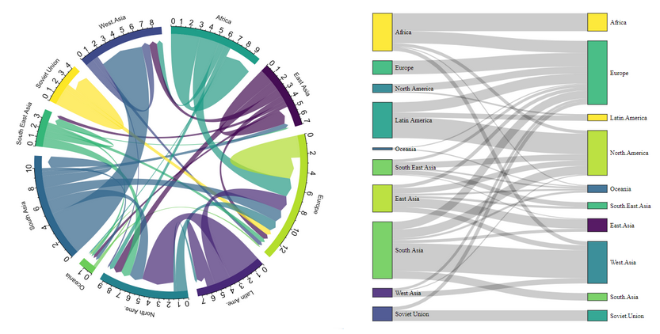
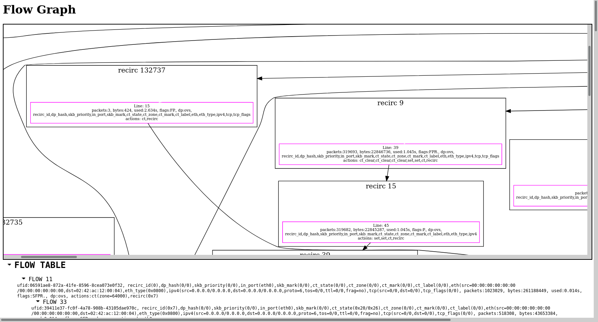

## Next

Informal doc gathering ideas about potential next steps. It's a brainstorming place, not a roadmap.

### Traffic Flows

#### Visualization

##### SanKey charts

An horizontal representation of flows between nodes[1]. It's a pretty way to quickly appreciate both traffic distribution and volumetry

E.g. https://www.d3-graph-gallery.com/sankey.html
Also, Elastiflow shows a nice usage of sankey charts.

[1] "Node" here means graph node, not kube node.

##### Chord diagrams

They are similar to sankey charts but with a round shape. Instead of an East/West distinction, in/out traffic can be represented with different color tones.

E.g. https://www.d3-graph-gallery.com/chord.html

Another example, same data visualized through chord or sankey:

#### Correlation with other kind of data

Data coming from netflows could be correlated with other kind of data (using same source/dest and close time), such as Cluster Metrics (e.g. high CPU / memory usage on pod X at a given time), Kube events (e.g. pod restarted, or deployment was scaled up/down), Logs (e.g. errors spotted in logs on pod X at a given time) or Distributed Tracing.

While the immediate goal would be to improve the troubleshooting experience for users, it could also potentially open a research field for trend analysis, anticipation / failures prediction.

#### Alerting

Investigate alerting capabilities of Loki, and whether or not it would make more sense to use Prometheus for this matter (see below: metrics generation).

Example of alerts: network saturation? and the opposite, network abnormally quiet.

#### Metrics generation

The flow collector (or OVS?) could also produce metrics out of the flow data (E.g. counters of bytes / packets / dropped packets etc.). eBPF will bring that, too.

#### Edge

Smart sampling / analysis of flows at the edge could help generate more accurate data in high volumetry scenarios. See pktvisor: https://github.com/ns1labs/pktvisor.

### Datapath flows in OVS

See also: https://issues.redhat.com/browse/NETOBSERV-53

"Datapath flows" here refers to the datapath inside an OVS node, it's not the same as netflows which refers to runtime traffic.

Showing a graph of datapath flows could be a great help for network admins while troubleshooting network.

Here's a (cropped) screenshot of such a flow:

### Network policies

#### Visualization

Find ways to better visualize:
- A single network policy
- Network policies involved for a given pod / workload / namespace

#### Testing

Connectivity checks to test that two pods can communicate, or that they cannot.

Integration of such tests with a CI tool?
