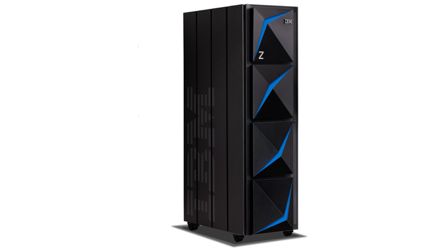
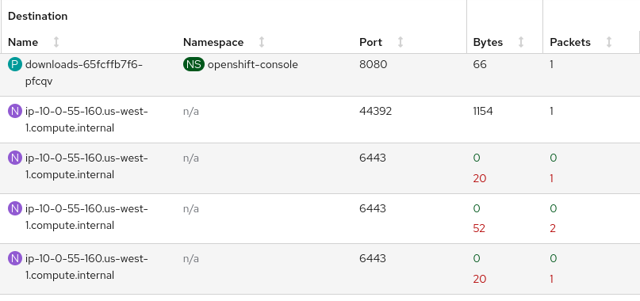
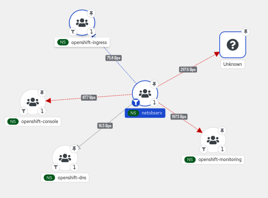
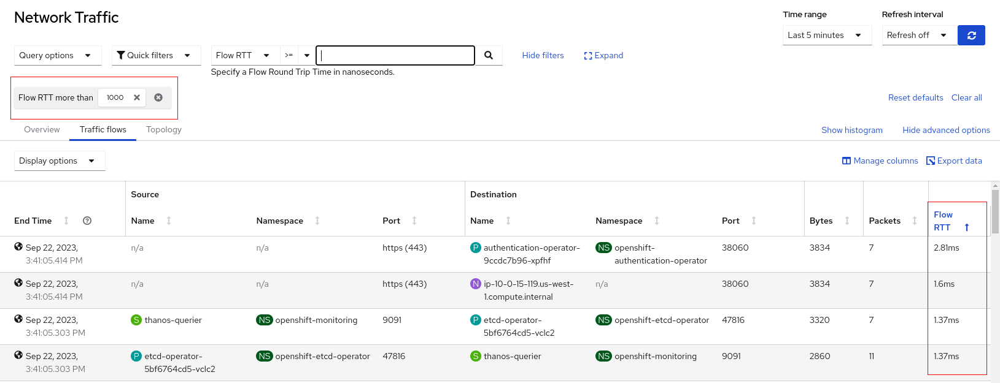

# What's New in Network Observability 1.4

OpenShift Container Platform (OCP) is the leading Kubernetes environment for managing container-based applications.  However, this is just the core platform.  If you go to **OperatorHub** on OpenShift web console (UI), you will see hundreds of *optional* operators, which are analogous to extensions for your browser.  Buried in this operator gold mine is one called Network Observability.  

Network Observability 1.4, as the release number suggests, is not new.  The team has put out four feature releases since its first general availability back in January 2023.  It has grown significantly since I wrote a [blog about Network Observability 1.0](https://cloud.redhat.com/blog/check-out-the-new-network-observability-support-in-openshift-4.12).  This release coincides with OCP 4.14 but can be used as far back as 4.10.

The focus of this blog is the new features in 1.4, but a quick word about Network Observability.  It is a tool that collects traffic flows using an eBPF agent and then enriches and stores them as logs and metrics to provide valuable insight and visualization into your network.  In case you've been living under a rock (I mean, a gold crystal) in the Linux world, [eBPF](https://en.wikipedia.org/wiki/EBPF) is the technology that allows you to extend the kernel capabilities without having to write a messy kernel module.  It uses various probes to get some really cool statistics that would otherwise be difficult to get, which we will dive into later in this blog.

## Features

All of the 1.4 features can be put into four categories.  They are:

1. Hardware
    - Support for SR-IOV interfaces
    - Support on [IBM Z](https://www.ibm.com/z) architecture

2. Traffic
    - Packet drops
    - DNS tracking information
    - Export flows and dashboards without Loki
    - Enhancements to Network Observability dashboards
    - Round Trip Time (RTT) {developer preview}

3. UI/UX
    - Comparison operator field in filtering
    - "Swap" source and dest
    - "Back and forth" to include return traffic
    - Vertical slider for changing scopes in Topology

4. Performance and scalability

## Hardware

### SR-IOV Interfaces

SR-IOV is a hardware standard to virtualize a NIC. In netdevice mode, the eBPF agent can now provide traffic flows that go through these interfaces.  To enable this feature, when creating the FlowCollector instance, you must enable *privileged* mode. This is in the **Create FlowCollector** form view under ***agent > ebpf > privileged***.

### IBM Z

In the last release, we added support for IBM Power and ARM.  We now officially support IBM Z as well.  Long live the mainframes!

## Traffic

On traffic features, Network Observability is providing additional information that is directly relevant to troubleshooting issues.  We plan to publish more details about these features and how to use them in future blogs.

### Packet drops

The eBPF agent can get real-time packet drops per flow for TCP, UDP, SCTP, and ICMPv4/v6 (such as ping).  To enable this feature, when creating the FlowCollector instance, you must enable *privileged* mode and the *PacketDrop* feature. This is in the **Create FlowCollector** form view under ***agent > ebpf > privileged*** and ***agent > ebpf > features***.

Now decide how you want to filter packet drops.  In **Observe > Network Traffic** under **Query options**, select whether to show flows that have all packets dropped, at least one packet dropped, no packets dropped, or no filter.  Be careful if you select "no packets dropped", as that means you won't see flows with packet drops.  Then in the filter field, there are new filters for the TCP state and the drop cause.  See the highlighted red areas below that it's referring to in web console.  You also need to be running OCP 4.13 or higher.

The **Overview** tab has several new packet drop graphs, two of which are shown below.

Click **Show advanced options** (which then becomes *Hide advanced options*) to reveal **Manage panels**.  Click this link to choose what graphs to display.

The **Traffic flows** tab shows the bytes and packet counts of what has been dropped in red.  The **Topology** tab displays a red link between vertices where packet drops have occurred.

    
    

### DNS tracking information

DNS is one networking area that is the source of potential problems.  This feature provides information on DNS ID, latency, and response code and the ability to filter on these fields.  To enable this feature, when creating the FlowCollector instance, you must enable *privileged* mode and the *DNSTracking* feature. This is in the **Create FlowCollector** form view under ***agent > ebpf > privileged*** and ***agent > ebpf > features***.

Like the Packet Drops feature, there are new DNS graphs in the **Overview** tab.  See above on how to display them.  There are also new DNS columns in the traffic flows table.

### Export flows and dashboards without Loki

If you only want to export flows, it is no longer necessary to install Loki.  Without Loki and internal flow storage, the netobserv console plugin is not installed, which means you don't get the **Observe > Network Traffic** panel and hence no Overview graphs, Traffic flows table, and Topology.  You will still get flow metrics in **Observe > Dashboards**.

### Enhancements to Network Observability dashboards

Speaking of dashboards, in **Observe > Dashboards, NetObserv / Health** selection, there is a new Flows Overhead graph that shows the percentage of flows generated by Network Observability itself.  The dashboard under **NetObserv** was also changed to separate applications and infrastructure.

### Round Trip Time (RTT)

Round Trip Time (RTT) is a development preview feature that shows the latency for the TCP handshake process on a per-flow basis.  To enable this feature, when creating the FlowCollector instance, you must enable the *FlowRTT* feature. This is in the **Create FlowCollector** form view under ***agent > ebpf > features***.  Note the privileged feature is not required.

The **Overview** tab has two new RTT graphs shown below.

The **Traffic flows** tab adds the *Flow RTT* column.  In the table below, it filters and displays all flows that take more than 1 millisecond (the value is in nanoseconds).

## UI/UX

### Comparison operator field in filtering

To the left of the filter field (see figure above on **Query options**) is a new field for the comparison operator.  Previously, the only comparison operator was an implied "equals" comparison.  Now, you can filter on "not equals" or "more than" for numeric value comparisons such as DNS latency or Flow RTT.

### "Swap" source and dest

When you click *Swap* in the filter section, it changes all the source values to dest and vice versa.  This makes it convenient to do this operation.

### "Back and forth" to include return traffic

Before this change, **Query options** had a Reporter section where you chose Source, Destination, or Both.  For external traffic, you either got half the traffic or all the traffic duplicated depending on your selection.  This now gives you two similar options.  Choose *One way* (default) to get the traffic exactly in one direction.  Choose *Back and forth* to let it figure out and do the right thing for you.  You don't have to think about ingress, egress... I digress!  The *Direction* column in the flows table will show one of *ingress*, *egress*, or the new *inner*, which indicates inter-node traffic.

### Vertical slider for changing scopes in Topology

The scope in Topology determines what is shown for the vertices in the graph.  The highest level view is to show Kubernetes nodes for the vertices by selecting Node.  The next level is Namespace, followed by Owner (typically a Deployment, StatefulSet, or DaemonSet), and finally Resource for the specific pod to pod/service communication.  Prior to this, the selection was under **Query options**.  Now it is visible as a vertical slider on the topology as shown on the right.

## Performance and scalability

Measuring performance, scalability, and resource utilization is tricky business.  We currently have some [guidelines](https://docs.openshift.com/container-platform/4.13/networking/network_observability/configuring-operator.html#network-observability-resources-table_network_observability) on resource recommendations with tests supporting up to 120 nodes.  We plan on investing more to improve performance, scalability, and reducing resources without compromising visibility that matters.

## Conclusion

I hope you enjoy the new features. This was a high level overview of this release and going forward, we plan to publish other blogs to describe the features in more details. In the meantime, continue mining for that data nugget!

---

Special thanks to Julien Pinsonneau, Mohamed Mahmoud, Joel Takvorian, Dave Gordon, and Sara Thomas for providing feedback, advice, and ensuring accuracy in this article.
